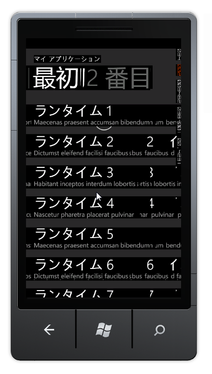

せっかくの4連休なのに、私用でいろいろあって時間がコマ切れになってしまい、まったくの無駄になってしまった。その時間を活かして、久しぶりに Windows Phone アプリでも作ろうかなと思ったらコレだし。

IvyBridge 内蔵の <a class="keyword" href="http://d.hatena.ne.jp/keyword/GPU">GPU</a> なのだけど、まだあまりドライバーの完成度が高くないのかもしれない。

