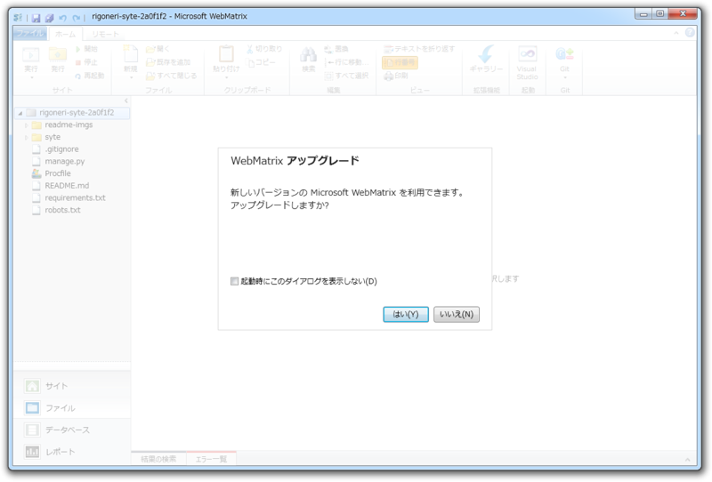
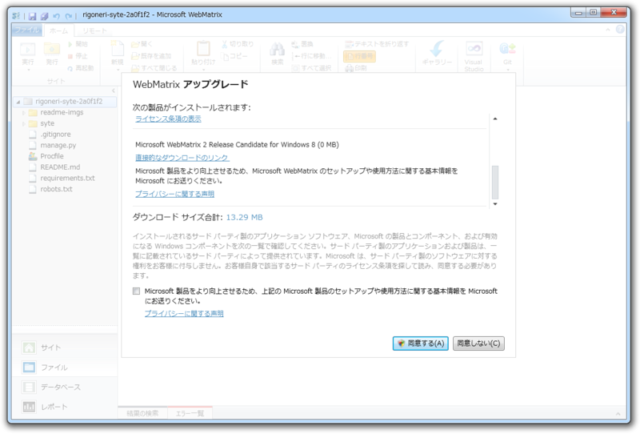
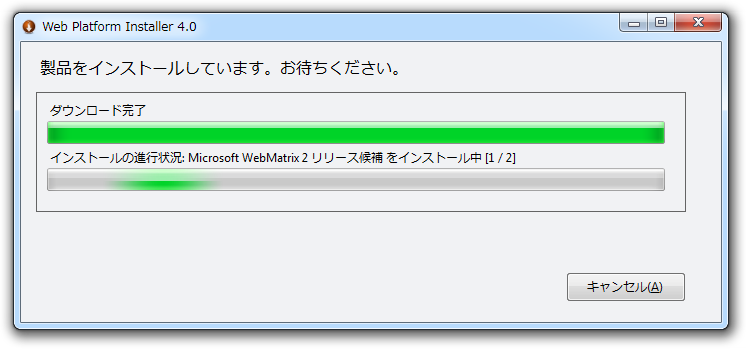
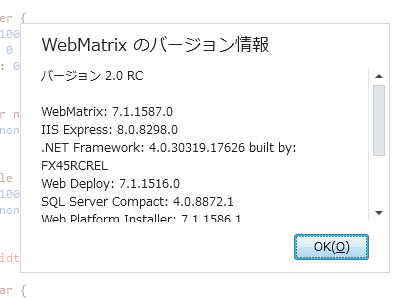

<a href="http://daruyanagi.hatenablog.com/entry/2012/07/16/010751">Windows Phone &#x30A8;&#x30DF;&#x30E5;&#x30EC;&#x30FC;&#x30BF;&#x30FC;&#x304C;&#x30A2;&#x30EC;&#x306A;&#x306E;&#x3067;&hellip;&hellip; - &#x3060;&#x308B;&#x308D;&#x3050;</a> 、 Windows Phone アプリの開発はあきらめて「<a class="keyword" href="http://d.hatena.ne.jp/keyword/WebMatrix">WebMatrix</a> 2」を起動すると、アップデートがきていた。この PC には RC 版が入っていたはずなので、 RC 版のアップデートということなのかな。ここんところ触ってなかったので、忘れてしまった。

何が変わっているのかイマイチよくわかんないけれど、 <a class="keyword" href="http://d.hatena.ne.jp/keyword/CSS">CSS</a> でエラーが出まくったり、コードの自動補完がうまくいかないのがなおってるのかもしれない。

ついでなので、ブログのテーマなんかを作ってみたりした。モバイル端末と共通のテーマにしたかったのだけど、シミュレーターのおかげでテストが楽ちんだな。

