
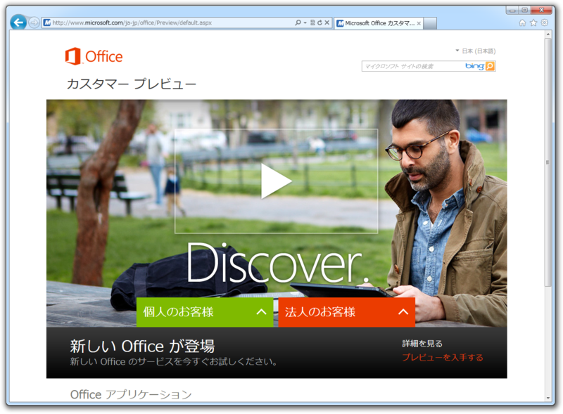

「Microsoft Office 2013」（Office 15）の一般向けプレビューが公開されたみたいですね（独り言：今日の記者説明会の内容ってこれだったのか！）。

<ul>
<li><a href="http://www.microsoft.com/en-us/news/Press/2012/Jul12/07-16OfficePR.aspx">Microsoft unveils the new Office</a>（プレスリリース）</li>
<li><a href="http://www.microsoft.com/ja-jp/office/preview/default.aspx">Microsoft Office &#x30AB;&#x30B9;&#x30BF;&#x30DE;&#x30FC; &#x30D7;&#x30EC;&#x30D3;&#x30E5;&#x30FC;</a></li>
</ul>
早速入れてみました。これで最新のオフィスを年内ぐらいはタダで使える！（ぉ

<h3>ダウンロード</h3>

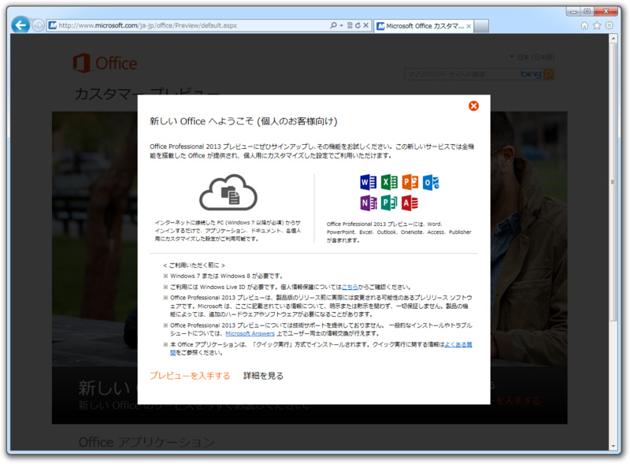

どうでもいいのだけど、タッチ操作だとこの画面に行き着くのがとても大変。ボタンがピョコピョコ動くのはオシャレ（笑）なのだけど、せっかくタッチ対応を謳うのだから、Web サイトもタッチでテストしてほしいです。

<h3>インストール</h3>

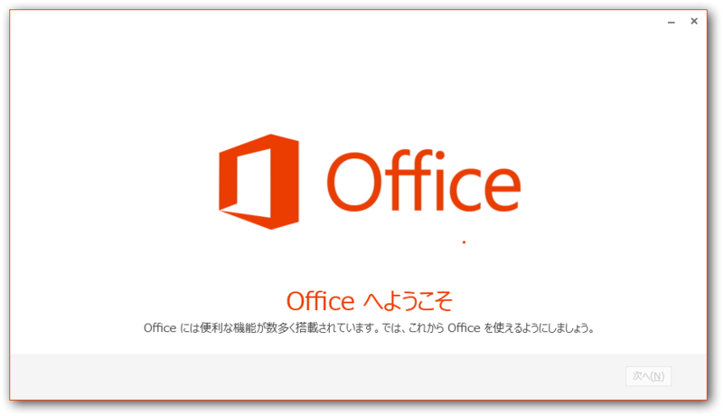

それでは早速インストール！

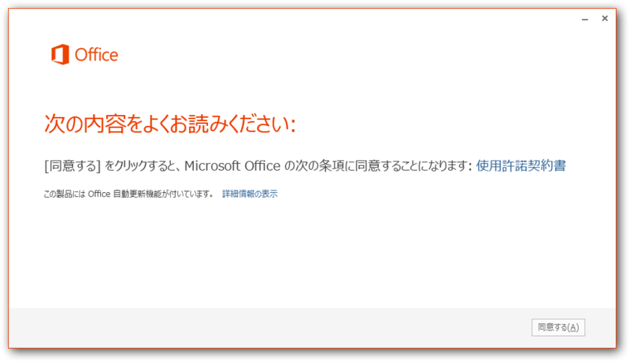

まずはお約束。

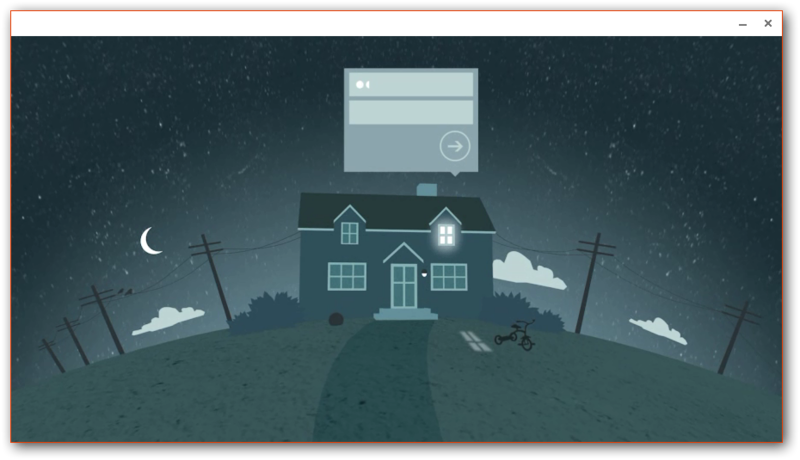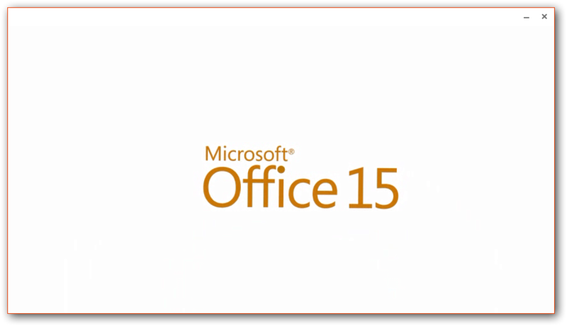

なんか <a class="keyword" href="http://d.hatena.ne.jp/keyword/Apple">Apple</a> のできそこないみたいなビデオが流れてカッコイイ。新しいオフィスの特徴はタッチ・<a class="keyword" href="http://d.hatena.ne.jp/keyword/%A5%B9%A5%BF%A5%A4%A5%E9%A5%B9">スタイラス</a>対応（要はスレートPCのサポート）と、「一つのIDで、どこからでも」というところなのかな。

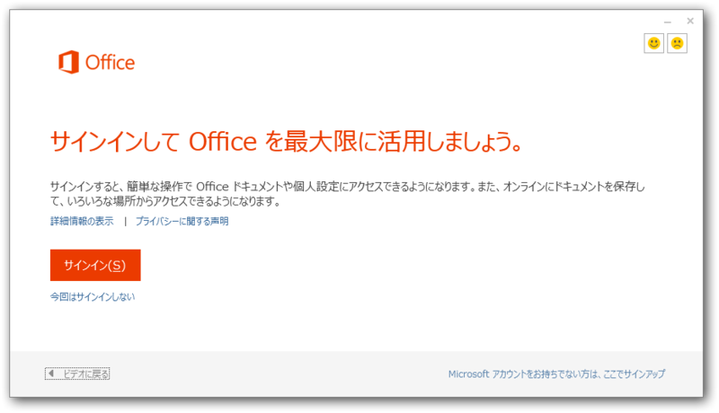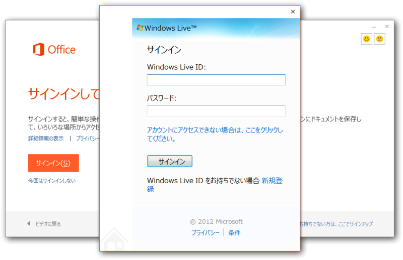

というわけで、オフィスのポテンシャルを最大限に発揮するには <a class="keyword" href="http://d.hatena.ne.jp/keyword/Windows%20Live">Windows Live</a> ID が必要です。……と Web サイトには書かれているけれど、一応なくてもいけるっぽい。まぁ、インストール時にオンラインとは限らないしね。

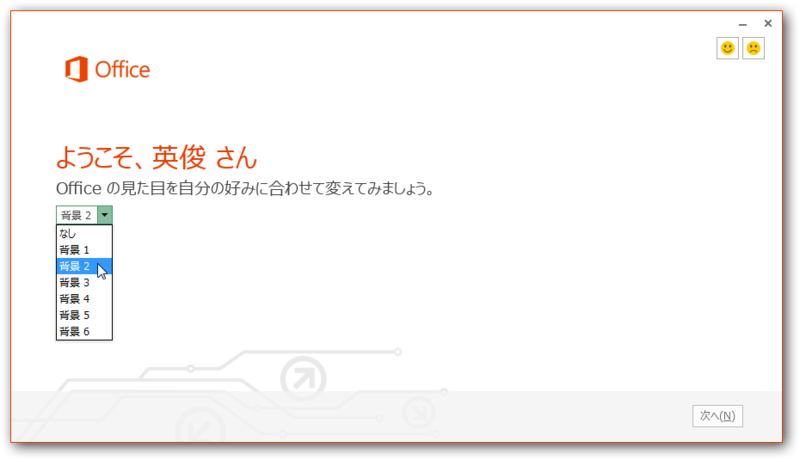

ちなみに、新しいオフィスは<a class="keyword" href="http://d.hatena.ne.jp/keyword/%A5%ED%A1%BC%A5%DF%A5%F3%A5%B0">ローミング</a>（Roaming）機能で設定が同期されるとのこと。このデザイン設定も同期されるのかなぁ。 <a class="keyword" href="http://d.hatena.ne.jp/keyword/Windows%208">Windows 8</a> はクソだという評判がすでに立ち始めているけれど、個人的にはこの<a class="keyword" href="http://d.hatena.ne.jp/keyword/%A5%ED%A1%BC%A5%DF%A5%F3%A5%B0">ローミング</a>機能には期待していいと思う<a href="#f1" name="fn1" title="Windows 8 と Office/Windows 7 のローミング機能ってちょっと違うのだろうか">*1</a>。

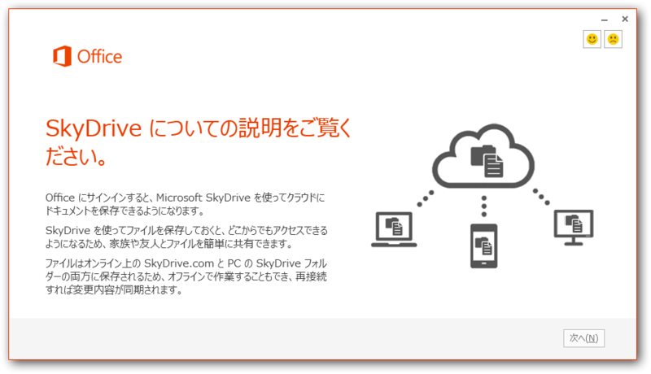

<a class="keyword" href="http://d.hatena.ne.jp/keyword/SkyDrive">SkyDrive</a> へドキュメント保存。今のオフィスでもできんことはないけれど、それがよりシームレスに統合されるということなのかな。

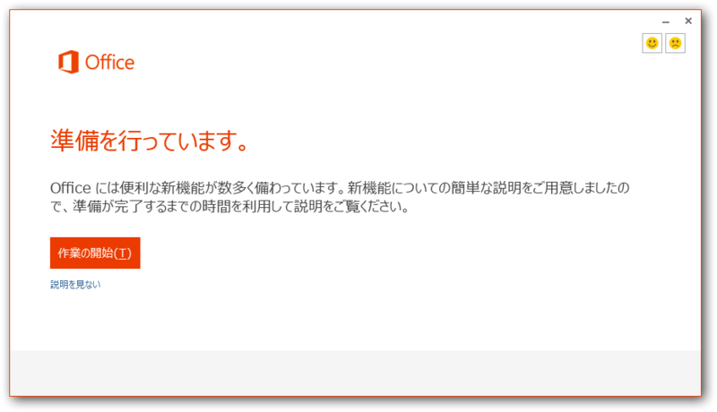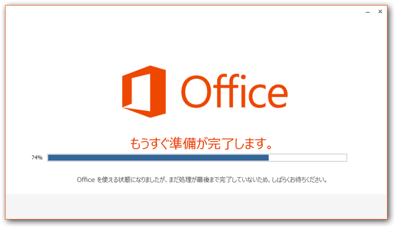

今回のプレビュー版は“クイック実行”という仕組みで実行される。前のバージョンも試用版は同じ仕組だっけ。プログラムがキャッシュされて、ストリーミングっぽく実行されるのだそうで、フルインストールするよりもお手軽で、すぐに利用できるということらしい。

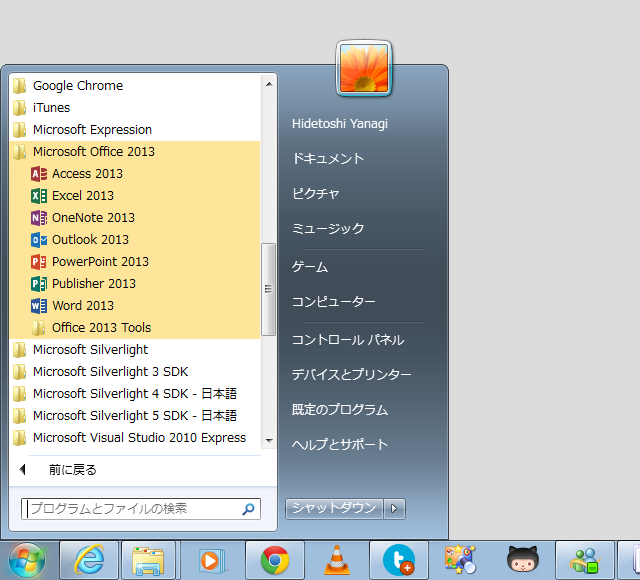

インストールされたよ！　注目は個人的要らない子「Outlook」の進化ですかね……。

<h3>実行</h3>

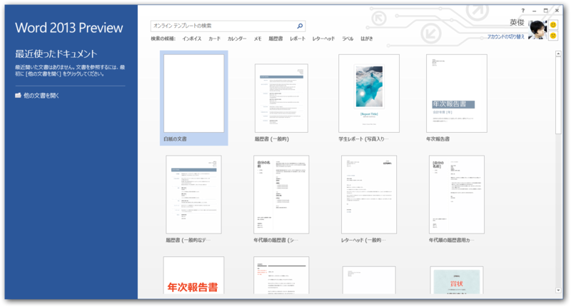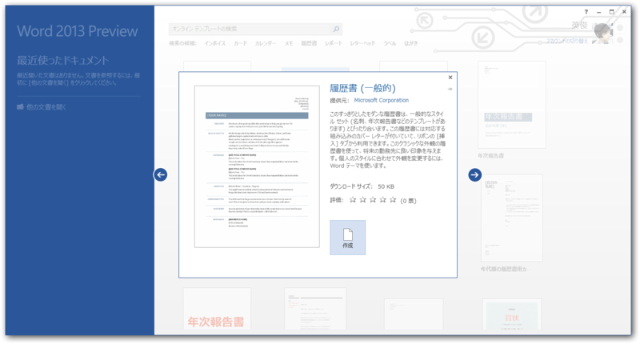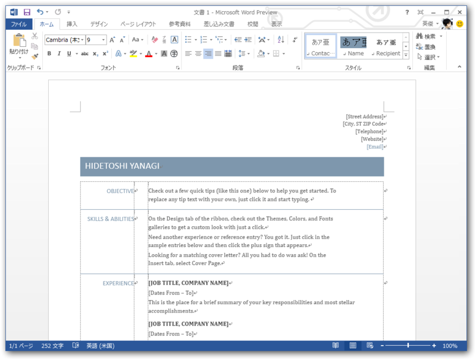

カッコイイ。<a class="keyword" href="http://d.hatena.ne.jp/keyword/%A5%B9%A5%BF%A5%A4%A5%E9%A5%B9">スタイラス</a>での動作も試してみたかったけれど、<i> S7S の<a class="keyword" href="http://d.hatena.ne.jp/keyword/%A5%B9%A5%BF%A5%A4%A5%E9%A5%B9">スタイラス</a>をどこかへやってしまった ／(^o^)＼ </i>こういうのはやっぱり本体に内蔵されるべきだよな。どうせ標準の<a class="keyword" href="http://d.hatena.ne.jp/keyword/%A5%B9%A5%BF%A5%A4%A5%E9%A5%B9">スタイラス</a>は1ボタンしか使えないポンコツだったので、2ボタン使える新しいのを買うか。

<a href="#fn1" name="f1" class="footnote-number">*1</a>:<a class="keyword" href="http://d.hatena.ne.jp/keyword/Windows%208">Windows 8</a> と Office/<a class="keyword" href="http://d.hatena.ne.jp/keyword/Windows%207">Windows 7</a> の<a class="keyword" href="http://d.hatena.ne.jp/keyword/%A5%ED%A1%BC%A5%DF%A5%F3%A5%B0">ローミング</a>機能ってちょっと違うのだろうか

