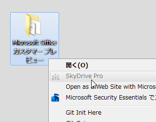

これってなんだろな、と昨日の朝（<a href="http://daruyanagi.hatenablog.com/entry/2012/07/17/084806">&#x3055;&#x3063;&#x305D;&#x304F;&#x300C;Microsoft Office &#x30AB;&#x30B9;&#x30BF;&#x30DE;&#x30FC; &#x30D7;&#x30EC;&#x30D3;&#x30E5;&#x30FC;&#x300D;&#x3092;&#x30A4;&#x30F3;&#x30B9;&#x30C8;&#x30FC;&#x30EB;&#x3057;&#x3066;&#x307F;&#x305F; - &#x3060;&#x308B;&#x308D;&#x3050;</a>）から思っていたのだけど<a href="#f1" name="fn1" title="Office 15 をインストールすると現れるようだ">*1</a>、昨日の製品発表会（<a href="http://pc.watch.impress.co.jp/docs/news/20120717_547294.html">&#x3010;PC Watch&#x3011; Microsoft&#x3001;&#x6B21;&#x671F;Office&#x306E;&#x30AB;&#x30B9;&#x30BF;&#x30DE;&#x30FC;&#x30D7;&#x30EC;&#x30D3;&#x30E5;&#x30FC;&#x3092;&#x7121;&#x511F;&#x516C;&#x958B; &#x301C;&#x65E5;&#x672C;&#x30DE;&#x30A4;&#x30AF;&#x30ED;&#x30BD;&#x30D5;&#x30C8;&#x304C;&#x65B0;&#x6A5F;&#x80FD;&#x306A;&#x3069;&#x3092;&#x89E3;&#x8AAC;</a>）でほんの少しだけ触れられていた。 Office 365 <a class="keyword" href="http://d.hatena.ne.jp/keyword/SharePoint">SharePoint</a> を統合して <a class="keyword" href="http://d.hatena.ne.jp/keyword/SkyDrive">SkyDrive</a> Pro と<a class="keyword" href="http://d.hatena.ne.jp/keyword/%A5%D6%A5%E9%A5%F3%A5%C7%A5%A3%A5%F3%A5%B0">ブランディング</a>するらしい。

<a href="http://www.insideris.com/skydrive-pro-hinted-what-is-it/">SkyDrive Pro Hinted. What Is It?</a> によると、 <a class="keyword" href="http://d.hatena.ne.jp/keyword/SkyDrive">SkyDrive</a> Pro と Office 365 <a class="keyword" href="http://d.hatena.ne.jp/keyword/SharePoint">SharePoint</a> はアイコンも同じであるようだ。 <a class="keyword" href="http://d.hatena.ne.jp/keyword/SharePoint">SharePoint</a> は使ったことがないので、古いのと新しいのとでどこが変わったのかよくわからない。けれど、新しい方を少しだけ見せてもらった感じだと、なんだか社内 <a class="keyword" href="http://d.hatena.ne.jp/keyword/Facebook">Facebook</a> みたいだなーと思った。こういうのを使ってりゃ、コミュニケーションが捗るんだろうなぁ。

<a href="#fn1" name="f1" class="footnote-number">*1</a>:Office 15 をインストールすると現れるようだ

