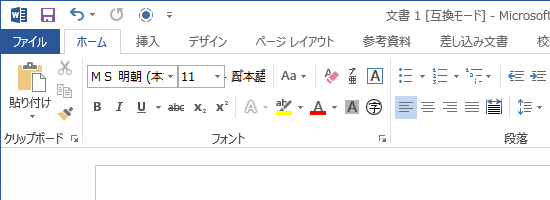
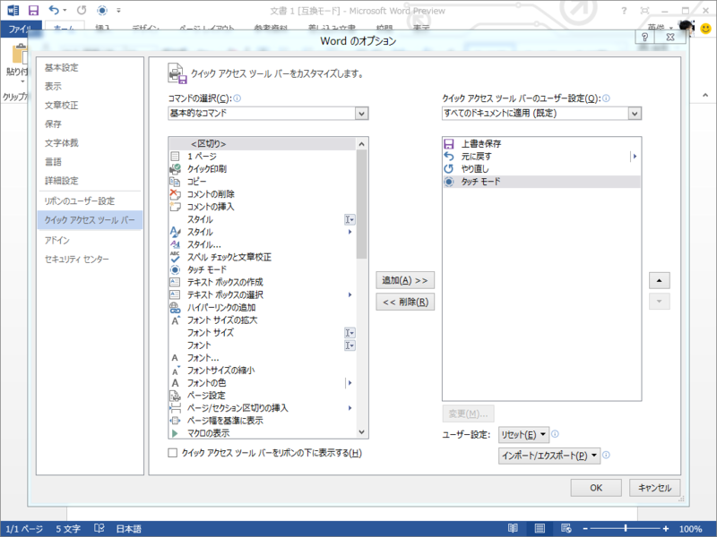
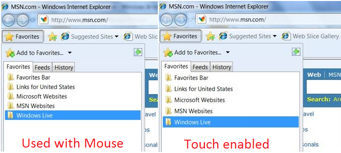

Office 15 でちょっと気に入ったのが「タッチモード」。これを ON にすれば、コントロール類のサイズが大きくなるほか、マージンも若干広くなって、指でタップしやすくなる。

タッチモードを OFF （既定）。

タッチモードを ON。ドキュメントの表示エリアは若干狭まるが、誤タッチが減るメリットを考えれば甘受できる。あと、 Word 2013 の場合は閲覧モードがなかなか充実しているので、読むだけならそちらを使ったほうがよい。

ただ、標準ではクイックツールバーには現れないようで、 手動でボタンを追加する必要があった<a href="#f1" name="fn1" title="手持ちの Sumsung Series 7 Slate の場合">*1</a>。これはちょっとわかりづらいし、このダイアログをタッチで操作するのかと思うとちょっと悲しい。ただ、製品版ではタッチ対応の有無を判定して自動でクイックツールバーへ登録、といった対応がなされるかもしれない。

実はこの手の機能は昔からあって、たとえば IE だとタッチ操作に対応したデバイスでは自動で「タッチモード」に相当するユーザーインターフェイスへ切り替わる（<a href="http://www.itmedia.co.jp/news/articles/0901/13/news099.html"> Windows 7&#x306E;IE 8&#x306B;&#x306F;&#x30BF;&#x30C3;&#x30C1;&#x6A5F;&#x80FD; - ITmedia &#x30CB;&#x30E5;&#x30FC;&#x30B9;</a>）。ただ、タッチファーストな <a class="keyword" href="http://d.hatena.ne.jp/keyword/Windows%208">Windows 8</a> とは言え、キーボード入力のプライオリティはそんなには下がらないわけで（<a href="http://daruyanagi.hatenablog.com/entry/2012/06/06/204210">Metro &#x30C7;&#x30B9;&#x30AF;&#x30C8;&#x30C3;&#x30D7;&#x306F;&#x3067;&#x3063;&#x304B;&#x3044;&#x30B9;&#x30BF;&#x30FC;&#x30C8;&#x30E1;&#x30CB;&#x30E5;&#x30FC;&#x3002;&#x6B7B;&#x3093;&#x3060;&#x306E;&#x306F;&#x30B9;&#x30BF;&#x30FC;&#x30C8;&#x30E1;&#x30CB;&#x30E5;&#x30FC;&#x3067;&#x306F;&#x306A;&#x304F;&#x30DE;&#x30A6;&#x30B9;&#x3002; - &#x3060;&#x308B;&#x308D;&#x3050;</a>）、タッチ入力の場合とキー入力の場合で表示を切り替えられる方が便利だろう。できればコレが OS 標準の機能であってほしいのだけれど。

<a href="#fn1" name="f1" class="footnote-number">*1</a>:手持ちの Sumsung Series 7 Slate の場合

