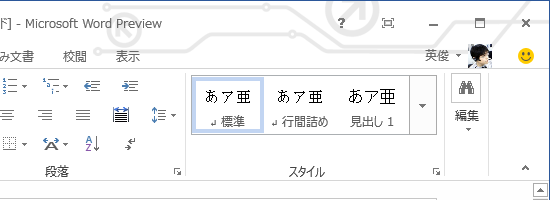

意外にダサいという反応が多かったこのテーマ機能。わしはカッコイイと思ったのだけど！　やっぱり自分のセンスがおかしいのか。いや待て、誰がみてもダサいのなら、そもそも最初から標準テーマとして収録されないだろうし……ブツブツ。

少しだけフォローしておくと、標準のテーマは無地なので、あんな「ダサい」模様は表示されない。6種類の中から自分なりの「カッコいい」テーマを選べるので安心してほしい。

テーマ機能は基本的に不要なモノだ。とくにオフィススイートのようなソフトには不要なモノだ。やはり、ココは最初から無地で<a class="keyword" href="http://d.hatena.ne.jp/keyword/%A5%B9%A5%AF%A5%EA%A1%BC%A5%F3%A5%B7%A5%E7%A5%C3%A5%C8">スクリーンショット</a>をとっておくべきだっただろう。そうすれば要らぬ誤解を招くこともなかった。プレビュー版で、しかもそんなところで叩かれたら、わしだってちょっとかわいそうかなと思う。

ただ、個人的にはココにコーポレートロゴなんかを表示しておくといいかもしれないなどと思うし、個人だったら<a class="keyword" href="http://d.hatena.ne.jp/keyword/%BD%E9%B2%BB%A5%DF%A5%AF">初音ミク</a>でも<a class="keyword" href="http://d.hatena.ne.jp/keyword/%C4%B6%B7%BB%B5%AE">超兄貴</a>でも、まぁ、なんでも好きなモノを表示しておくと楽しいんじゃないかなと思う。まぁ、なんつうか、あんまり邪険にするなヨ。

