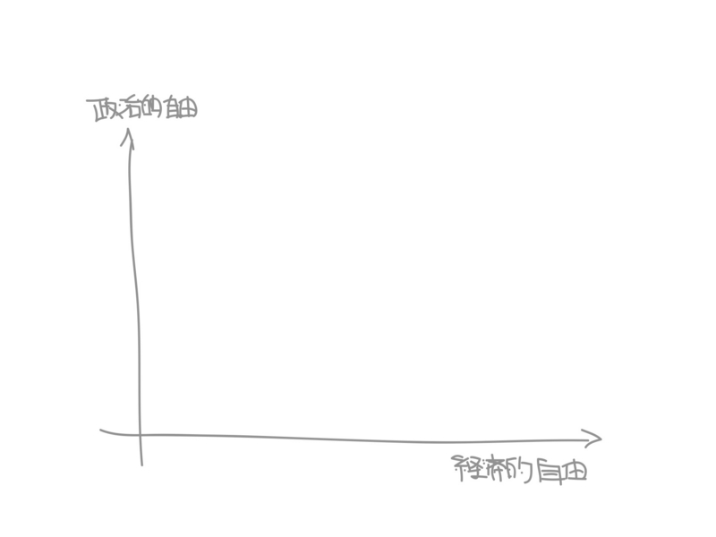
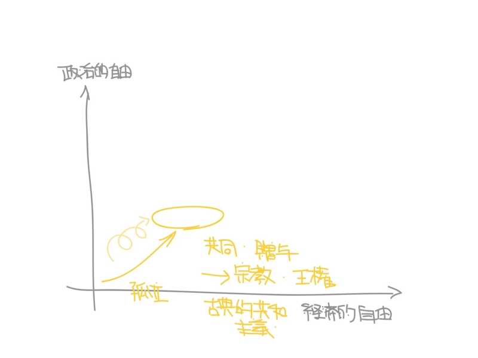
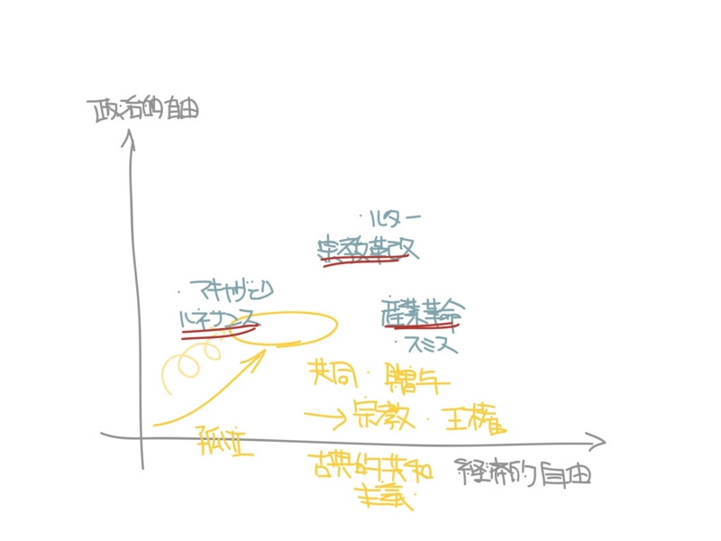
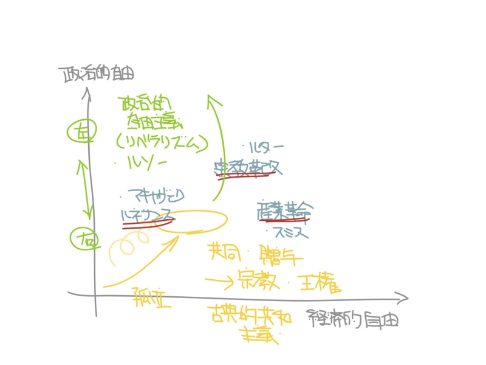
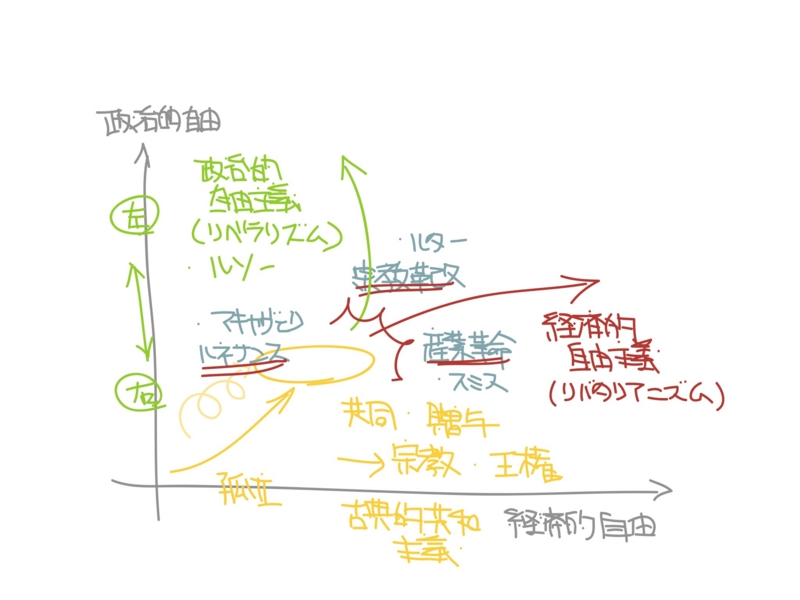
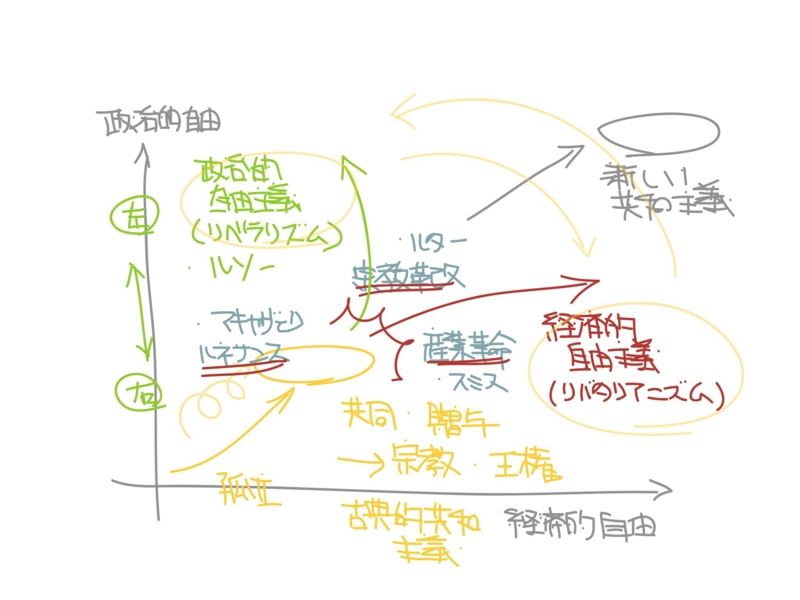

試みに、政治的自由と経済的自由というベクトルをもうけてみた。

孤立した個人は、サルの自由をもつ（<a href="http://daruyanagi.hatenablog.com/entry/2012/06/16/152148">&#x56DB;&#x3064;&#x306E;&#x81EA;&#x7531; - &#x3060;&#x308B;&#x308D;&#x3050;</a>）。しかし、ヒトは共同できるほうがより多くの自由を獲得できるはずだ。<b>古典的共和主義</b>が重視したのは、この自由だ。とくに古代ローマにおいては、コミュニティ（贈与社会）においてどのようなプレゼンス（よい影響、献身、犠牲）を与えられるか、同時に個人においてはどれほど自分の欲を抑えられるか（清貧、諦念）が思想的課題だった（<a class="keyword" href="http://d.hatena.ne.jp/keyword/%A5%B9%A5%C8%A5%A2%C5%AF%B3%D8">ストア哲学</a>）。

しかし、実際の歴史においてそれは束の間の奇跡であって、中世では専ら宗教と封建権力によって贈与社会が洗練・高度化されていった<a href="#f1" name="fn1" title="東洋では封建権力が発達したものの、宗教の発達がみられなかった。そこで、知的矛盾（哲学 vs 宗教、中世の普遍論争などはその点で無駄ではなかったのだと思える）が爆発することなく、封建社会の元で緩やかに経済が発達していった。故に、18世紀までは東洋のほうが豊かであった">*1</a>。その間、歴史の進歩は一進一退であったけれど、基本的に経済的な力を蓄えた下層階級が、より多くの政治的権力を獲得するという過程を経て、次第に政治的・経済的な地位を向上させていった。

14世紀以降、西洋は新しい局面を迎える。一つは<a class="keyword" href="http://d.hatena.ne.jp/keyword/%A5%EB%A5%CD%A5%B5%A5%F3%A5%B9">ルネサンス</a>（古典復興）。古典的共和主義がもう一度思い出され、宗教・封建権力が否定される。ここでの主役が、ニコロ・<a class="keyword" href="http://d.hatena.ne.jp/keyword/%A5%DE%A5%AD%A5%E3%A5%F4%A5%A7%A5%EA">マキャヴェリ</a>だ。彼は権謀術数（<a class="keyword" href="http://d.hatena.ne.jp/keyword/%A5%DE%A5%AD%A5%E3%A5%D9%A5%EA">マキャベリ</a>ズム）の祖として記憶されるに過ぎないが、もっと思い評価を与えていいと思う。ルターに代表される宗教改革は、彼の路線の延長に過ぎないとさえ思う。

もう一つは、18世紀からおこった産業革命。それまでの列強は大きな「ムラ」にすぎなかったが（<a href="http://daruyanagi.hatenablog.com/entry/2012/07/19/000912">&#x300C;&#x30DE;&#x30C1;&#x300D;&#x3068;&#x300C;&#x30E0;&#x30E9;&#x300D; - &#x3060;&#x308B;&#x308D;&#x3050;</a>）、列強が軍拡・経済競争に明け暮れた結果、それまで「ムラ」を「ムラ」として縛り上げてきたルールを解き放ち、利己心を肯定するようになった（<a href="http://daruyanagi.hatenablog.com/entry/2011/12/07/214926">&#x300C;&#x306A;&#x305C;&#x7523;&#x696D;&#x9769;&#x547D;&#x304C;&#x8D77;&#x3053;&#x3063;&#x305F;&#x306E;&#x304B;&#xFF1F;&#x300D; - &#x3060;&#x308B;&#x308D;&#x3050;</a>）。

ここで、古典的共和主義の限界が解き放たれる。贈与より交換、社会に埋め込まれた経済より経済に埋め込まれた社会（交換社会）へと移行していく。

そこでうまれた二つの潮流のうちの一つが、ルソーに代表される政治的<a class="keyword" href="http://d.hatena.ne.jp/keyword/%BC%AB%CD%B3%BC%E7%B5%C1">自由主義</a>（<a class="keyword" href="http://d.hatena.ne.jp/keyword/%A5%EA%A5%D9%A5%E9%A5%EA%A5%BA%A5%E0">リベラリズム</a>）だ。<a class="keyword" href="http://d.hatena.ne.jp/keyword/%A5%EA%A5%D9%A5%E9%A5%EA%A5%BA%A5%E0">リベラリズム</a>は、大陸合理主義に根ざしている。つまり、すべてのヒトには等しく理性が備わっている。ゆえに、その理性を働かせさえすれば、人民はある一つの結論――一般意思――へ到達することができる。<a class="keyword" href="http://d.hatena.ne.jp/keyword/%A5%EA%A5%D9%A5%E9%A5%EA%A5%BA%A5%E0">リベラリズム</a>“左翼”の台頭は、既存の古典的共和主義を時代遅れな“右翼”へと貶める。

男性と女性は平等であるべきだ。 
子供も大人と等しく人間として扱われるべきだ。 
人種間に不平等があってはならない。 
生まれによる差異、努力によって解消されない社会的差別は不公正である。

「個人」はかけがえのない「個人」であるがゆえ、無条件に尊重されるべきだ。共同によって社会をなした「個人」は、政治的自由を得て、もう一度自由な「弧人」へと還る。

もう一つの潮流は、古典的共和主義の復古が生み出した産物――市民社会――を土台に、個人の経済的自由を肯定する運動だ。その元祖はなんと言っても<a class="keyword" href="http://d.hatena.ne.jp/keyword/%A5%A2%A5%C0%A5%E0%A1%A6%A5%B9%A5%DF%A5%B9">アダム・スミス</a>だ。ただ、彼の後継者の一部はその土台を忘れ、専ら経済的な自由を主張するようになったが。

<a class="keyword" href="http://d.hatena.ne.jp/keyword/%A5%EA%A5%D9%A5%E9%A5%EA%A5%BA%A5%E0">リベラリズム</a>（および<a class="keyword" href="http://d.hatena.ne.jp/keyword/%B6%A6%BB%BA%BC%E7%B5%C1">共産主義</a>）は、そんな経済<a class="keyword" href="http://d.hatena.ne.jp/keyword/%BC%AB%CD%B3%BC%E7%B5%C1">自由主義</a>のカウンターパートでもある。経済<a class="keyword" href="http://d.hatena.ne.jp/keyword/%BC%AB%CD%B3%BC%E7%B5%C1">自由主義</a>は個人を抑圧している。ゆえに、規制されるべきだ。そして、そのカウンターパートとして現れたのがリバタリアリズムといえる。経済的<a class="keyword" href="http://d.hatena.ne.jp/keyword/%BC%AB%CD%B3%BC%E7%B5%C1">自由主義</a>の抑制は、全体主義につながり、むしろ政治的自由を喪失させる。所有と選択の自由こそが、重視されるべきだ。

<a class="keyword" href="http://d.hatena.ne.jp/keyword/%A5%EA%A5%D9%A5%E9%A5%EA%A5%BA%A5%E0">リベラリズム</a>・リバタリアリズムは、どちらも現代が得た思想的果実といえる。では、そのどちらかに組するべきであろうか。必ずしもそうはいえないのではないか。

経済的<a class="keyword" href="http://d.hatena.ne.jp/keyword/%BC%AB%CD%B3%BC%E7%B5%C1">自由主義</a>抜きでは、現代で僕らの享受する地位は得られなかっただろう。しかし、政治的<a class="keyword" href="http://d.hatena.ne.jp/keyword/%BC%AB%CD%B3%BC%E7%B5%C1">自由主義</a>から得た恩恵も少なくない。では、どちらもが共存できる道はないのだろうか。

“新しい共和主義”は、それを模索する。経済的・政治的自由のどちらもが、古典的<a class="keyword" href="http://d.hatena.ne.jp/keyword/%BC%AB%CD%B3%BC%E7%B5%C1">自由主義</a>を等しく土壌としており、しかしそれを若干ないがしろにしているのを憂う。その点で、“新しい共和主義”は保守的だといえる。ただ、旧来の保守主義で留まることは潔しとはしない。経済的・政治的自由によって得られた成果は正当に評価し、取り入れるべきだ。そして、経済的・政治的<a class="keyword" href="http://d.hatena.ne.jp/keyword/%BC%AB%CD%B3%BC%E7%B5%C1">自由主義</a>が本来の目標を見失って滞留したとき、それを批判できる理論的根拠を手に入れなけばならない。

<a href="#fn1" name="f1" class="footnote-number">*1</a>:東洋では封建権力が発達したものの、宗教の発達がみられなかった。そこで、知的矛盾（哲学 vs 宗教、中世の普遍論争などはその点で無駄ではなかったのだと思える）が爆発することなく、封建社会の元で緩やかに経済が発達していった。故に、18世紀までは東洋のほうが豊かであった

