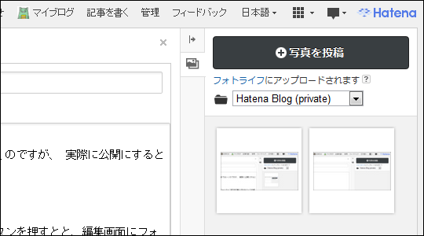

<blockquote cite="http://shiba-yan.hatenablog.jp/entry/20120718/1342597518">

無料ユーザーのままフィードバックを送り続けてもインパクトがないかと思ったので、月額 980 円払って Pro ユーザーになりました。

<cite><a href="http://shiba-yan.hatenablog.jp/entry/20120718/1342597518">&#x306F;&#x3066;&#x306A;&#x30D6;&#x30ED;&#x30B0; Pro &#x3092;&#x4F7F;&#x3044;&#x59CB;&#x3081;&#x307E;&#x3057;&#x305F; - &#x3057;&#x3070;&#x3084;&#x3093;&#x96D1;&#x8A18;</a></cite>
</blockquote>

それもそうだなぁ、と思って、わしも <a href="http://blog.hatena.ne.jp/guide/pro">&#x306F;&#x3066;&#x306A;&#x30D6;&#x30ED;&#x30B0;Pro - &#x306F;&#x3066;&#x306A;&#x30D6;&#x30ED;&#x30B0;</a> に移行してみた。これまでは、画像をアップロードするために「はてなフォトライフ」にだけお金を払っていたのだけれど（<a href="https://blog.daruyanagi.jp/entry/2012/02/12/000201">&#x306F;&#x3066;&#x306A;&#x30DD;&#x30A4;&#x30F3;&#x30C8;&#x8CB7;&#x3063;&#x305F;&#x3002; - &#x3060;&#x308B;&#x308D;&#x3050;</a>）<a href="#f-df49ffbe" name="fn-df49ffbe" title="無償枠では月10日ぐらいで転送量を使い果たす">*1</a>。

「はてなフォトライフ」は「はてなブログ Pro」に含まれる<a href="#f-bd84fc7d" name="fn-bd84fc7d" title="なんかポイントの表示がおかしいけど気にしないでおく">*2</a>。とくに手動による解約の必要もないみたい。

<h3>独自ドメインの割り当て</h3>

個人的に嬉しい機能は、ドメインの割り当て機能（とフォトライフの増量）のみ。これに2年間で14,000円も払うのは正直あまり納得がいかないのだけれど、買ってしまったので試す。今回は、あまり有効活用してなかった「daruyanagi.jp」を「daruyanagi.hatenablog.com」へ割り当ててみた。

とはいえ、

設定画面にある“独自ドメイン”に「daruyanagi.jp」と入力し、

DNS の設定を変えてるだけ<a href="#f-d135f108" name="fn-d135f108" title="うちは Value-Domain に管理してもらっているので、スクリーンショットのような感じ">*3</a>。あとは寝て待てばよい。とても簡単だった。

<h3>はてなブログ Pro に望むこと</h3>

最後に、はてなブログ Pro への希望を2点だけ。

<ul>
<li>エクスポート機能をつけろ。じゃなかったら、データ飛ばしたとき許さん。</li>
<li>Markdown 記法に対応してほしい。いくつも記法を覚えるの面倒くさい。ただし、[] で括るなどして、Amazon/数式/フォトライフ記法などは使えてほしい。</li>
</ul>
頑張ってね！

<a href="#fn-df49ffbe" name="f-df49ffbe" class="footnote-number">*1</a>:無償枠では月10日ぐらいで転送量を使い果たす

<a href="#fn-bd84fc7d" name="f-bd84fc7d" class="footnote-number">*2</a>:なんかポイントの表示がおかしいけど気にしないでおく

<a href="#fn-d135f108" name="f-d135f108" class="footnote-number">*3</a>:うちは Value-Domain に管理してもらっているので、スクリーンショットのような感じ

