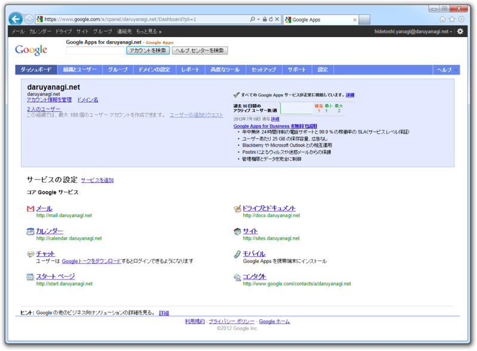
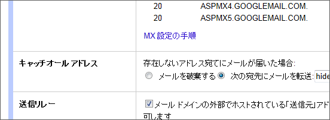

<blockquote>

「メールどこに送ればいい？」 
「 @daruyanagi.net で」 
「 @ の前は？」 
「なんでもいいよ」

</blockquote>

実際、何をつけてもうちに届くよ。そう、 <a class="keyword" href="http://d.hatena.ne.jp/keyword/Google%20Apps">Google Apps</a> を使っていればね<a href="#f1" name="fn1" title="あえて指定するなら、 mail をつけて下さればありがたい">*1</a>。

この「キャッチオール」機能を使えば、 @ の前が何であっても指定したメールアドレスに届く。うまく利用すれば、いろんなことに使える。

<h3>フィルターと組み合わせる</h3>

たとえば、（以下、ドメイン名は sample.com で話をすすめる。スパムを避けるため）

<ul>
<li>「todo@sample.com」へ送ったら［todo］ラベルをつける</li>
<li>「mobile@sample.com」へ送ったら <a class="keyword" href="http://d.hatena.ne.jp/keyword/iPhone">iPhone</a> へ転送</li>
</ul>
なんてことが、フィルター機能で簡単に実現できる。通常の <a class="keyword" href="http://d.hatena.ne.jp/keyword/Gmail">Gmail</a> でも、「sample+todo@<a class="keyword" href="http://d.hatena.ne.jp/keyword/gmail">gmail</a>.com」「sample+mobile@<a class="keyword" href="http://d.hatena.ne.jp/keyword/gmail">gmail</a>.com」といったように「+」を利用して実現できるけれど、まぁ、より短いアドレスでいいというのは気持ちいいよ。

<h3><a class="keyword" href="http://d.hatena.ne.jp/keyword/%BC%CE%A4%C6%A5%A2%A5%C9">捨てアド</a>が簡単に作れる</h3>

ショッピングサイトや Web サービスごとにアドレスを割り当てられるのもなかなかよろしい。

<ul>
<li>「rakuten@sample.com」 楽天専用アドレス</li>
<li>「seesmic@sample.com」 <a class="keyword" href="http://d.hatena.ne.jp/keyword/Twitter">Twitter</a>/<a class="keyword" href="http://d.hatena.ne.jp/keyword/Facebook">Facebook</a>クライアント「Seesmic」の登録メール</li>
</ul>
「rakuten@sample.com」宛のメールを自動で既読にしてアーカイブしたり、「seesmic@sample.com」宛てにくるスパムを一括で退治したりといったことが、これもフィルタリング機能で簡単に実現できる。利用するサービスごとにメールアドレスを変えておけば、<b>どのサービスからメールアドレスが漏れたのかが簡単に追跡できる</b>というメリットもある。海外の無償サービスなんかは楽天並みにメールアドレスの管理がユルい。そんなところにわざわざメインのメールアドレスを教えて上げる義理はないよね。これを <a class="keyword" href="http://d.hatena.ne.jp/keyword/Gmail">Gmail</a> の「+」で実現しようとすると、（アホな）メールアドレスのバリデーションでハネられる場合があって面倒。

<a href="http://www.google.com/apps/intl/ja/">Google Apps &#x3078;&#x3088;&#x3046;&#x3053;&#x305D;</a>

たぶん3、4年はそんな感じで運用しているけれど<a href="#f2" name="fn2" title="おかげでアカウントが100個も作れる (；´Д｀) ">*2</a>、とても便利だよ。ほかにも上手い使い道があったらコメントで教えて下さい。

<a href="#fn1" name="f1" class="footnote-number">*1</a>:あえて指定するなら、 mail をつけて下さればありがたい

<a href="#fn2" name="f2" class="footnote-number">*2</a>:おかげでアカウントが100個も作れる (；´Д｀) 

