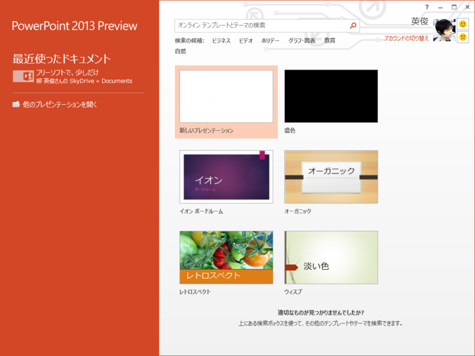
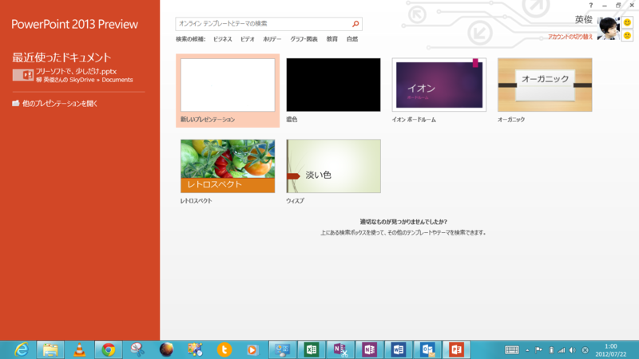

昨日は「<a class="keyword" href="http://d.hatena.ne.jp/keyword/PowerPoint">PowerPoint</a> 2013 Preview」でスライドを作っていた。新しいオフィスは超便利で、他の端末で開けば、前の端末で編集していたその続きにすぐとりかかれる。

デスクトップで作ったスライドを、 S7S で開いてみたけど、ちゃんと続きから表示された。デフォルトの保存場所が <a class="keyword" href="http://d.hatena.ne.jp/keyword/SkyDrive">SkyDrive</a> になっているのもいいな。オフィス文書を保存する用途ならば、 <a class="keyword" href="http://d.hatena.ne.jp/keyword/SkyDrive">SkyDrive</a> の無償ディスク容量 7GB は十分。むしろ、無限にも感じられる。

ほかにも、「<a class="keyword" href="http://d.hatena.ne.jp/keyword/PowerPoint">PowerPoint</a> 2013 Preview」はマルチモニター対応がスゴい。サブモニターにはプレゼンテーション、メインモニターにはプレゼンター用の画面が表示される。プレゼンター用の画面では、次のスライド、スライドにつけたメモ、プレゼンテーションを始めてからの経過時間なんかが表示されていて、こいつはかなり役立ちそうだ。

なにのスライドを作っていたのかは、8月末にお披露目できると思う。なので、今回は<a class="keyword" href="http://d.hatena.ne.jp/keyword/%A5%B9%A5%AF%A5%EA%A1%BC%A5%F3%A5%B7%A5%E7%A5%C3%A5%C8">スクリーンショット</a>を自重……

