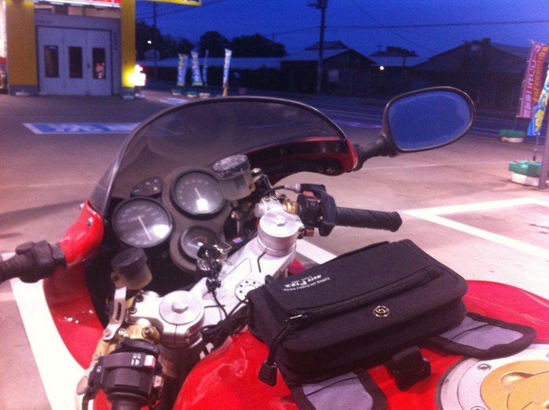
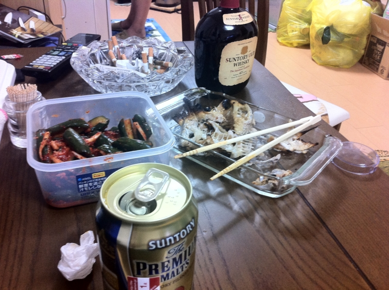

電話で父ちゃんが寂しそうにしていたので、急遽バイクを駆ってタダ飯とタダ酒をいただきに参った。行ってから知ったのだけど、明日は誕生日らしい。すっかり忘れていた。ちゃんと顔を出してよかった。とりあえず「知ってたで、知ってたで！」と取り繕う。

あとは適当に酒盛りして、しょうもない話をして、あんまり興味のない<a class="keyword" href="http://d.hatena.ne.jp/keyword/%C1%B4%B1%D1%A5%AA%A1%BC%A5%D7%A5%F3">全英オープン</a>に付き合って<a href="#f1" name="fn1" title="しかし、さすがに最高峰だけあって、素人目にも面白い">*1</a>、寝た。

<blockquote class="twitter-tweet" lang="ja">
昨日、親父と橋下市長どないやねんという話をしてた。政治的な見方ではあんまり一致しなかったものの、「絶倫やな」という点では完全に意見が一致した。
&mdash; だるやなぎさん (@daruyanagi) <a href="https://twitter.com/daruyanagi/status/227222828934643712" data-datetime="2012-07-23T02:05:18+00:00">7月 23, 2012</a></blockquote>

<blockquote class="twitter-tweet" lang="ja">
そういえば、週末、うちの親父が「もう人種差別やめる、黒人の嫁さんでもいいから……貰ってこい……ふえぇぇぇ……」みたいなこと言ってて、ほんとうに申し訳ないなと思ったけど、人種差別やめてくれたので世界に役立ったと思った
&mdash; だるやなぎさん (@daruyanagi) <a href="https://twitter.com/daruyanagi/status/227252131109941248" data-datetime="2012-07-23T04:01:44+00:00">7月 23, 2012</a></blockquote>

まぁ、マジでそんだけ。

<a href="#fn1" name="f1" class="footnote-number">*1</a>:しかし、さすがに最高峰だけあって、素人目にも面白い

