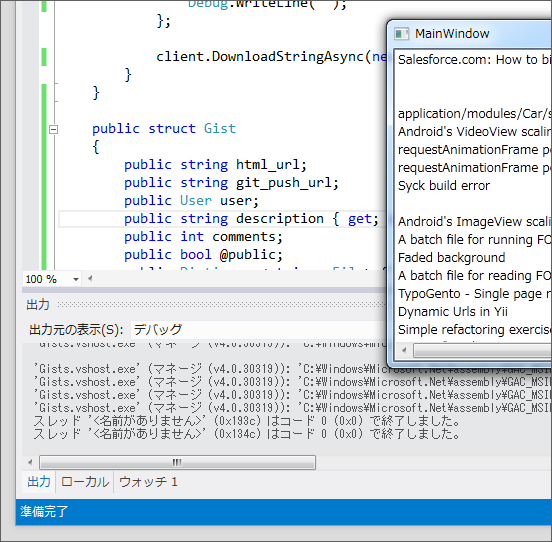

朝起きてボーっとしてたんだけど、そしたらふと「Windows Phone端末使って Gist でメモ取れたら便利じゃね？」と思いついた。早速、 <a class="keyword" href="http://d.hatena.ne.jp/keyword/Visual%20Studio">Visual Studio</a> を起動。けれど、趣味<a class="keyword" href="http://d.hatena.ne.jp/keyword/%A5%D7%A5%ED%A5%B0%A5%E9%A5%DE">プログラマ</a>ーの悲しさ、久しぶりだと何もかもすっかり忘れている<a href="#f1" name="fn1" title="歳もとったし">*1</a>。しかも、 <a class="keyword" href="http://d.hatena.ne.jp/keyword/Silverlight">Silverlight</a> だといろいろ機能が欠けてて面倒くさいことも判明。とりあえず、 <a class="keyword" href="http://d.hatena.ne.jp/keyword/WPF">WPF</a> で試作品でも作ることにした。 OAuth は面倒そうだったので、それも後回し。まずは Public の Gist を取得して ListBox に並べるところから始めよう。

<b>MainWindow.<a class="keyword" href="http://d.hatena.ne.jp/keyword/xaml">xaml</a></b>

<pre class="code lang-xml" data-lang="xml" data-unlink>&lt;Grid&gt;
&lt;ListBox Name=&quot;listBoxGists&quot;&gt;
&lt;/ListBox&gt;
&lt;/Grid&gt;
</pre>
<b>MainWindow.<a class="keyword" href="http://d.hatena.ne.jp/keyword/xaml">xaml</a>.cs</b>

<pre class="code lang-cs" data-lang="cs" data-unlink>using System.Net;
using Newtonsoft.Json;

/// &lt;summary&gt;
/// MainWindow.<a class="keyword" href="http://d.hatena.ne.jp/keyword/xaml">xaml</a> の相互作用ロジック
/// &lt;/summary&gt;
public partial class MainWindow : Window
{
public MainWindow()
{
InitializeComponent();
}

private void MainWindow_Loaded(
object sender, RoutedEventArgs e)
{
var client = new WebClient();

client.DownloadStringCompleted += (_sender, _e) =&gt;
{
listBoxGists.ItemsSource = JsonConvert
.DeserializeObject&lt;Gist[]&gt;(_e.Result);
};

client.DownloadStringAsync(
new <a class="keyword" href="http://d.hatena.ne.jp/keyword/Uri">Uri</a>(&quot;<a class="keyword" href="http://d.hatena.ne.jp/keyword/https">https</a>://<a class="keyword" href="http://d.hatena.ne.jp/keyword/api">api</a>.github.com/gists&quot;));
}
}

public struct Gist
{
public string html_url;
public string git_push_url;
public User user;
public string description;
public int comments;
public bool @public;
public Dictionary&lt;string, File&gt; files;
public string created_at;
public string url;
public string id;
public string updated_at;
public string git_pull_url;
}

public struct User
{
public string <a class="keyword" href="http://d.hatena.ne.jp/keyword/avatar">avatar</a>_url;
public string gravatar_id;
public string login;
public string url;
public string id;
}

public struct File
{
public string @type;
public string filename;
public string raw_url;
public string language;
public string size;
}
</pre>
これは酷いベタ書きでござる<a href="#f2" name="fn2" title="意外なことに、ここまではぐぐることもなく、案外すんなり書けたんだよ！">*2</a>。見る人が見たら殴りにくるよね？

<h3>第一の失敗</h3>

初回ビルドは成功。しかも、ちゃんと動いているみたいだ。けれど、数分後にもう一度試すと例外が発生するようになった。なぜだ。

けれど、これは比較的簡単に原因がわかった。エラーがでた箇所の JSON をみてみる。

日本語がうまく処理されていないらしい。ちゃんと WebClient の<a class="keyword" href="http://d.hatena.ne.jp/keyword/%A5%A8%A5%F3%A5%B3%A1%BC%A5%C9">エンコード</a>を指定していなかった……

<pre class="code lang-cs" data-lang="cs" data-unlink>var client = new WebClient()
{
Encoding = System.Text.UTF8Encoding.UTF8
};
</pre>
日本語のデータが含まれていても、例外が出なくなった。うまくいった。

<h3>第二の失敗</h3>

気をよくしたので、ついでに ListBox の見た目をもう少しよくしようと思った。

<pre class="code lang-xml" data-lang="xml" data-unlink>&lt;Grid&gt;
&lt;ListBox Name=&quot;listBoxGists&quot;&gt;
&lt;ListBox.ItemTemplate&gt;
&lt;DataTemplate&gt;
&lt;StackPanel&gt;
&lt;TextBlock Text=&quot;{Binding description}&quot;/&gt;
&lt;/StackPanel&gt;
&lt;/DataTemplate&gt;
&lt;/ListBox.ItemTemplate&gt;
&lt;/ListBox&gt;
&lt;/Grid&gt;
</pre>

うまくいかないでござる！　うまくいかないでござる！

<blockquote>

System.Windows.Data Error: 40 : BindingExpression path error: 'description' property not found on 'object' ''Gist' (HashCode=284350719)'. BindingExpression:Path=description; DataItem='Gist' (HashCode=284350719); target element is 'TextBlock' (Name=''); target property is 'Text' (type 'String')

</blockquote>

などというエラーがたくさんでている。ここで1時間が経過してタイムオーバー。さすがにもう会社へ行かなくてはいけない。

しかし、会社の椅子に座った途端、ふと気がついた。もしかしたら……！

家に帰って早速コードを一行だけ変更。

<pre class="code lang-cs" data-lang="cs" data-unlink>public struct Gist
{
public string html_url;
public string git_push_url;
public User user;
public string description { get; set; } /* Here! */
public int comments;
public bool @public;
public Dictionary&lt;string, File&gt; files;
public string created_at;
public string url;
public string id;
public string updated_at;
public string git_pull_url;
}
</pre>

お見事！　フィールドは<a class="keyword" href="http://d.hatena.ne.jp/keyword/%A5%D0%A5%A4%A5%F3%A5%C7%A5%A3%A5%F3%A5%B0">バインディング</a>できないのでした。

しかし、なんでこんなところで躓いているんだろう……まったく、わたくしさまの人生そのものですな。

<a href="#fn1" name="f1" class="footnote-number">*1</a>:歳もとったし

<a href="#fn2" name="f2" class="footnote-number">*2</a>:意外なことに、ここまではぐぐることもなく、案外すんなり書けたんだよ！

