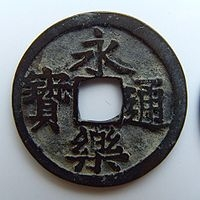
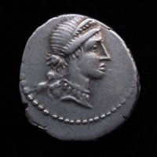

<table>
<tr>
<th></th>
<th>東洋の貨幣</th>
<th>西洋の貨幣</th>
</tr>
<tr>
<td></td>
<td></td>
<td></td>
</tr>
<tr>
<td>形状</td>
<td>円形方孔</td>
<td>円形無孔</td>
</tr>
<tr>
<td>刻印</td>
<td>貨幣名（漢字4文字）</td>
<td>権力者の肖像</td>
</tr>
<tr>
<td>材質</td>
<td>銅銭のみ（＋手形）</td>
<td>金貨・銀貨・銅貨</td>
</tr>
<tr>
<td>製法</td>
<td>鋳造（目方は不均一）</td>
<td>鍛造（目方が均一）</td>
</tr>
<tr>
<td>性質</td>
<td>権威による保証に基づく名目的貨幣</td>
<td>材料それ自体の価値に基づく素材貨幣</td>
</tr>
<tr>
<td></td>
<td>私鋳の横行</td>
<td>計算貨幣（ミナ、タレント）</td>
</tr>
</table>
無論、細かい差異は多くあるが、だいたいこんな感じ。近代まではむしろ西洋より東洋の方が「貨幣経済」が発達していた。

しかし、力量の似た大国が切磋琢磨するうちに、西洋の経済、通商と産業は急激に発展する。それは素材貨幣社会から名目貨幣社会への急速な脱皮であり、西洋の初期「経済学」のひとつの重要なテーマだった<a href="#f1" name="fn1" title="ブリオニズムから古典派経済学へ">*1</a>。もしかしたら固定電話網の発達がかえって携帯電話の普及を妨げるように、名目貨幣を自明のものとして受け入れすぎていたがために東洋では「経済学」が発達しなかったのかもしれない。

一方、古代日本では、そっくりそのまま中国の貨幣「システム」が輸入された。初期より金貨・銀貨ではなくもっぱら銅銭の普及を図り、それが普及する前から私鋳への対策を練っていた<a href="#f2" name="fn2" title="和銅期に私鋳対策をテーマとして書かれた官吏の論文が残っている">*2</a>というのだから興味深い。当時の朝廷と官僚は、現代の財務官僚顔負けの知性を持っていたようだ。しかし、その流通銭の多くは中国からの輸入に頼っていたし、それも途絶えた戦国期以降は、逆に素材貨幣経済へと戻ってしまった。

<blockquote cite="http://www.47news.jp/CN/201207/CN2012072401001999.html">

<a class="keyword" href="http://d.hatena.ne.jp/keyword/%BA%E2%CC%B3%BE%CA">財務省</a>が日本の得意とする貨幣技術を生かし、新興国からの製造受注を目指して“営業活動”に乗り出すことが２４日、分かった。国内では発行量が減っており、過剰となった設備の有効活用につなげる。専門技術の衰えを防ぐのも狙いで、９～１２月にベトナムやサウジアラビアなど１４カ国へ職員を派遣する予定だ。

<cite><a href="http://www.47news.jp/CN/201207/CN2012072401001999.html">&#x8CA1;&#x52D9;&#x7701;&#x3001;&#x8CA8;&#x5E63;&#x88FD;&#x9020;&#x306E;&#x53D7;&#x6CE8;&#x76EE;&#x6307;&#x3059;&#x3000;&#x65B0;&#x8208;&#xFF11;&#xFF14;&#x30AB;&#x56FD;&#x3067; - 47NEWS&#xFF08;&#x3088;&#x3093;&#x306A;&#x306A;&#x30CB;&#x30E5;&#x30FC;&#x30B9;&#xFF09;</a></cite>
</blockquote>

それがいまや、めぐりめぐって輸出する側に回るというのだから歴史は面白い。

<a href="http://www.amazon.co.jp/exec/obidos/ASIN/4022596740/bestylesnet-22/">貨幣の日本史 (朝日選書)</a>
<ul><li>作者: 東野治之</li><li>出版社/メーカー: <a class="keyword" href="http://d.hatena.ne.jp/keyword/%C4%AB%C6%FC%BF%B7%CA%B9%BC%D2">朝日新聞社</a></li><li>発売日: 1997/03</li><li>メディア: ペーパーバック</li><li>購入: 1人 クリック: 10回</li><li><a href="http://d.hatena.ne.jp/asin/4022596740/bestylesnet-22" target="_blank">この商品を含むブログ (1件) を見る</a></li></ul>

<a href="#fn1" name="f1" class="footnote-number">*1</a>:ブリオニズムから古典派経済学へ

<a href="#fn2" name="f2" class="footnote-number">*2</a>:和銅期に私鋳対策をテーマとして書かれた官吏の論文が残っている

