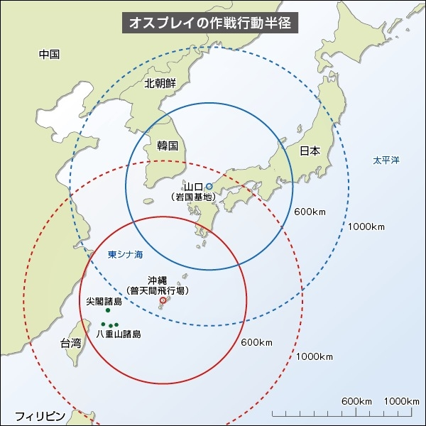

米軍が MV22 を配備する件について、日本政府ができることは少ない。発言権がほとんどないと言ってもいいぐらいだ。結局、日本は米軍に守ってもらっているのだから。なので、いかに市民団体やマスコミが騒ごうが、アメリカがその気にならない限り、配備が撤回されることはないだろう。

もし本気で MV22 の配備を撤回させようと思うのならば、日米の軍事的関係こそを見直さなければならない。ぶっちゃけよう。日本が憲法九条を改正して再軍備を行い、「米軍に守ってもらっている」立場を解消する必要がある。それをアメリカが望むかどうかはわからないが……個人的にはまったく反対だけれども、核武装についてもタブーとせず、真剣に議論すべきだと思う。

これは米軍基地の問題にも言えることだ。基地そのものに反対しても基地はなくならない。これは外交問題なので、地方選挙の論点にするのも無駄だ。

それにしても、原発問題でも思うのだけれど、なぜ目先の問題ばかりにとらわれて、本質的なアクションを避けるのだろうね。みんな本当のところは現状維持を望んでいるのではないかとさえ思う。

<table>
<tr>
<th></th>
<th>MV22 問題・基地問題</th>
<th>原発問題</th>
</tr>
<tr>
<td>実際のアクション</td>
<td>MV22 の搬入反対・基地反対</td>
<td>原発再稼働反対</td>
</tr>
<tr>
<td>本質的な問題</td>
<td>日米安保条約</td>
<td>原発の存在がロックインされた経済</td>
</tr>
<tr>
<td>本質的なアクション</td>
<td>日本の軍事的あり方の見直し</td>
<td>原発なしで持続可能な経済の模索</td>
</tr>
</table>

わしはあまり軍事に詳しくないけれど、 MV22 の存在が海兵隊のグアム移転にもリンクしているのなら、 MV22 への反対は沖縄の現状維持を意味するかもしれない。それにしても MV22 、日本にもほしいぐらいだな（1機約64億円らしい）。これがあれば、山間部・島嶼部の自然災害や侵攻にも対応できそうだし。むしろ日本向きじゃないのかなと思ったりする。

<ul>
<li><a href="https://blog.daruyanagi.jp/entry/2012/05/07/063811">&#x305D;&#x308D;&#x305D;&#x308D;&#x539F;&#x767A;&#x554F;&#x984C;&#x306B;&#x3064;&#x3044;&#x3066;&#x3072;&#x3068;&#x3053;&#x3068;&#x8A00;&#x3063;&#x3066;&#x304A;&#x304F;&#x304B;&#x3002; - &#x3060;&#x308B;&#x308D;&#x3050;</a></li>
</ul>