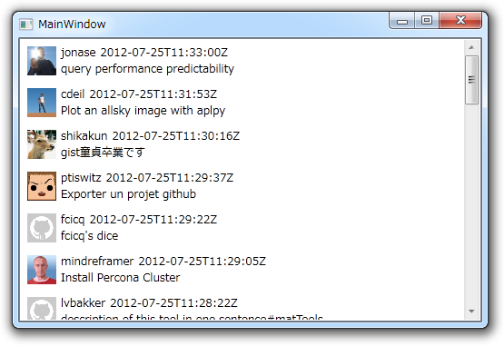

<a href="https://blog.daruyanagi.jp/entry/2012/07/24/201150">&#x5931;&#x6557;&#x306E;&#x6570;&#x3060;&#x3051;&#x5F37;&#x304F;&#x306A;&#x308A;&#x305F;&#x3044; - &#x3060;&#x308B;&#x308D;&#x3050;</a> の補足。

<pre class="code" data-lang="" data-unlink>&#34;files&#34;: {
&#34;close_duplicate_tab.js&#34;: {
&#34;type&#34;: &#34;application/javascript&#34;,
&#34;filename&#34;: &#34;close_duplicate_tab.js&#34;,
&#34;raw_url&#34;: &#34;https://gist.github.com/raw/3175551/c7590ad8cfdd352150a8c845ff96fb9f30bd3a65/close_duplicate_tab.js&#34;,
&#34;language&#34;: &#34;JavaScript&#34;,
&#34;size&#34;: 1465
}
}</pre>
この Json は Dictionary&lt;string, File&gt; でうけることになるのだけど、 File を最初以下のとおりに定義していた。

<pre class="code lang-cs" data-lang="cs" data-unlink>public struct File
{
public string @type;
public string filename;
public string raw_url;
public string language;
public string size;
}
</pre>
これでもいいのだけれど、フィールドはビューへバインディングできないのでプロパティにした、というのは前回に言った<a href="#f-1abcc75c" name="fn-1abcc75c" title="type の前に @ をつけるのは、 type が予約語であるため。アクセスする場合は File.type でよい">*1</a>。

<pre class="code lang-cs" data-lang="cs" data-unlink>public struct File
{
public string @type { get; set; }
public string filename { get; set; }
public string raw_url { get; set; }
public string language { get; set; }
public string size { get; set; }
}
</pre>
これでうまくいったのだけれど……うっかり struct を class にしてなかった。それでも動くんだな…… struct でもプロパティ持てるの？<a href="#f-1fd0fe34" name="fn-1fd0fe34" title="持てるらしい！　struct はメンバ関数をもてるので、プロパティがプライベートメンバ変数およびそのセッター・ゲッターの糖衣構文だと考えれば、別にできてもおかしくはないということかなぁ。教えて、エロいひと！">*2</a>　よくわからなくなってくる。ここでは値を渡すことはないし、のちのち面倒くさいことになったら嫌なので class にしておいたほうが無難かな。

まぁ、それは置いておこう。

次に気になるのは、プロパティが Snake Case になっていること。やっぱり Pascal Case にしておきたい。試してみたところ<a href="#f-2b14458a" name="fn-2b14458a" title="ドキュメント読めよ">*3</a>、 Jason.NET でデシリアライズするときには大文字と小文字が区別されないようなので、先頭を大文字にしてもいいようだ。

<pre class="code lang-cs" data-lang="cs" data-unlink>public class File
{
public string @Type { get; set; }
public string Filename { get; set; }
public string Raw_Url { get; set; }
public string Language { get; set; }
public string Size { get; set; }
}
</pre>
しかし、これでも Raw_Url のようにアンダーバーが残ってしまう。 Snake Case を勝手に Pascal Case のフィールド・プロパティへ割り当ててくれないかなぁ、とほのかに期待していたのだけれど、そこまではやってくれないみたい<a href="#f-82a71e39" name="fn-82a71e39" title="Ruby on Rails ならやってくれただろう">*4</a>。そんなときは、 JasonProperty 属性を利用すればよいようだ。

<pre class="code lang-cs" data-lang="cs" data-unlink>public class File
{
public string @Type { get; set; }
public string Filename { get; set; }
[JsonProperty(&quot;raw_url&quot;)]
public string RawUrl { get; set; }
public string Language { get; set; }
public string Size { get; set; }
}
</pre>
それだけ。

<a href="#fn-1abcc75c" name="f-1abcc75c" class="footnote-number">*1</a>:type の前に @ をつけるのは、 type が予約語であるため。アクセスする場合は File.type でよい

<a href="#fn-1fd0fe34" name="f-1fd0fe34" class="footnote-number">*2</a>:持てるらしい！　struct はメンバ関数をもてるので、プロパティがプライベートメンバ変数およびそのセッター・ゲッターの糖衣構文だと考えれば、別にできてもおかしくはないということかなぁ。教えて、エロいひと！

<a href="#fn-2b14458a" name="f-2b14458a" class="footnote-number">*3</a>:ドキュメント読めよ

<a href="#fn-82a71e39" name="f-82a71e39" class="footnote-number">*4</a>:Ruby on Rails ならやってくれただろう

