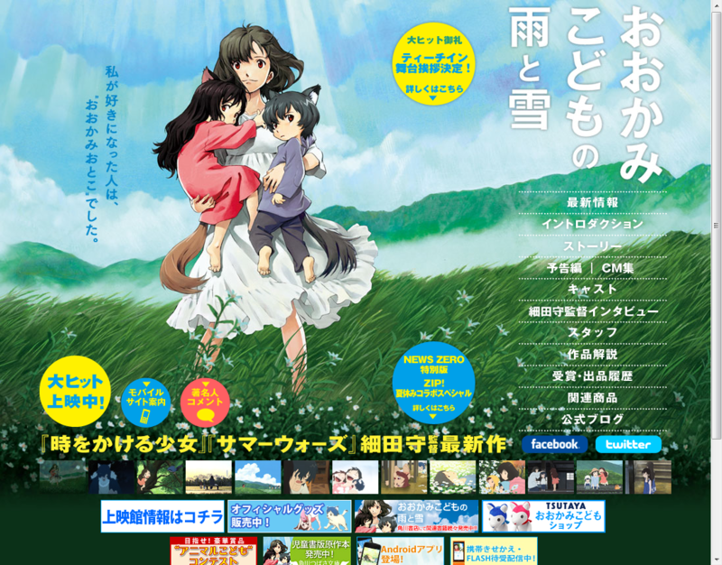

<a href="http://www.ookamikodomo.jp">&#x6620;&#x753B;&#x300C;&#x304A;&#x304A;&#x304B;&#x307F;&#x3053;&#x3069;&#x3082;&#x306E;&#x96E8;&#x3068;&#x96EA;&#x300D;</a>

久しぶりで劇場で泣きかけた。油断すると涙がじわじわでてきて困った……たぶん、今年最高傑作の映画だなぁ。まだ夏だけど。

まず、オープニングの美しさに心奪われ、期待高まる。これはきっとアタリだなぁ……と感じさせる。シナリオにどんでん返しはないけれど<a href="#f1" name="fn1" title="ナレーションが終始“雪”の目線から語られることでも、二人の選択がどのような結果になるのかが途中で読めてしまう。けれど、なにも問題ない。">*1</a>、淡々と丁寧に二人の子どもの変化が塗り重ねられていて、ストーリーの重量感・立体感は十分<a href="#f2" name="fn2" title="『サマー・ウォーズ』はその点、軽薄であんまり好みではない。とても面白いことには同意するけど">*2</a>。もう一度、劇場でゆっくり味わいたいぐらい。

それにしても、対比が印象的な映画だった。

ひとが多いし、なんでもあるのに居所のない都会。 
ひとが少ないし、なにもないのに温かい田舎<a href="#f3" name="fn3" title="馴染むのは生半可じゃなかったけど！">*3</a>。

やんちゃな“雪”と、おとなしい“雨”。 
ひとになりたがる“雪”と、おおかみになりたい“雨”。

明るく幸せな雪の日と、暗く決断を迫る雨の日。

そして、それを終始笑顔で見守るお母さんの“花”。お母さんってのはほんとすごいものだ。

この映画を観ているあいだ、まるで“おとぎばなし”のように時間が過ぎていった感じがする。親になるっていうのはあんな感じなんだろうか。それだったら、ちょっぴり切ないことだ。

あと、焼き鳥が美味しそうだった。

<a href="#fn1" name="f1" class="footnote-number">*1</a>:ナレーションが終始“雪”の目線から語られることでも、二人の選択がどのような結果になるのかが途中で読めてしまう。けれど、なにも問題ない。

<a href="#fn2" name="f2" class="footnote-number">*2</a>:『サマー・ウォーズ』はその点、軽薄であんまり好みではない。とても面白いことには同意するけど

<a href="#fn3" name="f3" class="footnote-number">*3</a>:馴染むのは生半可じゃなかったけど！

