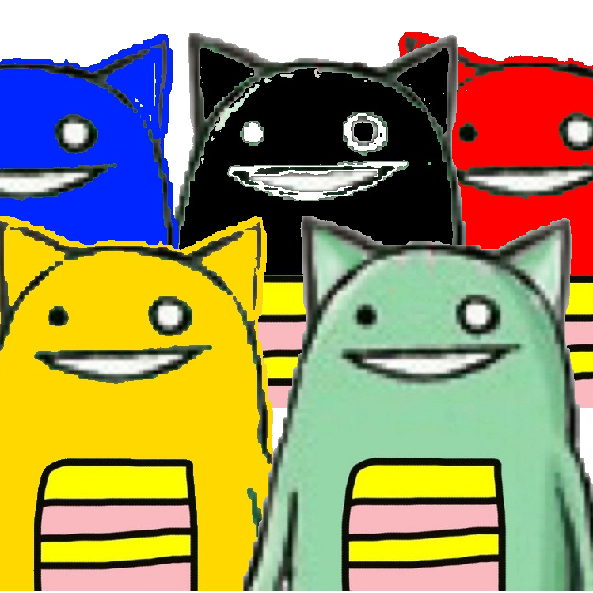

週末は <a href="https://blog.daruyanagi.jp/entry/2012/07/28/212349">&#x300E;&#x304A;&#x304A;&#x304B;&#x307F;&#x3053;&#x3069;&#x3082;&#x306E;&#x96E8;&#x3068;&#x96EA;&#x300F; - &#x3060;&#x308B;&#x308D;&#x3050;</a> を観たあと、頭痛でダウン。その日の朝からあんまり具合がよくなかったのだけれど、夕方には本格的にダメになり、日曜日は完全に起動不能。結局、月曜日も会社を休んでしまいました。今も、右目の奥あたりに頭痛が居座っている感じ。

頭痛だと本を読む気にもならなくて、本当になにもせず、ただ時間だけが過ぎていく。

今思えば、せっかくだからオリンピックでも観ればいいのに、それすら思いつかなかった。ぼんやり昔のことを思い出したり、これからどうしようか考えたり。昔話に関しては、書く気になったらまたそのときにでも。久しぶりに思い出したことがあるので書きたいのだけれど、さすがにブログに書くのは恥ずかしい気もしないでもない。これからなにをするかについてもまとめておきたいけれど、これも今じゃない気がする。

そんなこんなで、いろいろ書きたいのだけれど本調子じゃないので、5分で作った新しい Twitter アイコンだけ載っけとく。やっつけ感たっぷりだけれど、五輪期間中はこれで行くよ！　どうも体調が悪いと、細かいことをする根気が続かない。

