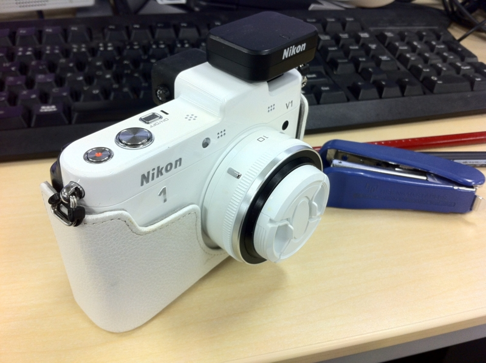
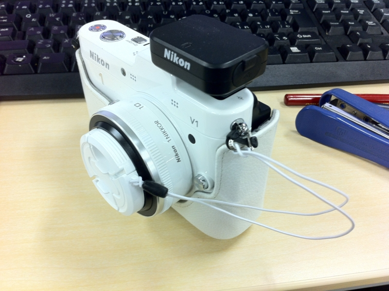

Nikon 1 V1（ニコイチ）のレンズキャップをなくしてしまった。 <a href="https://blog.daruyanagi.jp/entry/2012/07/28/212349">&#x300E;&#x304A;&#x304A;&#x304B;&#x307F;&#x3053;&#x3069;&#x3082;&#x306E;&#x96E8;&#x3068;&#x96EA;&#x300F; - &#x3060;&#x308B;&#x308D;&#x3050;</a> を観に行った帰り、ビックカメラで買おうと思っていたのだけれど、どうやら純正品は黒しかない上、980円もするらしい。たかだかレンズキャップなのに。

というわけで、サードパーティー製のレンズキャップを買ってみた。お値段は純正の半額、500円。ちょっと分厚くてゴツいけれど、センターでつまんで外せるし、ちゃんと白もラインナップされている。レンズキャップをなくさないように、弾力性のある紐で本体に結びつけて置けるのもグッド。

ただちょっと不満だったのは、そのゴム紐。余ると左右に分かれて、どこかに引っ掛けてしまいそう。さいわい紐には弾力があるので、ちょっと伸ばして適当なところに引っ掛けておくと邪魔にならなくていいのだけれど、できたらココは一本にまとめておいてほしかったかな。

<a href="http://www.amazon.co.jp/exec/obidos/ASIN/B005IL0EK2/bestylesnet-22/">ETSUMI レンズキャップ インナーワンタッチキャップ 46mm E-6389</a>
<ul><li>出版社/メーカー: エツミ</li><li>発売日: 2011/08/30</li><li>メディア: Camera</li><li> クリック: 1回</li><li><a href="http://d.hatena.ne.jp/asin/B005IL0EK2/bestylesnet-22" target="_blank">この商品を含むブログを見る</a></li></ul>

（だいたいこんな感じの。ニコイチは径41mmなので間違いなく！）

