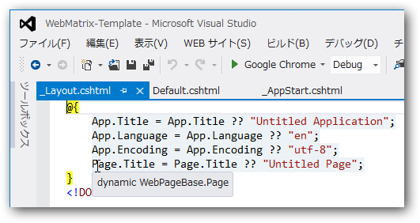
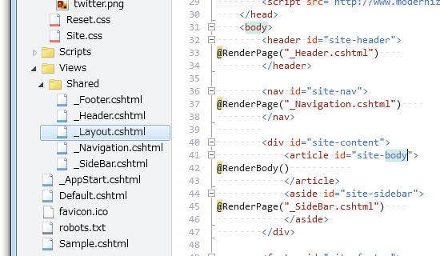
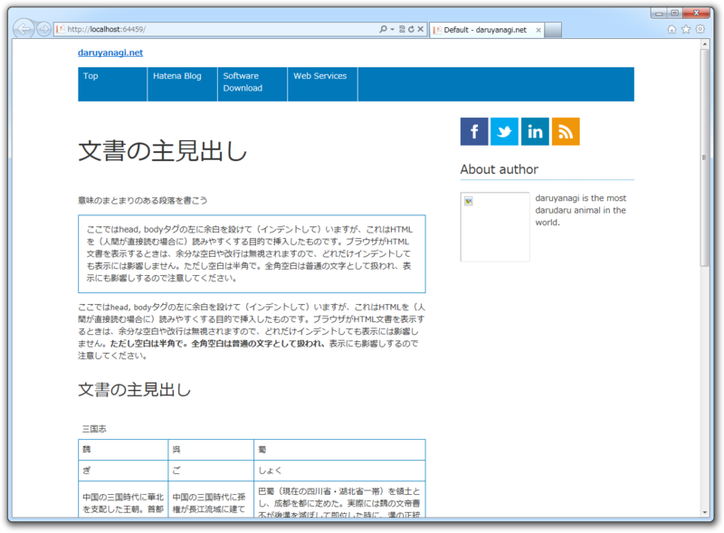

<blockquote cite="http://www.microsoft.com/ja-jp/download/details.aspx?id=15979">

Razor 構文を使用する <a class="keyword" href="http://d.hatena.ne.jp/keyword/ASP.NET">ASP.NET</a> Web Pages は web framework および <a class="keyword" href="http://d.hatena.ne.jp/keyword/WebMatrix">WebMatrix</a> の一部で、Windows を使用した Web サイトの構築で必要なすべてが含まれます。

<cite><a href="http://www.microsoft.com/ja-jp/download/details.aspx?id=15979">
Download: Razor &#x69CB;&#x6587;&#x3092;&#x4F7F;&#x7528;&#x3059;&#x308B; ASP.NET Web Pages - Microsoft Download Center - Download Details
</a></cite>
</blockquote>

<a class="keyword" href="http://d.hatena.ne.jp/keyword/WebMatrix">WebMatrix</a> + <a class="keyword" href="http://d.hatena.ne.jp/keyword/ASP.NET">ASP.NET</a> Web Pages でキレイにコーディングしたいなぁ、と思うのだけれど、どうするのが正しいのかよくわからない。自分なりのテンプレみたいなのがほしいんだけれどね。

<h3>設定の共通化</h3>

まず、 Web サイト全体の設定は一元管理したい。たぶん、これは“_AppStart.cshtml”に記述するのが正しいのだろう。

<pre class="code lang-cs" data-lang="cs" data-unlink>@{
App.Title = &quot;daruyanagi.net&quot;;
App.Author = &quot;daruyanagi&quot;;
App.Language = &quot;ja&quot;;
App.Encoding = &quot;<a class="keyword" href="http://d.hatena.ne.jp/keyword/utf-8">utf-8</a>&quot;;
App.Copyright = &quot;Copyright © 2012 daruyanagi. All rights reserved.&quot;;
App.Description = &quot;This is the web site of Hidetoshi Yanagi <a class="keyword" href="http://d.hatena.ne.jp/keyword/a.k.a.">a.k.a.</a> daruyanagi.&quot;;
App.Keyword = &quot;daruyanagi&quot;;
}
</pre>
これでも十分に簡素だけれど、設定ファイルやデータベースからロードできるようにすればもっとクールかもしれない。

App（や、このあとにでてくる Page）は dynamic 型（WebPageExecutingBase.App<a href="#f1" name="fn1" title="WebPageExecutingBase は The base class for all Plan9 files (_pagestart, _appstart, and regular pages) らしいのだけれど、 Plan9 ってなんぞ。今度調べよう">*1</a>）なので、あらかじめメンバーを定義しておかなくても、あとからいろいろ追加できる。

<pre class="code lang-cs" data-lang="cs" data-unlink>@{
AppState[&quot;customAppName&quot;] = &quot;Application Name&quot;;
}
</pre>
ほんとは AppState というのを使うっぽいけど、まぁ、いいや。

<h3>レイアウトの共通化</h3>

つぎは、 Web サイトのデザインの共通化。 HTML 5 でレイアウトファイル（“~/Views/Shared/_Layout.cshtml”）記述して、 <a class="keyword" href="http://d.hatena.ne.jp/keyword/jQuery">jQuery</a> / Modernizr / <a class="keyword" href="http://d.hatena.ne.jp/keyword/html5">html5</a>.js あたりのスクリプトをロードしておくのがモダンなやり方というものだろう。あと、リセット <a class="keyword" href="http://d.hatena.ne.jp/keyword/CSS">CSS</a> で一度スタイルをリセットし、そのあとに独自の <a class="keyword" href="http://d.hatena.ne.jp/keyword/CSS">CSS</a> を充てるようにした。ブラウザー幅によってデザインを変更するレスポンシブな部分を担当する <a class="keyword" href="http://d.hatena.ne.jp/keyword/CSS">CSS</a> を切り分ければ、より一層メンテナンス性は上がるかも。ただ、あんまりファイル数は多くしたくないな。

<pre class="code lang-html" data-lang="html" data-unlink>@{
App.Title = App.Title ?? &quot;Untitled Application&quot;;
App.Language = App.Language ?? &quot;en&quot;;
App.Encoding = App.Encoding ?? &quot;utf-8&quot;;
Page.Title = Page.Title ?? &quot;Untitled Page&quot;;
}
&lt;!DOCTYPE html&gt;

&lt;html lang=&quot;@App.Language&quot;&gt;
&lt;head&gt;
        &lt;title&gt;@Page.Title - @App.Title&lt;/title&gt;
        
        &lt;meta charset=&quot;@App.Encoding&quot; /&gt;
        &lt;meta name=&quot;description&quot; content=&quot;@App.Description&quot;&gt;
        &lt;meta name=&quot;keywords&quot; content=&quot;@App.Keyword&quot;&gt;
        &lt;meta name=&quot;author&quot; content=&quot;@App.Author&quot;&gt;
        &lt;meta name=&quot;copyright&quot; content=&quot;@App.Copyright&quot;&gt;
        &lt;meta name=&quot;genarator&quot; content=&quot;Microsoft <a class="keyword" href="http://d.hatena.ne.jp/keyword/WebMatrix">WebMatrix</a> 2.0&quot;&gt;
        &lt;meta name=&quot;viewport&quot;
              content=&quot;width=device-width,initial-scale=1&quot;&gt;

        &lt;link rel=&quot;stylesheet&quot; href=&quot;~/Content/Reset.<a class="keyword" href="http://d.hatena.ne.jp/keyword/css">css</a>&quot; /&gt;
        &lt;link rel=&quot;stylesheet&quot; href=&quot;~/Content/Site.<a class="keyword" href="http://d.hatena.ne.jp/keyword/css">css</a>&quot; /&gt;
        
        &lt;!--[if lt IE 9]&gt;
        &lt;script src=&quot;http://html5shiv.googlecode.com/<a class="keyword" href="http://d.hatena.ne.jp/keyword/svn">svn</a>/trunk/<a class="keyword" href="http://d.hatena.ne.jp/keyword/html5">html5</a>.js&quot;&gt;&lt;/script&gt;
        &lt;![endif]--&gt;

        &lt;script src=&quot;http://code.<a class="keyword" href="http://d.hatena.ne.jp/keyword/jquery">jquery</a>.com/<a class="keyword" href="http://d.hatena.ne.jp/keyword/jquery">jquery</a>-latest.js&quot;&gt;&lt;/script&gt;
        &lt;script src=&quot;http://www.modernizr.com/downloads/modernizr-latest.js&quot;&gt;&lt;/script&gt;
    &lt;/head&gt;
&lt;body&gt;
&lt;header id=&quot;site-header&quot;&gt;
@RenderPage(&quot;_Header.cshtml&quot;)
&lt;/header&gt;

&lt;nav id=&quot;site-nav&quot;&gt;
@RenderPage(&quot;_Navigation.cshtml&quot;)
&lt;/nav&gt;

&lt;div id=&quot;site-content&quot;&gt;
&lt;article id=&quot;site-body&quot;&gt;
@RenderBody()
&lt;/article&gt;
&lt;aside id=&quot;site-<a class="keyword" href="http://d.hatena.ne.jp/keyword/sidebar">sidebar</a>&quot;&gt;
@RenderPage(&quot;_<a class="keyword" href="http://d.hatena.ne.jp/keyword/SideBar">SideBar</a>.cshtml&quot;)
&lt;/aside&gt;
&lt;/div&gt;

&lt;footer id=&quot;site-footer&quot;&gt;
@RenderPage(&quot;_Footer.cshtml&quot;)
&lt;/footer&gt;
&lt;/body&gt;
&lt;/html&gt;
</pre>
冒頭は、“_AppStart.cshtml”で Title などを指定し忘れたときに、最低限のパラメータを指定しておくコード。今まで気づかなかったのだけれど、&lt;meta name="author" content="@App.Author"&gt; で @App.Author が null だと、 content 属性は出力されず、 &lt;meta name="author"&gt; だけが出力されるんだね。なかなか頭いいな。

ヘッダーやナビゲーション、サイドバー、フッターは外部ファイルに追い出した。ここらへんは「分割し、統治せよ（divide et impera）」<a href="#f2" name="fn2" title="http://www.kitashirakawa.jp/taro/2011/05/divide-et-impera/">*2</a>ってやつですな。

<pre class="code lang-html" data-lang="html" data-unlink>@{
Layout = &quot;~/Views/Shared/_Layout.cshtml&quot;;

Page.Title = &quot;Default&quot;;
}
&lt;p&gt;Web ページの内容。&lt;/p&gt;
</pre>
あとは、こんな感じで @RenderBody() で<a class="keyword" href="http://d.hatena.ne.jp/keyword/%A5%EC%A5%F3%A5%C0%A5%EA%A5%F3%A5%B0">レンダリング</a>する内容を記述すればいいというわけ。ページ固有のデータは、 dynamic 型の変数 Page に格納しておくことができる。

<pre class="code lang-" data-lang="" data-unlink>@{
PageData[&#34;Color1&#34;] = &#34;Red&#34;;
PageData[&#34;Color2&#34;] = &#34;Blue&#34;;
} </pre>
PageData （IDictionary<object, dynamic>）に入れてもいいっぽい。 Page.Title にいれた値は、 PageData["Title"] で取り出せるし、たぶんその逆も可なので好きなほうを使うといい。もしかしたらパフォーマンス的な違いがあるのかもしれないけれど。

あとはこれを適当に <a class="keyword" href="http://d.hatena.ne.jp/keyword/CSS">CSS</a> で装飾すると、こんな感じになる。

<h3>これからの目標</h3>

今見返してふと思ったのは、比較的簡単にテーマ機能なんかを実装できるなということ。ただデザインを変えたいがために、毎回一からこんなの作るのはアホらしい。

あと、 @RenderPage("_Footer.cshtml")  は @RenderFooter() などと記述できるとカッコいいな。「フッターはテーマフォルダ直下の“_Footer.cshtml”に書く」。なるべく規約ベースで。これも簡単にできそうだ。

汎用的な部分はガンガン外に追い出して、再利用できるといい。

<h3>まとめ</h3>

<a class="keyword" href="http://d.hatena.ne.jp/keyword/ASP.NET%20MVC">ASP.NET MVC</a> はとてもすばらしい技術だと思うけれど、素人に毛の生えたレベルではどうもデカ過ぎる。その点、 <a class="keyword" href="http://d.hatena.ne.jp/keyword/ASP.NET">ASP.NET</a> Web Pages はちょうどいい。大規模なサービスを作ろうと思うとすぐぐちゃぐちゃになって破綻するけれど（そんな場合は <a class="keyword" href="http://d.hatena.ne.jp/keyword/MVC">MVC</a> パターンの力を借りるべきだ）、“Template.html”をひたすらコピペして新しい記事を作るような個人サイトならば、 <a class="keyword" href="http://d.hatena.ne.jp/keyword/ASP.NET">ASP.NET</a> Web Pages で十分なんだ。サーバーを <a class="keyword" href="http://d.hatena.ne.jp/keyword/IIS">IIS</a> にして、拡張子を html から cshtml にするだけでいい。たったこれだけで、 <a class="keyword" href="http://d.hatena.ne.jp/keyword/C%23">C#</a> ＋ Razor を使ってキレイにコーディングできる。今から覚えるんだったら、 <a class="keyword" href="http://d.hatena.ne.jp/keyword/PHP">PHP</a> より <a class="keyword" href="http://d.hatena.ne.jp/keyword/C%23">C#</a> ＋ Razor のほうが簡潔かつ安全でいいと思うし。

ドキュメントは、とりあえずこれを読んどけばいい。わしも全部は読んでないけれど、これの紙バージョンをもっていてたまに読んでいる。お盆休み中に、また復習してみようと思う。

<ul>
<li><a href="http://msdn.microsoft.com/ja-jp/asp.net/gg193039">Razor &#x69CB;&#x6587;&#x3068; ASP.NET Web &#x30DA;&#x30FC;&#x30B8;</a></li>
</ul>
あとは、しばやんのやる気を待つしかない。

<ul>
<li><a href="http://shiba-yan.hatenablog.jp/entry/20110714/1310652120">PHP &#x3068;&#x6BD4;&#x8F03;&#x3057;&#x3066;&#x899A;&#x3048;&#x308B; ASP.NET Web Pages (1) - &#x3057;&#x3070;&#x3084;&#x3093;&#x96D1;&#x8A18;</a></li>
</ul>
また、おいおい Razor に関しては備忘録をかねて書いていきたいと思うかも。

<a href="#fn1" name="f1" class="footnote-number">*1</a>:WebPageExecutingBase は The base class for all Plan9 files (_pagestart, _appstart, and regular pages) らしいのだけれど、 Plan9 ってなんぞ。今度調べよう

<a href="#fn2" name="f2" class="footnote-number">*2</a>:http://www.kitashirakawa.jp/taro/2011/05/divide-et-impera/

