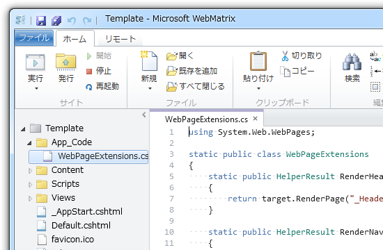

<blockquote cite="https://blog.daruyanagi.jp/entry/2012/08/07/054832">

あと、 @RenderPage("_Footer.cshtml") は @RenderFooter() などと記述できるとカッコいいな。「フッターはテーマフォルダ直下の“_Footer.cshtml”に書く」。なるべく規約ベースで。これも簡単にできそうだ。

<cite><a href="https://blog.daruyanagi.jp/entry/2012/08/07/054832">WebMatrix + ASP.NET Web Pages &#x3067;&#x30AD;&#x30EC;&#x30A4;&#x306B;&#x30B3;&#x30FC;&#x30C7;&#x30A3;&#x30F3;&#x30B0;&#x3057;&#x305F;&#x3044; - &#x3060;&#x308B;&#x308D;&#x3050;</a></cite>
</blockquote>

これをやってみた。なんていうか、“_Footer.cshtml”なんて固定値、あんまりよく目にするところに書いておきたくない。

 

<h3>拡張メソッド</h3>

まずは拡張メソッドを試してみた。 WebPage クラスがあたかも最初から RenderFooter() をもっていたかのように見せかけるのが目的。“App_Code”フォルダを掘って、そのなかに C# クラスファイル（.cs）を作成する。 RenderBody() のシグネチャを参考にこういうのを作ってみた。

<pre class="code lang-cs" data-lang="cs" data-unlink>using System.Web.WebPages;

static public class WebPageExtensions
{
static public HelperResult RenderFooter(
this WebPage target, params object[] data)
{
return target.RenderPage(&quot;_Footer.cshtml&quot;, data);
}
}
</pre>
すると、 cshtml ファイルで @this.RenderFooter() という感じで呼べる。

<pre class="code lang-html" data-lang="html" data-unlink>:
:
&lt;div id=&quot;site-content&quot;&gt;
&lt;article id=&quot;site-body&quot;&gt;
@RenderBody()
&lt;/article&gt;
&lt;aside id=&quot;site-sidebar&quot;&gt;
@RenderPage(&quot;_SideBar.cshtml&quot;) &lt;!-- 古い書き方 --&gt;
&lt;/aside&gt;
&lt;/div&gt;

&lt;footer id=&quot;site-footer&quot;&gt;
@this.RenderFooter() &lt;!-- 新しい書き方 --&gt;
&lt;/footer&gt;
&lt;/body&gt;
&lt;/html&gt;
</pre>
そうなんだ、<b> this が要るんだ</b>。 @RenderBody() みたいに this を使わずに呼びたかったけれど、これはどうしようもないっぽい。

<h3>Func&lt;HelperResult&gt;</h3>

次に考えたのは、 Func&lt;HelperResult&gt; を使うこと。最初の @{……} セクションで RenderFooter を定義しておけば、 this なしの @RenderFooter() で使えるはず。

<pre class="code lang-cs" data-lang="cs" data-unlink>&lt;!DOCTYPE html&gt;

@{
App.Title = App.Title ?? &quot;Untitled Application&quot;;
App.Language = App.Language ?? &quot;en&quot;;
App.Encoding = App.Encoding ?? &quot;utf-8&quot;;
Page.Title = Page.Title ?? &quot;Untitled Page&quot;;

Func&lt;HelperResult&gt; RenderFooter =
() =&gt; RenderPage(&quot;_Footer.cshtml&quot;);
}

&lt;html lang=&quot;@App.Language&quot;&gt;
&lt;head&gt;
:
:
</pre>
cshtml ファイルはこんなかんじになる。

<pre class="code lang-html" data-lang="html" data-unlink>:
:
&lt;div id=&quot;site-content&quot;&gt;
&lt;article id=&quot;site-body&quot;&gt;
@RenderBody()
&lt;/article&gt;
&lt;aside id=&quot;site-sidebar&quot;&gt;
@RenderPage(&quot;_SideBar.cshtml&quot;) &lt;!-- 古い書き方 --&gt;
&lt;/aside&gt;
&lt;/div&gt;

&lt;footer id=&quot;site-footer&quot;&gt;
@RenderFooter() &lt;!-- 新しい書き方 --&gt;
&lt;/footer&gt;
&lt;/body&gt;
&lt;/html&gt;
</pre>
目的は達成したけれど、これはこれでどうなんだろう。とりあえず今のところ単純なラムダ式でなんとかなっているけれど、たとえばRenderFooter でエラー処理を追加する場合（“_Footer.cshtml”がない場合がありえる）を考えると、「レイアウトファイルを簡潔にしたい」という目的からはだいぶ外れてくる。

RenderFooter をページの初期化に使う“_PageStart.cshtml”へ逃がそうかと思ったけれど、それもダメそうだし。結局、“_PageStart.cshtml”へ退避できるものだけ退避させて、あとはこんな感じにした。

<pre class="code lang-cs" data-lang="cs" data-unlink>&lt;!DOCTYPE html&gt;

@{
Func&lt;HelperResult&gt; RenderHeader =
() =&gt; RenderPage(&quot;_Header.cshtml&quot;);
Func&lt;HelperResult&gt; RenderNavigation =
() =&gt; RenderPage(&quot;_Navigation.cshtml&quot;);
Func&lt;HelperResult&gt; RenderSideBar =
() =&gt; RenderPage(&quot;_SideBar.cshtml&quot;);
Func&lt;HelperResult&gt; RenderFooter =
() =&gt; RenderPage(&quot;_Footer.cshtml&quot;);
}

&lt;html lang=&quot;@App.Language&quot;&gt;
&lt;head&gt;
:
:
</pre>
マジックワードを一元管理できるだけでも、まぁ、いいかな。

ちなみに @{……} を DOCTYPE 宣言のあとに書くように変えたのは、 XML ドキュメントを返すときとの統一性を考えて。むかし、 DOCTYPE 宣言の前に @{……} を書いて無駄な改行が入ってしまい、ちゃんと解釈してもらえなかったことがあったので。

<h3>おまけ</h3>

調べている途中でみつけたのだけれど、これおもしろいな。

<pre class="code lang-cs" data-lang="cs" data-unlink>@{
Func&lt;dynamic, object&gt; b = @&lt;strong&gt;@item&lt;/strong&gt;;
}
&lt;span&gt;This sentence is @b(&quot;In Bold&quot;).&lt;/span&gt;
</pre>
手元で試したらちゃんと動いたし。

<blockquote cite="http://haacked.com/archive/2011/02/27/templated-razor-delegates.aspx">

Note that the delegate that’s generated is a Func<T, HelperResult>. Also, the @item parameter is a special magic parameter. These delegates are only allowed one such parameter, but the template can call into that parameter as many times as it needs.

<cite><a href="http://haacked.com/archive/2011/02/27/templated-razor-delegates.aspx">Templated Razor Delegates | You&rsquo;ve Been Haacked</a></cite>
</blockquote>

なんでこうなるのかイマイチよくわからんけど……。 @ って結局なんなんだ（＠ｗ＠！

<ul>
<li><a href="http://shiba-yan.hatenablog.jp/entry/20110423/1303562559">Templated Razor Delegates &#x304C;&#x9762;&#x767D;&#x3044; - &#x3057;&#x3070;&#x3084;&#x3093;&#x96D1;&#x8A18;</a></li>
</ul>

