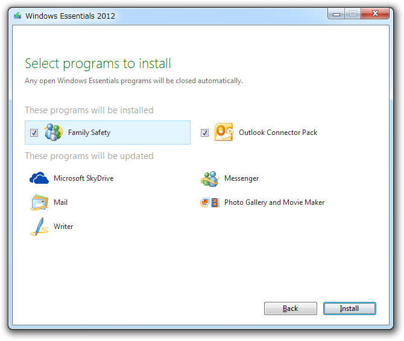
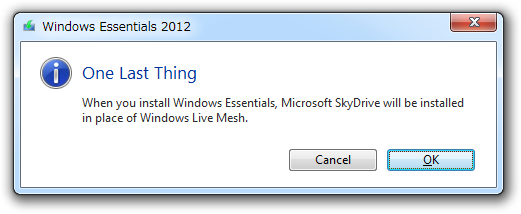

<blockquote cite="http://www.forest.impress.co.jp/docs/news/20120808_552147.html">

新たにオンラインストレージサービス“<a class="keyword" href="http://d.hatena.ne.jp/keyword/SkyDrive">SkyDrive</a>”のクライアントソフト「<a class="keyword" href="http://d.hatena.ne.jp/keyword/SkyDrive">SkyDrive</a> for Windows（Microsoft <a class="keyword" href="http://d.hatena.ne.jp/keyword/SkyDrive">SkyDrive</a>）」が追加され、代わりにファイル同期・リモートデスクトップ接続ソフト「<a class="keyword" href="http://d.hatena.ne.jp/keyword/Windows%20Live">Windows Live</a> Mesh」などが削除された。また、一部製品で“Live”のブランド名が廃されている。

<cite><a href="http://www.forest.impress.co.jp/docs/news/20120808_552147.html">&#x7A93;&#x306E;&#x675C; - &#x3010;NEWS&#x3011;&#x300C;Windows Essential 2012&#x300D;&#x304C;&#x516C;&#x958B;&#x3001;&#x65B0;&#x3057;&#x3044;&#x300C;Photo Gallery&#x300D;&#x300C;Movie Maker&#x300D;&#x3092;&#x540C;&#x68B1;</a></cite>
</blockquote>

ナンテコッタイ ／(^o^)＼

<a class="keyword" href="http://d.hatena.ne.jp/keyword/Windows%20Home%20Server">Windows Home Server</a> 2011 ＋ <a class="keyword" href="http://d.hatena.ne.jp/keyword/Windows%20Live">Windows Live</a> Mesh で最強の「パーソナルクラウド」<a href="#f1" name="fn1" title="この言い方大嫌い！">*1</a>を構築していたのに、短期間でその両方ともがなくなってしまうなんて！　この2つは機会があるごとにあちこちで個人的にプッシュしていたこともあり、さすがにショックが大きい。

<blockquote cite="http://cloud.watch.impress.co.jp/docs/news/20120706_545307.html">

米Microsoftは5日（米国時間）、次期サーバーOS「Windows Server 2012」のエディション構成を発表した。「Standard」とその上位版「Datacenter」に加えて、中小企業向けの「Essentials」と「Foundation」を提供する。従来よりも数を絞り、わかりやすくした形だ。なお、個人向けブランドの「<a class="keyword" href="http://d.hatena.ne.jp/keyword/Windows%20Home%20Server">Windows Home Server</a>」は現行製品で提供を終了する。

<cite><a href="http://cloud.watch.impress.co.jp/docs/news/20120706_545307.html">Windows Server 2012&#x306E;&#x30A8;&#x30C7;&#x30A3;&#x30B7;&#x30E7;&#x30F3;&#x69CB;&#x6210;&#x306F;4&#x3064;&#x306B;&#x3001;&#x8907;&#x96D1;&#x306A;&#x4F53;&#x7CFB;&#x3092;&#x6574;&#x7406; - &#x30AF;&#x30E9;&#x30A6;&#x30C9; Watch</a></cite>
</blockquote>

まぁ、でも、所詮 <a class="keyword" href="http://d.hatena.ne.jp/keyword/Windows%20Live">Windows Live</a> Mesh はタダで提供されていたものだし、向こうの都合で終わるのは仕方がない。さいわい <a class="keyword" href="http://d.hatena.ne.jp/keyword/SkyDrive">SkyDrive</a> の無料枠が 25GB<a href="#f2" name="fn2" title="今から申し込んだユーザーは 7GB のみ">*2</a> あるので、細かいファイルはそっちに移しているけれど、音楽や写真は地味に容量がデカいので収まりきるか不安だ。もしダメならお金を出して容量を追加しなくてはならない。結局、これなんだな。 <a class="keyword" href="http://d.hatena.ne.jp/keyword/Live%20Mesh">Live Mesh</a> と <a class="keyword" href="http://d.hatena.ne.jp/keyword/SkyDrive">SkyDrive</a> のビジネスが競合してしまった、というのが打ち切りの理由なんだろう。 ストレージビジネスと直接競合しないリモートデスクトップ接続機能は、 <a class="keyword" href="http://d.hatena.ne.jp/keyword/SkyDrive">SkyDrive</a> へと移管・統合されている。

ちなみに、 <a class="keyword" href="http://d.hatena.ne.jp/keyword/Windows%20Live">Windows Live</a> Mesh が収録されている <a class="keyword" href="http://d.hatena.ne.jp/keyword/Windows%20Live">Windows Live</a> Essential 2011 はまだダウンロード可能。いつまでダウンロード可能か、また Mesh サービスがいつまで運用されるかは今のところ明らかではない。 <a class="keyword" href="http://d.hatena.ne.jp/keyword/Live%20Mesh">Live Mesh</a> はとても野心的で実用性も高かったのに、あまり知名度もなく、挙句ブランドが二転三転して<a href="#f3" name="fn3" title="一時期は FolderShare だの Live Sync だのという名前だった">*3</a>最後には立ち消え、という可哀想な結果に終わりそう。残念でならない。

<ul>
<li><a href="http://www.forest.impress.co.jp/docs/news/20101022_401559.html">&#x7A93;&#x306E;&#x675C; - &#x3010;NEWS&#x3011;&#x300C;Windows Live Sync&#x300D;&#x304C;2011&#x5E74;3&#x6708;31&#x65E5;&#x306B;&#x505C;&#x6B62;&#x3001;&#x300C;Windows Live Mesh&#x300D;&#x3078;&#x306E;&#x79FB;&#x884C;&#x3092;</a></li>
</ul>

<a href="#fn1" name="f1" class="footnote-number">*1</a>:この言い方大嫌い！

<a href="#fn2" name="f2" class="footnote-number">*2</a>:今から申し込んだユーザーは 7GB のみ

<a href="#fn3" name="f3" class="footnote-number">*3</a>:一時期は <a class="keyword" href="http://d.hatena.ne.jp/keyword/FolderShare">FolderShare</a> だの Live Sync だのという名前だった

