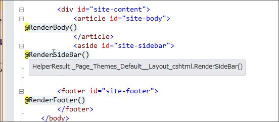

<blockquote class="twitter-tweet" data-lang="ja">
だるさん、Razor には <a href="https://twitter.com/functions?ref_src=twsrc%5Etfw">@functions</a> って記法もあるんやで
&mdash; しばやん (@shibayan) <a href="https://twitter.com/shibayan/status/233077862264078336?ref_src=twsrc%5Etfw">2012年8月8日</a></blockquote>

知ってたさ！　でも、なんか Func&lt;&gt; ってカッコいいから使ってみたかったんだよ！<a href="#f-d33ff292" name="fn-d33ff292" title="忘れてた">*1</a> 

<h3>@functions</h3>

というわけで、レイアウトファイルで @functions を使ってみた。

<pre class="code lang-cs" data-lang="cs" data-unlink>&lt;!DOCTYPE html&gt;

&lt;html lang=&quot;@App.Language&quot;&gt;
&lt;head&gt;
:
:
&lt;div id=&quot;site-content&quot;&gt;
&lt;article id=&quot;site-body&quot;&gt;
@RenderBody()
&lt;/article&gt;
&lt;aside id=&quot;site-sidebar&quot;&gt;
@RenderSideBar()
&lt;/aside&gt;
&lt;/div&gt;

&lt;footer id=&quot;site-footer&quot;&gt;
@RenderFooter()
&lt;/footer&gt;
&lt;/body&gt;
&lt;/html&gt;

@functions {
public HelperResult RenderHeader()
{
return RenderPage(&quot;_Header.cshtml&quot;);
}
public HelperResult RenderNavigation()
{
return RenderPage(&quot;_Navigation.cshtml&quot;);
}
public HelperResult RenderSideBar()
{
return RenderPage(&quot;_SideBar.cshtml&quot;);
}
public HelperResult RenderFooter()
{
return RenderPage(&quot;_Footer.cshtml&quot;);
}
}
</pre>
@functions{……} を使う利点はいくつかあるけど、

<blockquote cite="https://blog.daruyanagi.jp/entry/2012/08/08/035745">

とりあえず今のところ単純なラムダ式でなんとかなっているけれど、たとえばRenderFooter でエラー処理を追加する場合（“_Footer.cshtml”がない場合がありえる）を考えると、「レイアウトファイルを簡潔にしたい」という目的からはだいぶ外れてくる。

<cite><a href="https://blog.daruyanagi.jp/entry/2012/08/08/035745">WebMatrix + ASP.NET Web Pages &#x3067;&#x30AD;&#x30EC;&#x30A4;&#x306B;&#x30B3;&#x30FC;&#x30C7;&#x30A3;&#x30F3;&#x30B0;&#x3057;&#x305F;&#x3044;&#xFF08;2&#xFF09; - &#x3060;&#x308B;&#x308D;&#x3050;</a></cite>
</blockquote>

という懸念はないね。ながながとラムダ式を書くのはアレだけれど、一般的な関数ならばまぁ、いいや。あと、冒頭じゃなくて末尾に書けるのも何気に美味しい。レイアウトファイルのメインはあくまでも HTML ファイルだと思うし、ユーティリティ関数みたいなのは隅っこに書いておきたいって思う。 @{……} セクションで宣言した変数だと使う前に宣言しておかないとダメみたいだけれど、 @functions{……} で宣言した関数はあとで宣言してもいいみたいだ。

Visual Studio のツールチップでみてみたのだけれど、何がなんだかよくわかんないね。なんなんだろう、このテンポラリクラスは。こうなってくると、ちょっと中身を知りたくなってくる。あと、テンポラリクラス名でわかるかもしれないけれど、テーマ機能もつけてみた。

<blockquote cite="https://blog.daruyanagi.jp/entry/2012/08/07/054832">

今見返してふと思ったのは、比較的簡単にテーマ機能なんかを実装できるなということ。ただデザインを変えたいがために、毎回一からこんなの作るのはアホらしい。

<cite><a href="https://blog.daruyanagi.jp/entry/2012/08/07/054832">WebMatrix + ASP.NET Web Pages &#x3067;&#x30AD;&#x30EC;&#x30A4;&#x306B;&#x30B3;&#x30FC;&#x30C7;&#x30A3;&#x30F3;&#x30B0;&#x3057;&#x305F;&#x3044; - &#x3060;&#x308B;&#x308D;&#x3050;</a></cite>
</blockquote>

その話はまた今度するかもしれないし、しないかもしれない。

ちなみに、このコーナーはあくまでも自分の試行錯誤を書いてみただけで、このやり方が正しいというわけでは<b>決してない</b>ので注意してください。

<a href="#fn-d33ff292" name="f-d33ff292" class="footnote-number">*1</a>:忘れてた

