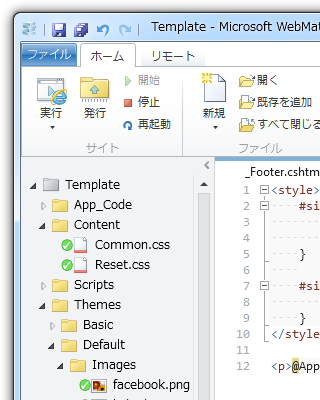

<blockquote cite="https://blog.daruyanagi.jp/entry/2012/08/07/054832">

今見返してふと思ったのは、比較的簡単にテーマ機能なんかを実装できるなということ。ただデザインを変えたいがために、毎回一からこんなの作るのはアホらしい。

<cite><a href="https://blog.daruyanagi.jp/entry/2012/08/07/054832">WebMatrix + ASP.NET Web Pages &#x3067;&#x30AD;&#x30EC;&#x30A4;&#x306B;&#x30B3;&#x30FC;&#x30C7;&#x30A3;&#x30F3;&#x30B0;&#x3057;&#x305F;&#x3044; - &#x3060;&#x308B;&#x308D;&#x3050;</a></cite>
</blockquote>

というわけで、今回はテーマ機能を（試しに）作ってみた。

 

<ul>
<li>“~/Themes/”フォルダにテーマフォルダを作成（今回は Basic と Default）</li>
<li>それぞれのテーマフォルダにレイアウトファイル、スタイルシート、リソースなどをまとめる</li>
<li>“App.Theme”にテーマフォルダの名前を入れれば、サイト全体のテーマが切り替わる</li>
</ul>
カッコいいか悪いかは知らないけど、とりあえず書いてみた。

<pre class="code lang-cs" data-lang="cs" data-unlink># _AppStart.cshtml

@{  /* Configure App Setting */
App.Theme = &quot;Default&quot;;
}

@using System.IO;

@{  /* Define Utilities */
const string ThemeBaseDir = &quot;~/Themes/&quot;;
const string ThemeLayoutFile = &quot;_Layout.cshtml&quot;;

App.GetThemePath = new Func&lt;string&gt;(() =&gt;
VirtualPathUtility.ToAbsolute(
Path.Combine(ThemeBaseDir, App.Theme)
)
);

App.GetLayoutPath = new Func&lt;string&gt;(() =&gt;
VirtualPathUtility.ToAbsolute(
Path.Combine(ThemeBaseDir, App.Theme, ThemeLayoutFile)
)
);
}
</pre>
“~/Themes/”を絶対パスへ変換するには、“VirtualPathUtility.ToAbsolute()”を使えばいいみたい。

<pre class="code lang-cs" data-lang="cs" data-unlink># _PageStart.cshtml

@{
Layout = App.GetLayoutPath();
Page.Title = Page.Title ?? &quot;Untitled Page&quot;;
}
</pre>
さっき定義した関数の使い方はこんな感じ。これでページを読み込むときにテーマが適用されると思う。やろうと思えば、 Themes フォルダ内のテーマフォルダを列挙して<a href="#f-65f2844b" name="fn-65f2844b" title="こういう処理に慣れた .NET のやり方が使えるのが嬉しいなぁ">*1</a>、ブラウザーから動的にテーマを変更する、といったこともできないこともない気がする。 

<pre class="code lang-cs" data-lang="cs" data-unlink>&lt;link rel=&quot;stylesheet&quot; href=&quot;~/Content/Reset.css&quot; /&gt;
&lt;link rel=&quot;stylesheet&quot; href=&quot;~/Content/Common.css&quot; /&gt;
&lt;link rel=&quot;stylesheet&quot; href=&quot;@App.GetThemePath()/Styles/Main.css&quot; /&gt;
</pre>
レイアウトファイルでリソースを読み込むとき、テーマフォルダのパスを知るにはこんな感じで使う。けれど、これだと IntelliSense の助けが得られないな。無理して App に Theme 関連の変数や関数が属すようにせず、 Static な Theme クラスを作って、そっちで管理するほうがいいかもしれない。 

スタイルシートは、

<ol>
<li><b>~/Content/Reset.css</b>：ブラウザー依存のレイアウトのリセット。適当なライブラリを使えばいいと思う。</li>
<li><b>~/Content/Common.css</b>：テーマに関係ない共通のスタイルを記述。 Reset.css の不満なところを書き換えたりとか<a href="#f-8594263d" name="fn-8594263d" title="Reset.css はなるべく書き換えたくない。ライセンスもあるし、アップデートしたらそのまま差し替えたいし">*2</a>。</li>
<li>テーマフォルダのスタイルシート</li>
</ol>
という順で読み込んでいくようにしてみた。なるべく分けて、論理的にやらないと、あとからだんだん訳がわからなくなってくる……

<a href="#fn-65f2844b" name="f-65f2844b" class="footnote-number">*1</a>:こういう処理に慣れた .NET のやり方が使えるのが嬉しいなぁ

<a href="#fn-8594263d" name="f-8594263d" class="footnote-number">*2</a>:Reset.css はなるべく書き換えたくない。ライセンスもあるし、アップデートしたらそのまま差し替えたいし

