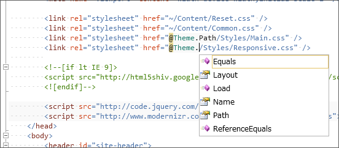

<blockquote cite="https://blog.daruyanagi.jp/entry/2012/08/15/051237">

けれど、これだと IntelliSense の助けが得られないな。無理して App に Theme 関連の変数や関数が属すようにせず、 Static な Theme クラスを作って、そっちで管理するほうがいいかもしれない。

<cite><a href="https://blog.daruyanagi.jp/entry/2012/08/15/051237">WebMatrix + ASP.NET Web Pages &#x3067;&#x30AD;&#x30EC;&#x30A4;&#x306B;&#x30B3;&#x30FC;&#x30C7;&#x30A3;&#x30F3;&#x30B0;&#x3057;&#x305F;&#x3044;&#xFF08;4&#xFF09; - &#x3060;&#x308B;&#x308D;&#x3050;</a></cite>
</blockquote>

さっそくやってみた。

まず、 App_Code フォルダに Theme.cs を作成して、以下のようにコーディング。前回のと内容的には殆ど変わらない。

<pre class="code lang-cs" data-lang="cs" data-unlink>using System.Web;

public static class Theme
{
const string ThemeBaseDir = &quot;~/Themes/&quot;;
const string ThemeLayoutFile = &quot;_Layout.cshtml&quot;;

public static void Load(string name) { Name = name; }

public static string Name { get; private set; }

public static string Path
{
get
{
return VirtualPathUtility.ToAbsolute(
System.IO.Path.Combine(ThemeBaseDir, Name)
);
}
}

public static string Layout
{
get
{
return VirtualPathUtility.ToAbsolute(
System.IO.Path.Combine(ThemeBaseDir, Name, ThemeLayoutFile)
);
}
}
}
</pre>
“_AppStart.cshtml”も書き換えておく。

<pre class="code lang-cs" data-lang="cs" data-unlink>@{
// App.Theme = &quot;Default&quot;;
Theme.Load(&quot;Default&quot;);
}
</pre>
最初は Theme.Name を public にして Theme.Name = "Default" みたいな感じで使うようにしていたけれど、 Theme.Load() の方が意図が明確になると思った。

さてはて、レイアウトファイルの方も書き換えよう。

<pre class="code lang-html" data-lang="html" data-unlink>&lt;link rel=&quot;stylesheet&quot; href=&quot;~/Content/Reset.css&quot; /&gt;
&lt;link rel=&quot;stylesheet&quot; href=&quot;~/Content/Common.css&quot; /&gt;
&lt;!-- &lt;link rel=&quot;stylesheet&quot; href=&quot;@App.GetThemePath()/Styles/Main.css&quot; /&gt; --&gt;
&lt;link rel=&quot;stylesheet&quot; href=&quot;@Theme.Path/Styles/Main.css&quot; /&gt;
</pre>

dynamic 型にしたら入力補完されないけれど、ちゃんとクラスにしたら……ほら！　クラスの責務も明確になるし、断然こっちのほうがいいなと自己満足した。

<h3>閑話休題</h3>

WebMatrix 2 RC 版はなかなか完成度が高いと思うけれど、テキストのコピーにやたら時間がかかったり<a href="#f-76078fae" name="fn-76078fae" title="とくに［テキストを折り返す］を ON にすると絶望的に遅いことがある">*1</a>、まれにコピー＆ペーストそのものができなくなってしまう。 NuGet のリボンボタンが行方不明になるのもたまに困る。

あと、［Alt］キーでメニューのナビゲーションが出るのだけれど、そっちにフォーカスがとられて矩形選択や IME の切り替え<a href="#f-52b40b4a" name="fn-52b40b4a" title="英語配列だと［Alt］＋［~］キーが標準">*2</a>に支障が出るのもなおしてほしいところかな。［Alt］キー ＝ メニュー操作 というのは確かにわかりやすいのだけれど。

不具合のいくつかはすでに報告済み。 RTM でちゃんとなおればいいなぁ、と思った。

<a href="#fn-76078fae" name="f-76078fae" class="footnote-number">*1</a>:とくに［テキストを折り返す］を ON にすると絶望的に遅いことがある

<a href="#fn-52b40b4a" name="f-52b40b4a" class="footnote-number">*2</a>:英語配列だと［Alt］＋［~］キーが標準

