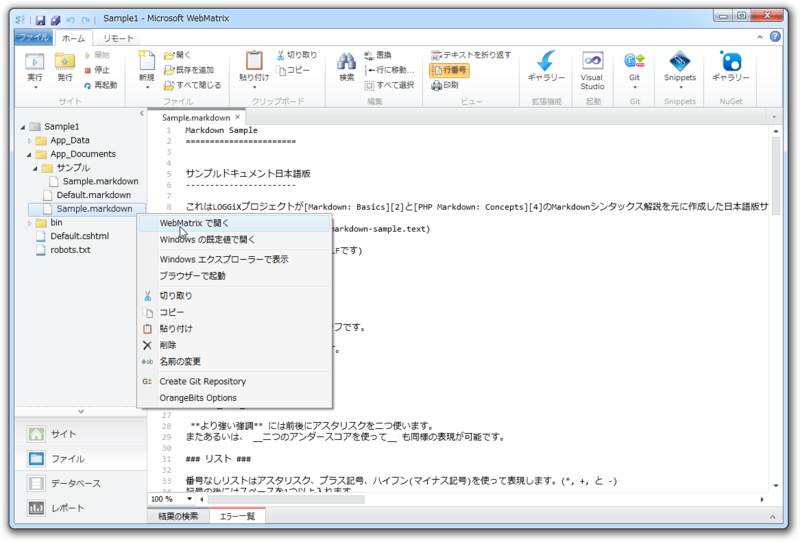
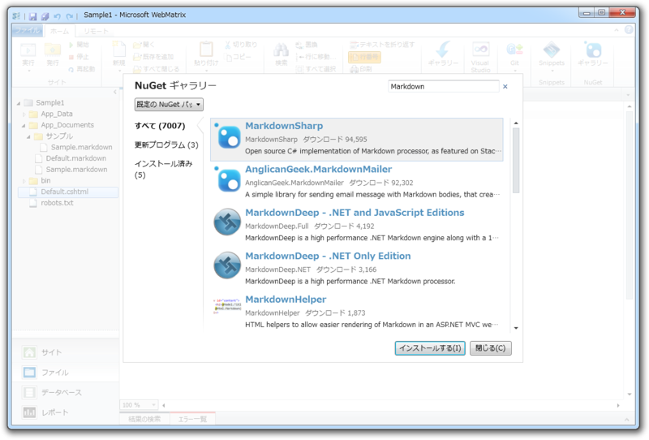
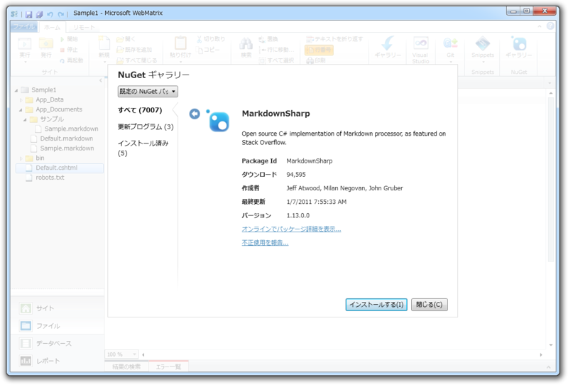
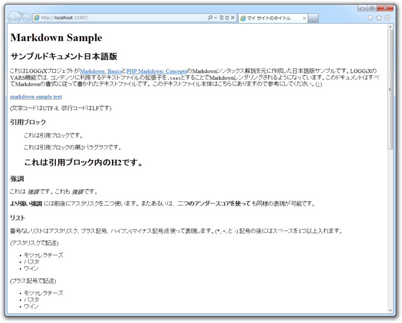
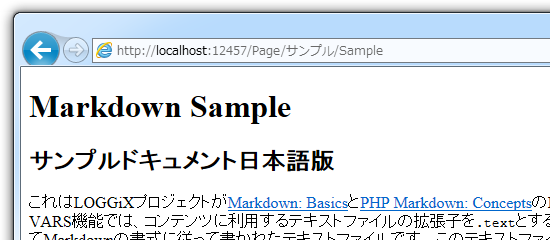

<blockquote>

<b>Markdown</b> は軽量マークアップ言語で、 テキストを HTML へ変換する記法および変換ツール（パーサー）を指します。 Markdown の記法は英文メールでよく利用されるテキスト装飾がヒントになっており、変換元テキストから変換したあとの HTML マークアップの見当がつけやすく、覚えるのが比較的容易です<a href="#f-731aff19" name="fn-731aff19" title="弱点は若干機能不足なこと。これを補う派生版が幾つかあります">*1</a>。最近では GitHub などで Wiki 記法として用いられることが多くなっているので、覚えておいて損はないです。

</blockquote>

この Markdown パーサーを「WebMatrix 2」で使ってみましょう（<b>所要時間5分</b>）。

<h3>準備</h3>

まず、 Empty Site テンプレートから新規サイトを作成し<a href="#f-a24137a6" name="fn-a24137a6" title="簡便のため。好きなテンプレートを利用してもよい">*2</a>、適当にフォルダーを作って Markdown テキストのサンプルを配置します。

今回、サンプルは <a href="http://tkns.homelinux.net/modules/manual/ja/data/markdown-sample.text">http://tkns.homelinux.net/modules/manual/ja/data/markdown-sample.text</a> （テキスト形式、UTF-8エンコード）をお借りしました。ちなみに、 “.md” や “.markdown” といった拡張子<a href="#f-6c0192e4" name="fn-6c0192e4" title="べつにこれである必要はないが、 Markdown 書式のテキストであることを示すためにたびたび用いられる">*3</a>のファイルを「WebMatrix 2」で開くには、コンテキストメニューから［WebMatrix で開く］を選択します。

つぎに、パーサーをインストール。 NuGet で「MarkdownSharp」パッケージを選択しましょう。

<a href="https://blog.daruyanagi.jp/entry/2012/02/12/213437">C# &#x306E; Markdown &#x30A8;&#x30F3;&#x30B8;&#x30F3; - &#x3060;&#x308B;&#x308D;&#x3050;</a> にはいくつかあるのですが、「MarkdownSharp」がもっとも無難だと思います。

インストールはとっても簡単。勝手にレポジトリからダウンロード・セットアップされます。ほかのパッケージが必要であれば<a href="#f-0c9c2c17" name="fn-0c9c2c17" title="依存関係があるといいます">*4</a>、そのパッケージも自動でセットアップされます。パッケージは自分でも作れるので、やってみると面白いですネ。

これで準備は完了。

<h3>コーディング</h3>

Default.cshtml を開いて、以下のように記述します。 Markdown テキストのサンプルへのパスは適当に環境に合わせて変えてください<a href="#f-e01fe3ef" name="fn-e01fe3ef" title="ほんとは App_Data フォルダに Markdown テキストを格納したかったのだけれど、なんかいろいろファイルが入っていてヤダ">*5</a>。

<pre class="code lang-cs" data-lang="cs" data-unlink>@{
var markdown = new MarkdownSharp.Markdown();
var path = Server.MapPath(&quot;~/App_Documents/Sample.markdown&quot;);
var encoding = System.Text.Encoding.UTF8;
var text = System.IO.File.ReadAllText(path, encoding);
}

&lt;!DOCTYPE html&gt;

&lt;html lang=&quot;ja&quot;&gt;
&lt;head&gt;
&lt;meta charset=&quot;utf-8&quot; /&gt;
&lt;title&gt;マイ サイトのタイトル&lt;/title&gt;
&lt;/head&gt;
&lt;body&gt;
@Html.Raw(markdown.Transform(text)) &lt;!-- Add this ! --&gt;
&lt;/body&gt;
&lt;/html&gt;
</pre>
これで終わり！　あとは［実行］ボタンを押せば Markdown テキストが HTML へ変換されて表示されるはずです。

new MarkdownSharp.Markdown() でパーサーのインスタンスを生成し、 Transform() で変換します。ただし、結果をそのまま利用しても HTML エンコードされた状態で表示されてしまう<a href="#f-52e7b3cd" name="fn-52e7b3cd" title="セキュリティ上の理由です">*6</a>ので、 Html.Raw() でそれを抑止します。 Server.MapPath() を利用すれば、ディスク上の物理パスを取得できます。ファイルを扱うときはよく利用するので覚えておくといいかも。あとは .NET Framework ではおなじみの処理ですね。

おしまい！

<h3>ステップアップ</h3>

<h4>ルーティング</h4>

これだけだと面白くないので、ルーティングを利用してみました。

<pre class="code lang-cs" data-lang="cs" data-unlink># Page.cshtml

@{
var markdown = new MarkdownSharp.Markdown();

var path = Server.MapPath(
string.Format(&quot;{0}{1}.markdown&quot;,
&quot;~/App_Documents/&quot;,
UrlData.Count == 0
? &quot;Default&quot;
: string.Join(&quot;/&quot;, UrlData)
));

var encoding = System.Text.Encoding.UTF8;
var text = System.IO.File.ReadAllText(path, encoding);
}

&lt;!DOCTYPE html&gt;

&lt;html lang=&quot;en&quot;&gt;
&lt;head&gt;
&lt;meta charset=&quot;utf-8&quot; /&gt;
&lt;title&gt;&lt;/title&gt;
&lt;/head&gt;
&lt;body&gt;
@Html.Raw(markdown.Transform(text))
&lt;/body&gt;
&lt;/html&gt;
</pre>
これで ~/Page/サンプル/Sample などというパスも扱えます。 ~/Page.cshtml で受け取った UrlData には  ["サンプル", "Sample"] という配列が格納されているので、それを適当に加工してください（<a href="https://blog.daruyanagi.jp/entry/2012/07/06/174414">WebMatrix &#x306E;&#x30EB;&#x30FC;&#x30C6;&#x30A3;&#x30F3;&#x30B0; - &#x3060;&#x308B;&#x308D;&#x3050;</a> も参考にしてみてください）。

 

<h4>もう少しキレイに</h4>

ページを表示するごとに MarkdownSharp.Markdown を new したり、 @Html.Raw( markdown.Transform(text) ) を呼び出すのはあまりかっこうがよくない気がしますね。

そこで試しに、 ~/App_Code/Markdown.cs というコードを書いてみました。

<pre class="code lang-cs" data-lang="cs" data-unlink>using System;
using System.IO;
using System.Text;
using System.Web;

/// &lt;summary&gt;
/// Summary description for ClassName
/// &lt;/summary&gt;
public static class Markdown
{
private static readonly MarkdownSharp.Markdown md =
new MarkdownSharp.Markdown();
private static readonly Encoding encoding = Encoding.UTF8;

public static HtmlString Load(string path)
{
return new HtmlString(
md.Transform(
File.ReadAllText(path, encoding)
)
);
}
}
</pre>
これで Page.cshtml がちょっとシンプルになりました。

<pre class="code lang-cs" data-lang="cs" data-unlink>@{
var path = Server.MapPath(
string.Format(&quot;{0}/{1}.markdown&quot;,
&quot;~/App_Documents/&quot;,
UrlData.Count == 0
? &quot;Default&quot;
: string.Join(&quot;/&quot;, UrlData)
));
}

&lt;!DOCTYPE html&gt;

&lt;html lang=&quot;en&quot;&gt;
&lt;head&gt;
&lt;meta charset=&quot;utf-8&quot; /&gt;
&lt;title&gt;&lt;/title&gt;
&lt;/head&gt;
&lt;body&gt;
@Markdown.Load(path)
&lt;/body&gt;
&lt;/html&gt;
</pre>
HtmlString 型で返せば、ビューで @Html.Raw() が要りません。あとは、 Url Rewrite を使って /Page/ なしで利用できるようにするとか、 ファイルの作成日時から RSS を吐いてみるとか（キャッシュを使わないとエラいことになりそうですね！）まだまだ改善の余地がありそう。

<a href="#fn-731aff19" name="f-731aff19" class="footnote-number">*1</a>:弱点は若干機能不足なこと。これを補う派生版が幾つかあります

<a href="#fn-a24137a6" name="f-a24137a6" class="footnote-number">*2</a>:簡便のため。好きなテンプレートを利用してもよい

<a href="#fn-6c0192e4" name="f-6c0192e4" class="footnote-number">*3</a>:べつにこれである必要はないが、 Markdown 書式のテキストであることを示すためにたびたび用いられる

<a href="#fn-0c9c2c17" name="f-0c9c2c17" class="footnote-number">*4</a>:依存関係があるといいます

<a href="#fn-e01fe3ef" name="f-e01fe3ef" class="footnote-number">*5</a>:ほんとは App_Data フォルダに Markdown テキストを格納したかったのだけれど、なんかいろいろファイルが入っていてヤダ

<a href="#fn-52e7b3cd" name="f-52e7b3cd" class="footnote-number">*6</a>:セキュリティ上の理由です

