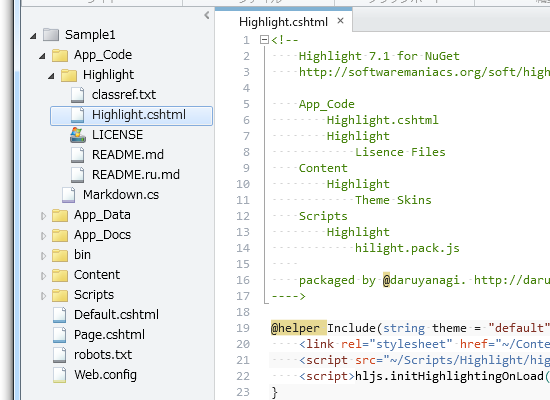
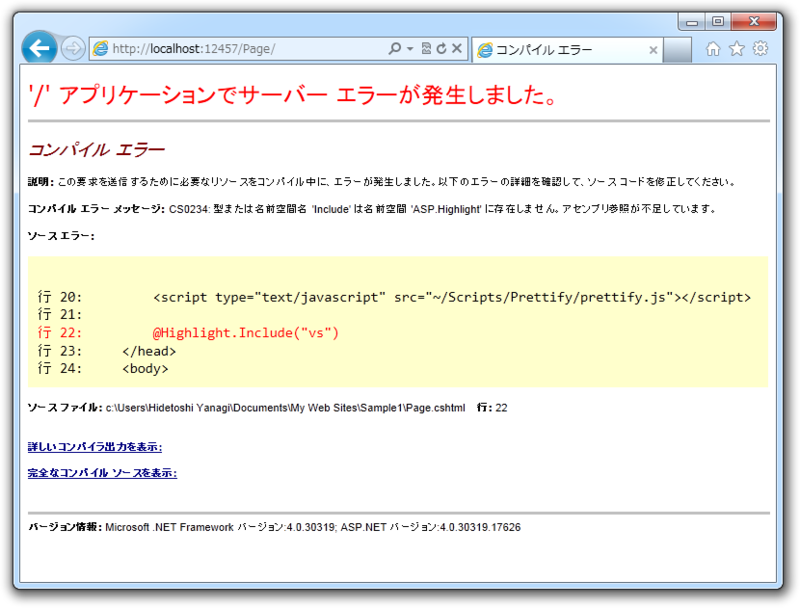

前回（<a href="https://blog.daruyanagi.jp/entry/2012/08/16/155714">WebMatrix &#x3067; Markdown &#x3092;&#x5C11;&#x3057;&#x3060;&#x3051;&#x62E1;&#x5F35;&#x3057;&#x3066;&#x307F;&#x308B; - &#x3060;&#x308B;&#x308D;&#x3050;</a>）、 Hilight.js をこのようなフォルダー構成で配置したの、覚えてますか。

<pre class="code" data-lang="" data-unlink>~/
App_Code/
Highlight.cshtml &lt;-- ぇ？
Highlight/
Lisence Files
Content/
/Highlight
Theme Skins
Scripts/
Highlight/
hilight.pack.js</pre>
パッとみて「これイケてなくね」って思いません？ Highlight.cshtml は ~/App_Code/Highlight 以下の配置される方がキレイですよね。

<pre class="code" data-lang="" data-unlink>~/
App_Code/
Highlight/
Highlight.cshtml &lt;-- こうだろ！
Lisence Files
Content/
Highlight/
Theme Skins
Scripts/
Highlight/
hilight.pack.js</pre>
~/App_Code/ フォルダーっていうのは、「ソースコードを置くだけで自動でコンパイルしてくれる不思議なフォルダー」なのですけど、デフォルト状態ではサブフォルダーまではみてくれないんですね。 Web.config にこのような設定を追加してあげる必要があります。

<pre class="code lang-xml" data-lang="xml" data-unlink>&lt;?xml version=&quot;1.0&quot;?&gt;
&lt;configuration&gt;
&lt;system.web&gt;
&lt;compilation debug=&quot;false&quot;&gt;
&lt;codeSubDirectories&gt;
&lt;add directoryName=&quot;Highlight&quot;/&gt;
&lt;/codeSubDirectories&gt;
&lt;/compilation&gt;
&lt;/system.web&gt;
&lt;/configuration&gt;
</pre>
~/App_Code/ フォルダーではソースコードの言語を自動判別してくれるのだけれど、サブフォルダーに分ければ異なる言語を混ぜて利用する、なんてこともできるらしい。へぇ、知らなかった。

<ul>
<li><a href="http://msdn.microsoft.com/en-us/library/t990ks23.aspx">Shared Code Folders in ASP.NET Web Site Projects | Microsoft Docs</a></li>
</ul>

でも、この方法でサブフォルダーをコンパイル対象に含めても cshtml ファイルの面倒まではみてくれないみたい……。しょうがないので、静的クラスに書き換えてしまおう。

<pre class="code lang-cs" data-lang="cs" data-unlink># Highlight.cshtml

@helper Include(string theme = &quot;default&quot;){
&lt;link rel=&quot;stylesheet&quot; href=&quot;~/Content/Highlight/@(theme).css&quot;&gt;
&lt;script src=&quot;~/Scripts/Highlight/highlight.pack.js&quot;&gt;&lt;/script&gt;
&lt;script&gt;hljs.initHighlightingOnLoad();&lt;/script&gt;
}
</pre>
書き換え前。

<pre class="code lang-cs" data-lang="cs" data-unlink>using System.Web;

public static class Highlight
{
const string STYLE_DIR = &quot;~/Content/Highlight/&quot;;
const string SCRIPT_DIR = &quot;~/Scripts/Highlight/&quot;;
const string HTML = @&quot;&lt;!-- for Highlight.js support --&gt;
        &lt;link rel=&quot;&quot;stylesheet&quot;&quot; href=&quot;&quot;{0}{1}.css&quot;&quot;&gt;
        &lt;script src=&quot;&quot;{2}highlight.pack.js&quot;&quot;&gt;&lt;/script&gt;
        &lt;script&gt;hljs.initHighlightingOnLoad();&lt;/script&gt;&quot;;

public static HtmlString Include(string theme = &quot;default&quot;)
{
return new HtmlString(
string.Format(
HTML,
VirtualPathUtility.ToAbsolute(STYLE_DIR),
theme,
VirtualPathUtility.ToAbsolute(SCRIPT_DIR)
)
);
}
}
</pre>
書き換え後。ちょっと長くなったけれど、これはそれだけ「ヘルパーがすげえ！」ということにしておいてください。

これでブツがそろったので、今度は NuGet パッケージにして公開しましょうかね（予定）。

