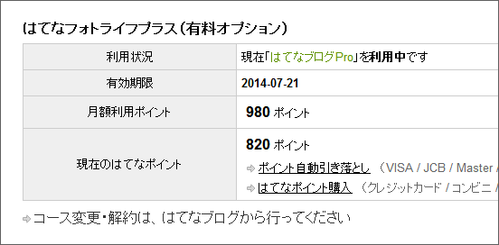

はてなブログ Pro デビューを果たして（<a href="https://blog.daruyanagi.jp/entry/2012/07/21/130327">&#x306F;&#x3066;&#x306A;&#x30D6;&#x30ED;&#x30B0; Pro &#x30C7;&#x30D3;&#x30E5;&#x30FC; &#x2015;&#x2015; &#x72EC;&#x81EA;&#x30C9;&#x30E1;&#x30A4;&#x30F3;&#x306E;&#x5272;&#x308A;&#x5F53;&#x3066; - &#x3060;&#x308B;&#x308D;&#x3050;</a>） 一ヶ月ぐらいになるけど、だいぶ気になることがある。とくに課金周りについてはちょっとイヤな体験をしたので少し聞いておくれ。

<h3>1000ポイント余計に買わされた</h3>

はてなブログ Pro（14,000ポイント）を購入するとき、970ポイントの残高があった。それだったら、13,030ポイントを自動チャージしてくれればいいよね。でも、1,000ポイント多く（14,030ポイント）チャージされた。「ポイント残高がマイナス」ではなく、「ポイント残高がゼロ」というタイミングで自動チャージされるらしい。

すぐさま、自動チャージを解約した。

<h3>はてなフォトライフ Pro が継続扱い、ポイントが引かれた</h3>

はてなブログ Pro で はてなフォトライフ Pro が置き換えられたと解釈していて油断していたら、次の月に はてなフォトライフ Pro の分のポイント（180ポイント）が引かれてしまった。なんだこの罠は。少額過ぎてサポートにメールするのもめんどいぐらいだ。

<h3>まぁ、こっちの不注意もあるのかもしれないけど？</h3>

こういう「小金稼ぎ」が一番嫌いだ。あまったポイントは一年で失効するらしいけど、こんな“はしたポイント”どうするのさ。腹いせに Tシャツ買ってやろうと思ったけど、ポイント足りないしさ！

<blockquote cite="http://staff.hatenablog.com/entry/2012/08/14/130643">

本日、はてなオリジナルTシャツ2012の販売が始まりました。

これを記念して、「はてなブログ」デザインのTシャツが当たるプレゼントキャンペーンを実施します。はてなブログに「はてなオリジナルTシャツ2012」の記事を書くと、キャンペーンに応募できます。記事には、Tシャツ販売ページのURLを必ず記述してください。

<cite><a href="http://staff.hatenablog.com/entry/2012/08/14/130643">&#x306F;&#x3066;&#x306A;&#x30D6;&#x30ED;&#x30B0;T&#x30B7;&#x30E3;&#x30C4;&#x30D7;&#x30EC;&#x30BC;&#x30F3;&#x30C8;&#x30AD;&#x30E3;&#x30F3;&#x30DA;&#x30FC;&#x30F3;&#x3092;&#x5B9F;&#x65BD;&#x3057;&#x307E;&#x3059;&#xFF01; - &#x306F;&#x3066;&#x306A;&#x30D6;&#x30ED;&#x30B0;&#x958B;&#x767A;&#x30D6;&#x30ED;&#x30B0;</a></cite>
</blockquote>

<a href="http://www.hatena.ne.jp/info/hatenatshirts2012">&#x306F;&#x3066;&#x306A;&#x30AA;&#x30EA;&#x30B8;&#x30CA;&#x30EB;T&#x30B7;&#x30E3;&#x30C4;2012 - &#x306F;&#x3066;&#x306A;</a> くれたら許してあげる щ(ﾟдﾟщ)ｶﾓｰﾝ

