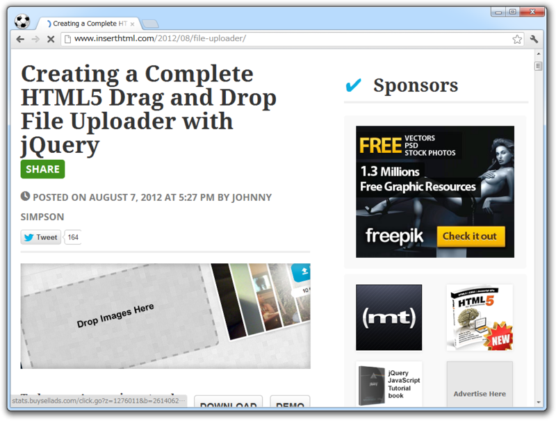
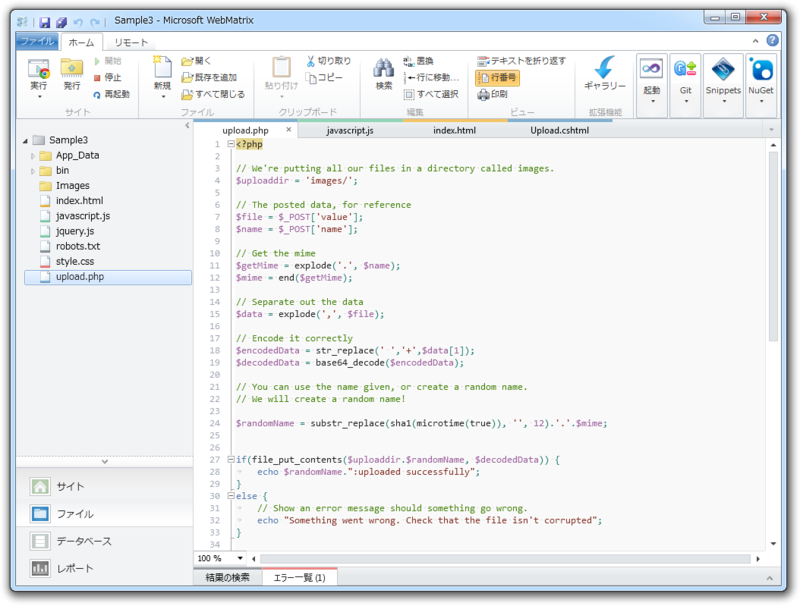
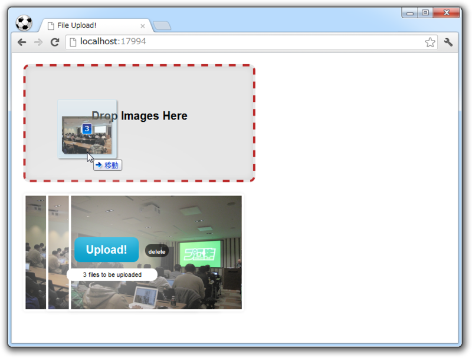
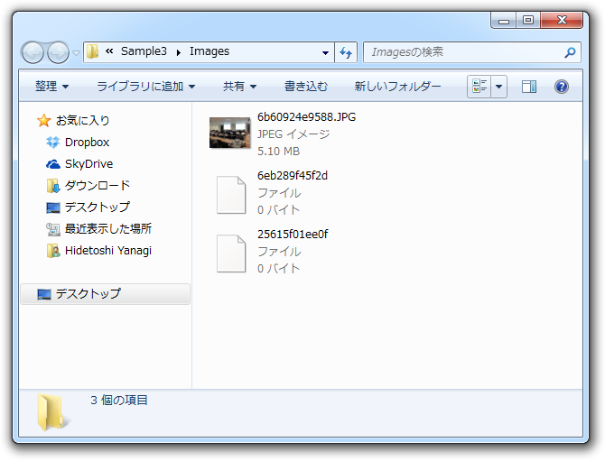

<a href="http://www.inserthtml.com/2012/08/file-uploader/">Creating a Complete HTML5 Drag and Drop File Uploader with jQuery | InsertHTML</a>

ドラッグ＆ドロップで画像ファイルをアップロードできるアプリってたまに公開されてますけど、ちょっと試したくても面倒ですよね。フロントエンドは <a class="keyword" href="http://d.hatena.ne.jp/keyword/HTML5">HTML5</a> + <a class="keyword" href="http://d.hatena.ne.jp/keyword/jQuery">jQuery</a> なので Web ブラウザーだけで動きますけど、バックエンドはたいてい <a class="keyword" href="http://d.hatena.ne.jp/keyword/PHP">PHP</a> スクリプトなので Web サーバーが必要です。

つまり、

<ul>
<li>Web サーバーを動かす</li>
<li><a class="keyword" href="http://d.hatena.ne.jp/keyword/PHP">PHP</a> のセットアップ</li>
</ul>
なんてことを、わざわざしなきゃいけないんですよ！　ちょっと試したいだけなのにね。

そんなときは「<a class="keyword" href="http://d.hatena.ne.jp/keyword/WebMatrix">WebMatrix</a> 2」を使ってください（<a href="http://www.forest.impress.co.jp/docs/news/20120608_538907.html">&#x7A93;&#x306E;&#x675C; - &#x3010;NEWS&#x3011;&#x300C;WebMatrix 2&#x300D;&#x304C;&#x30EA;&#x30EA;&#x30FC;&#x30B9;&#x5019;&#x88DC;&#x7248;&#x306B;&#x3001;&ldquo;Node.js&rdquo;&#x30B5;&#x30DD;&#x30FC;&#x30C8;&#x3084;&ldquo;Azure&rdquo;&#x9023;&#x643A;&#x3092;&#x8FFD;&#x52A0;</a>）。デフォルトで <a class="keyword" href="http://d.hatena.ne.jp/keyword/PHP">PHP</a> が有効で、サーバーだって <a class="keyword" href="http://d.hatena.ne.jp/keyword/IIS">IIS</a> Express が利用できる。めっちゃ簡単ですよ！

<h3>準備</h3>

「Empty Site」テンプレートで Web サイトを作成します。画像アップロード先が“Images”フォルダなので、あらかじめ作成しておきましょう。そして、アップローダーをダウンロードして展開し、 Web サイトのルートにまるっとコピーします。

これだけ。

<h3>使ってみよう！</h3>

Web サイトを実行して、画像ファイルをブラウザーにドラッグ＆ドロップしてください。なお、 Web ブラウザーは IE 以外で。 <a class="keyword" href="http://d.hatena.ne.jp/keyword/IE9">IE9</a> でもゴニョゴニョすれば使えるはず（<a href="http://html5labs.interoperabilitybridges.com/">HTML5Labs - Home</a>）だけど、初期状態では残念ながら利用できません。

ちゃんとアップロードされ……あれ？　複数ファイルのアップロードにも対応してるはずだけど、2つ目以降がちゃんとアップロードされていない。まぁ、いいや。こんな感じで簡単にお試しできるので入れておいて損はないんじゃないかな？

