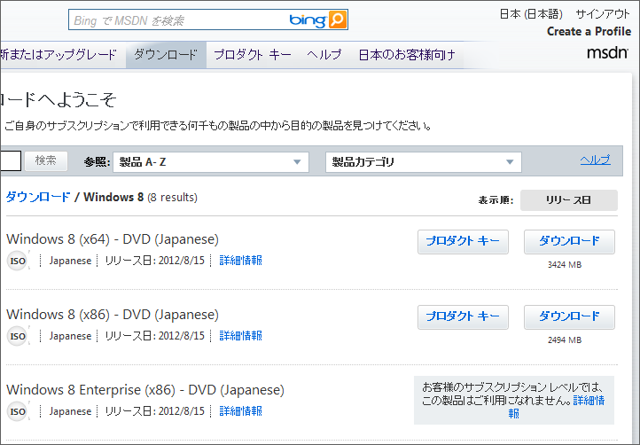
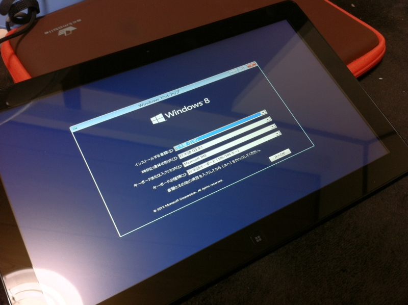
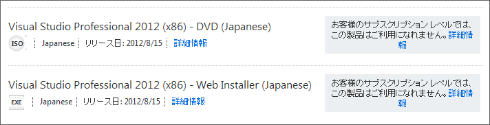

神様！　前回（<a href="https://blog.daruyanagi.jp/entry/2012/08/16/162322">Windows 8 &#x304C;&#x3067;&#x305F;&#x3088;&#xFF01;&hellip;&hellip; &#xFF76;&#xFF9E;&#x2501;&#x2501;(;&#xFF9F;&#x414;&#xFF9F;)&#x2501;&#x2501;&#xFF9D;!! - &#x3060;&#x308B;&#x308D;&#x3050;</a>）ダウンロードできずに涙をのんだ Windows 8 ですけど、一日遅れで Visual Studio 2010 Professional with MSDN Essentials ユーザーにも開放されたみたいです。やったー！

さっそく Samsung Series 7 Slate へインストール。適当に［Windows］キーを押したまま電源ボタンを押すと BIOS 画面には入れたので、［Windows］キーと音量ボタンで試行錯誤しながらブートデバイスを BD ドライブへセット。あとはすんなりセットアップできました。デスクトップへのインストールは……まぁ、まだいいや。

そういえば、巷では「 Metro という名前が廃止される（らしい）！」と話題になってますけど、あれってどうなんでしょう。とりあえず、公式アナウンスがないことには何もうかつなことは言えませんが、この際、

<ul>
<li>ウィンドウスタイル（Windows Style）：従来のデスクトップアプリ</li>
<li>フルスクリーンスタイル（Full-Screen Style）：いわゆる Metro アプリ</li>
</ul>
なんかに改称したらどうかなぁ、なんて思います。自分でもあんまりかっこういいとは思いませんが、できたら「名は体を表す」でいってもらえると、よくわかんない人に説明するときに楽なんですけどね。まぁ、そうなるといよいよ「Windows」というブランドを OS から外すことにもなりかねませんが。

<h3>今回利用した BD ドライブ</h3>

<a href="http://www.amazon.co.jp/exec/obidos/ASIN/B0081ARZ1I/bestylesnet-22/">Logitec USB3.0対応 ポータブルブルーレイドライブ 3D再生 BDXLライティング付き 【USBバスパワー対応】レッド LBD-PME6U3VRD</a>
<ul><li>出版社/メーカー: ロジテック</li><li>発売日: 2012/05/11</li><li>メディア: Personal Computers</li><li>購入: 1人 クリック: 3回</li><li><a href="http://d.hatena.ne.jp/asin/B0081ARZ1I/bestylesnet-22" target="_blank">この商品を含むブログを見る</a></li></ul>

今回インストールに利用した BD-RW ドライブはこれ。ちょっと前に買っておいたんだけど、ちゃんと役に立った。どうせなら、と思って選んでみた赤色が気に入っている。あと、バスパワー駆動なのと USB ケーブルが収納できるので便利かな。別にトンガッたところもなくて、素直でよい子です。

<h3>Visual Studio 2012 Professional</h3>

ちなみに、「Visual Studio 2012 Professional」はさすがに使わせてもらえなかった（そりゃそうか）。「Visual Studio 2010 Professional」に拡張機能をぶち込みまくって「Visual Studio 2012 Professional」相当にして使うかな（<a href="http://www.forest.impress.co.jp/docs/special/20120614_539974.html">&#x3010;&#x7279;&#x96C6;&#x3011;&#x300C;Visual Studio 2010&#x300D;&#x5411;&#x3051;&#x62E1;&#x5F35;&#x6A5F;&#x80FD;&#x30EA;&#x30F3;&#x30AF;&#x96C6; - &#x7A93;&#x306E;&#x675C;</a> が参考になれば）。 Metro アプリは「Visual Studio 2012 Express for Windows 8」でとりあえずは十分そうだし、なんか最近は WebMatrix / ASP.NET Web Pages がちょっと楽しくなってきたのでそんなに困らないかも。だいたい、 Windows Phone SDK も未対応だしね。

