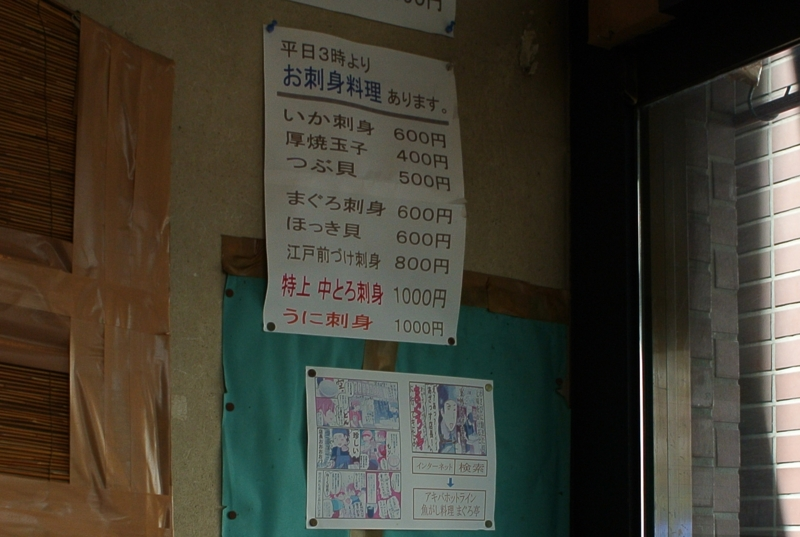

秋葉原で @subsfn とお昼ごはん食べた。 <a href="http://akiba-pc.watch.impress.co.jp/hotline/20110917/etc_comic1.html">&#x3061;&#x3087;&#x3073;&#xFF06;&#x59C9;&#x3061;&#x3083;&#x3093;&#x306E;&#x300E;&#x30A2;&#x30AD;&#x30D0;&#x3067;&#x3054;&#x306F;&#x3093;&#x98DF;&#x3079;&#x305F;&#x3044;&#x306A;&#x3002;&#x300F; &#x301C;&#x300C;&#x9B5A;&#x304C;&#x3057;&#x6599;&#x7406; &#x307E;&#x3050;&#x308D;&#x4EAD;&#x300D;&#x7DE8;&#x301C;</a> にも載っているお店で、お店にもマンガのコピーが貼ってあった。

ランチは海鮮丼がメインで、夜にはそのまま居酒屋へ移行するらしい。丼は夜でも食べられるみたいなので、夜の部にいけばよかったかもしれない。前日寝られなくて寝不足だったし。

さっそく、一番高いの（まるき丼　1,500円）注文。ほんとは大トロ丼を頼もうと思ったのだけれど、品切れだったのだそうで。

しかし、まぁ、さすがのボリュームやな。これは満足やで。昨晩からご飯を食べておらずお腹が減っていたので、ぺろりと平らげてしまった。醤油は甘いのと辛いの二種類あって、好きな方を選べるみたい。自分はテキトーに調合して食べてみた。唯一の文句の付け所は、ごはんかな。もう少しモチっとしていればよかった。まぁ、これはその日の炊き加減にもよるのかもしれないけれど。

海辺の町に旅行でもすればもっとリーズナブルに食べられるのだろうけど、それはそれ、これはこれ。都内でガッツリ海鮮丼を食べたいときにはいい選択肢なのかも。

<iframe width="425" height="350" frameborder="0" scrolling="no" marginheight="0" marginwidth="0" src="https://maps.google.co.jp/maps?ie=UTF8&amp;q=%E9%AD%9A%E3%81%8C%E3%81%97%E6%96%99%E7%90%86+%E3%81%BE%E3%81%90%E3%82%8D%E4%BA%AD&amp;fb=1&amp;gl=jp&amp;hq=%E9%AD%9A%E3%81%8C%E3%81%97%E6%96%99%E7%90%86+%E3%81%BE%E3%81%90%E3%82%8D%E4%BA%AD&amp;cid=0,0,2044038475408696175&amp;t=m&amp;brcurrent=3,0x60188c1eab102b8d:0xae1eb01fbc26375e,0&amp;ll=35.70183,139.769225&amp;spn=0.006099,0.00912&amp;z=16&amp;iwloc=A&amp;output=embed"></iframe> <small><a href="https://maps.google.co.jp/maps?ie=UTF8&amp;q=%E9%AD%9A%E3%81%8C%E3%81%97%E6%96%99%E7%90%86+%E3%81%BE%E3%81%90%E3%82%8D%E4%BA%AD&amp;fb=1&amp;gl=jp&amp;hq=%E9%AD%9A%E3%81%8C%E3%81%97%E6%96%99%E7%90%86+%E3%81%BE%E3%81%90%E3%82%8D%E4%BA%AD&amp;cid=0,0,2044038475408696175&amp;t=m&amp;brcurrent=3,0x60188c1eab102b8d:0xae1eb01fbc26375e,0&amp;ll=35.70183,139.769225&amp;spn=0.006099,0.00912&amp;z=16&amp;iwloc=A&amp;source=embed" style="color:#0000FF;text-align:left">大きな地図で見る</a></small>

