
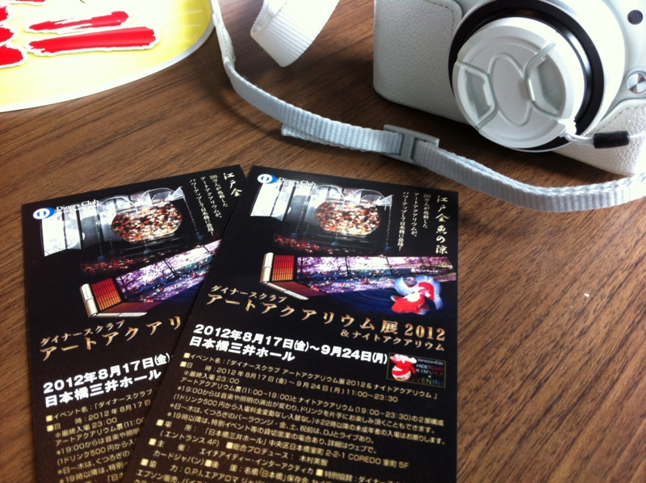<a href="http://h-i-d.co.jp/art/art-aquarium-2012/"> 
ART AQUARIUM 2012 | Art Aquarium | &#x30A2;&#x30FC;&#x30C8;&#x30A2;&#x30AF;&#x30A2;&#x30EA;&#x30A6;&#x30E0;    </a> に行ってきた。

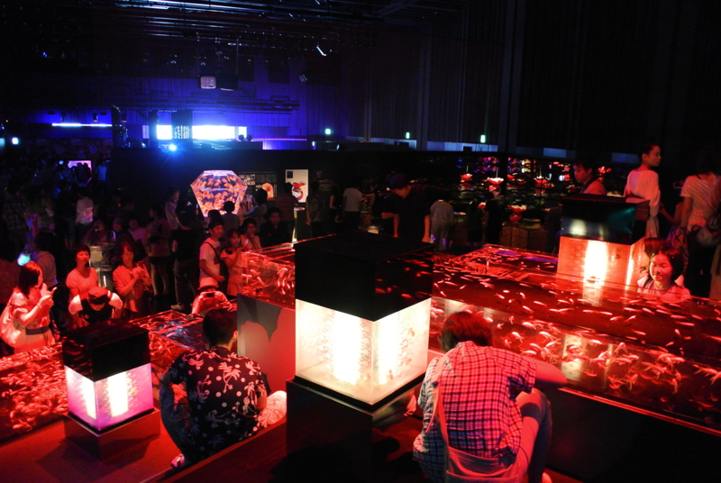

金魚、金魚、金魚。金魚そのものもキレイなのだけれど、光を巧くつかって変化を演出しているので観ていて飽きない。とはいえ、結構人が多かったので途中で具合が悪くなってしまったのだけど。

館内はフラッシュが禁止されているものの写真撮影自体は OK で（動画は禁止）、みんなこの幻想的な光景をカメラやケータイに収めようと躍起になっていた。

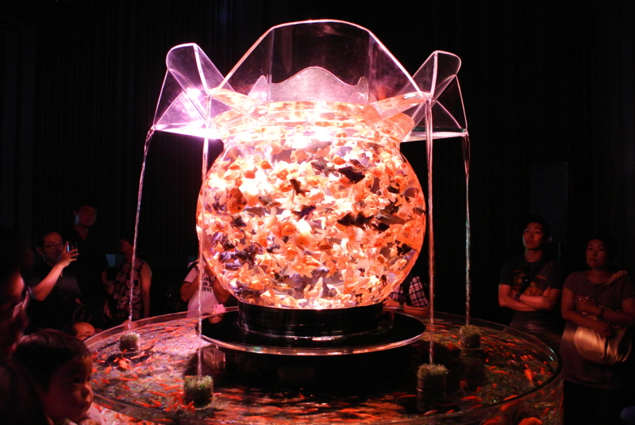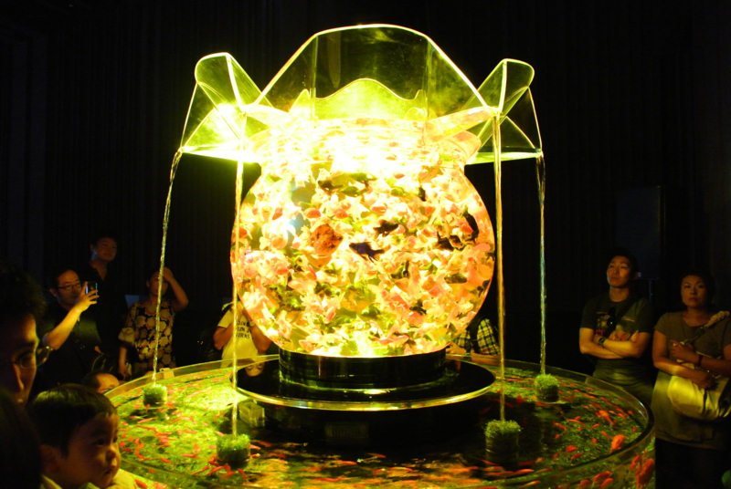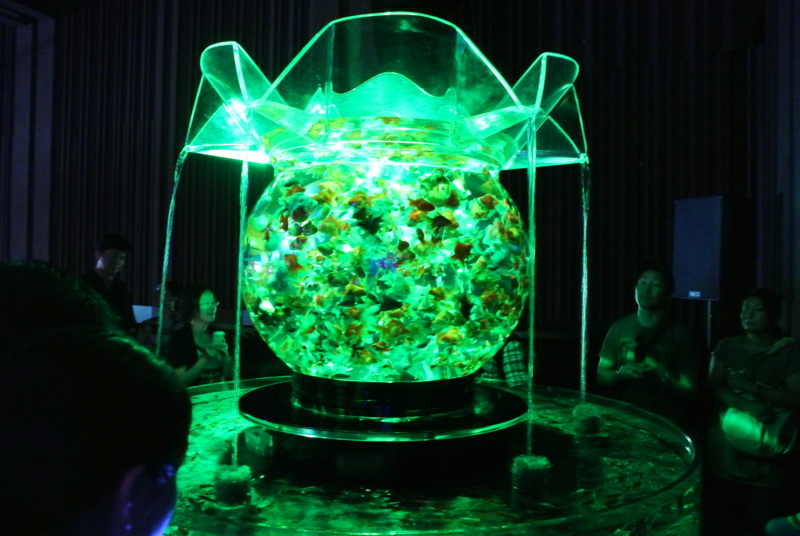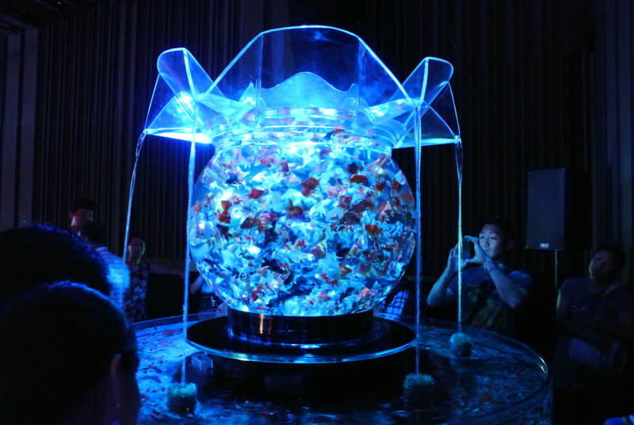

かくいう僕もその一人だけれど、正直、なかなかうまくとるのは難しいんじゃないかなと思った。

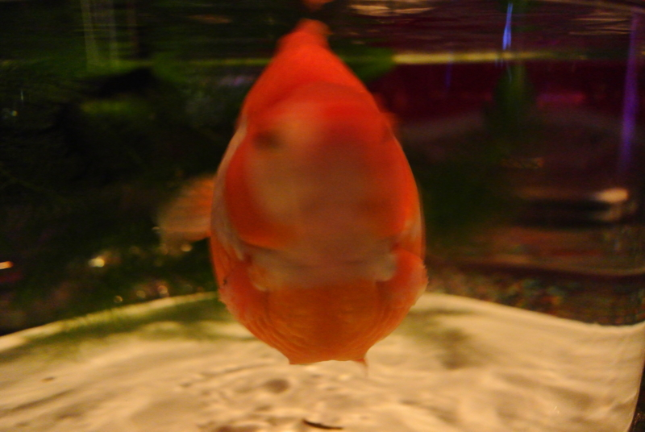

基本的に暗いのでブレるし、光源と色が常に変化するから設定合わせづらいし、そもそもアクリル越しだとなんか汚く写る。まぁ、 <a class="keyword" href="http://d.hatena.ne.jp/keyword/Nikon">Nikon</a> 1 V1 で撮ったので何も考えてないけれど<a href="#f1" name="fn1" title="ホワイトバランスをちょっとだけかえた">*1</a>。

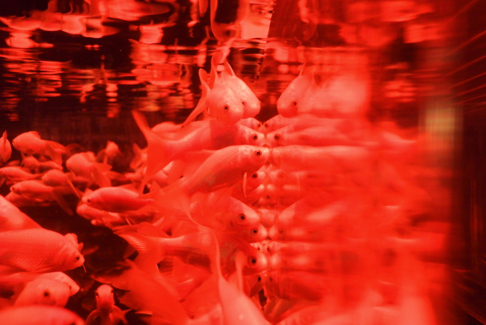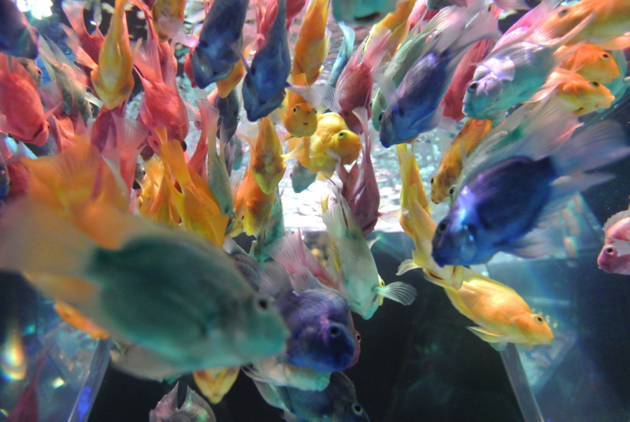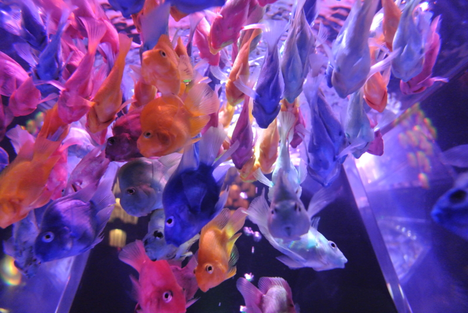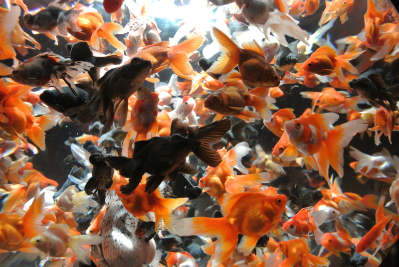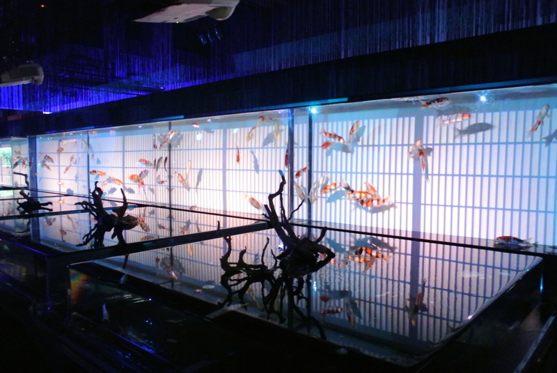

実際に目で見るともっと色鮮やかで、キレイだよ。

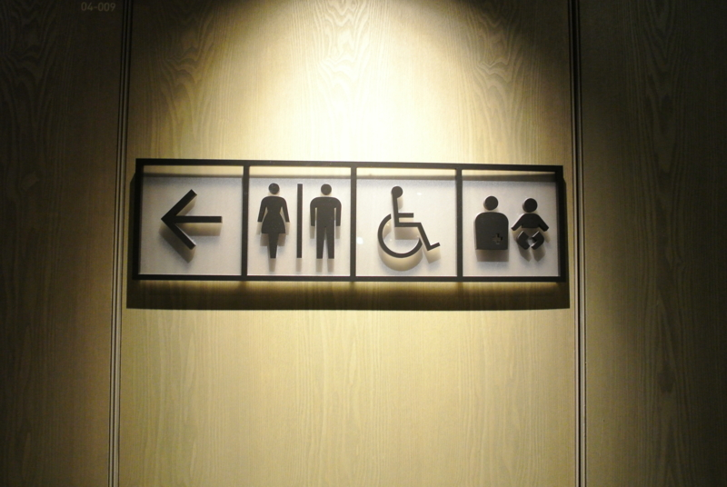

<a href="#fn1" name="f1" class="footnote-number">*1</a>:ホワイトバランスをちょっとだけかえた

