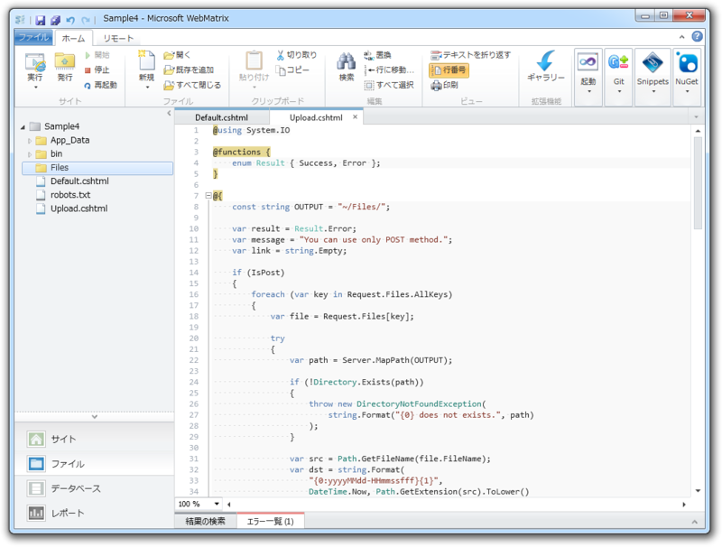
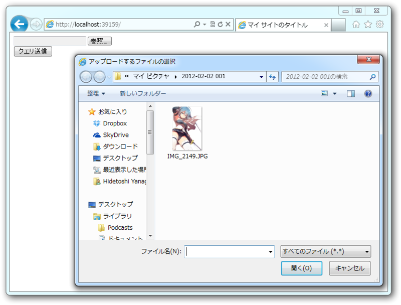
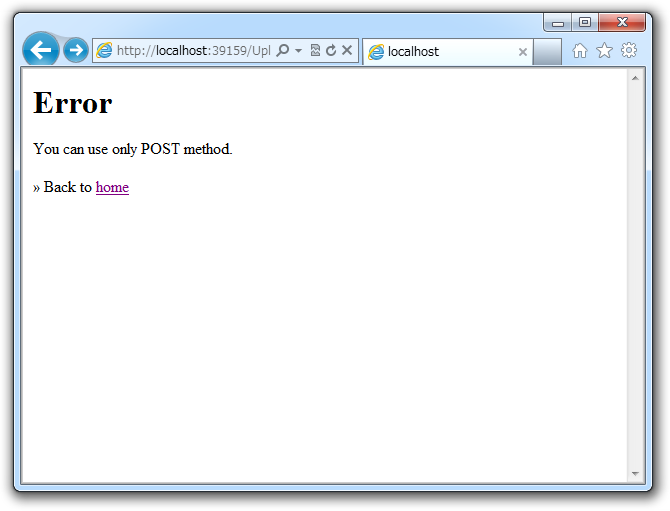
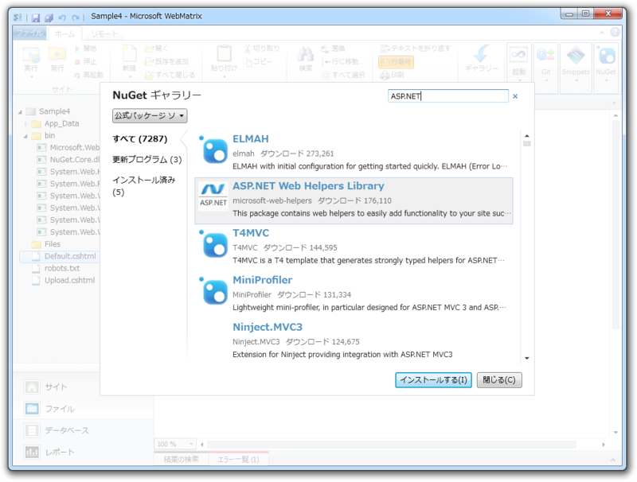
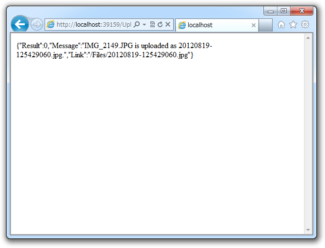

今日は「<a class="keyword" href="http://d.hatena.ne.jp/keyword/WebMatrix">WebMatrix</a> 2」でファイルのアップロードを試してみた。なお、このサンプルは「Empty Sites」テンプレートを元に作成している。

<h3>Delault.cshtml</h3>
<pre class="code lang-html" data-lang="html" data-unlink>&lt;!DOCTYPE html&gt;

&lt;html lang=&quot;ja&quot;&gt;
&lt;head&gt;
        &lt;meta charset=&quot;<a class="keyword" href="http://d.hatena.ne.jp/keyword/utf-8">utf-8</a>&quot; /&gt;
        &lt;title&gt;マイ サイトのタイトル&lt;/title&gt;
    &lt;/head&gt;
&lt;body&gt;
&lt;form action=&quot;~/Upload&quot; method=&quot;post&quot;
              enctype=&quot;multipart/form-data&quot;&gt;
&lt;input type=&quot;file&quot; name=&quot;upload&quot; /&gt;&lt;br /&gt;
&lt;input type=&quot;submit&quot; name=&quot;submit&quot; /&gt;
&lt;/form&gt;
&lt;/body&gt;
&lt;/html&gt;
</pre>
拡張子を html にすれば、ただの HTML ドキュメントだね！　ファイルのアップロードを行うので、 multipart/form-data をつけるのを忘れないように。

<h3>Upload.cshtml</h3>

アップロード処理を行う cshtml はこんな感じにしてみた。

ほんとは path が存在しなければ例外、 file のサイズが 0 ならば例外、 file が image/*** でなければ例外、といったチェックを入れるのだけれど、ソースが長くなるので割愛している。あと、最初から複数ファイルのアップデートに対応できるように記述している。

<pre class="code lang-cs" data-lang="cs" data-unlink>@using System.IO

@functions {
<a class="keyword" href="http://d.hatena.ne.jp/keyword/enum">enum</a> Result { Success, Error };
}

@{
var result = Result.Error;
var message = &quot;You can use only POST method.&quot;;
var link = string.Empty;

if (IsPost)
{
foreach (var key in Request.Files.AllKeys)
{
var file = Request.Files[key];

try
{
const string OUTPUT = &quot;~/Files/&quot;;
var path = Server.MapPath(OUTPUT);

var src = Path.GetFileName(file.FileName);
var dst = string.Format(
&quot;{0:yyyyMMdd-HHmmssfff}{1}&quot;,
DateTime.Now, Path.GetExtension(src).ToLower()
);

file.SaveAs(Path.Combine(path, dst));

result = Result.Success;
message = string.Format(
&quot;{0} is uploaded as {1}.&quot;,
src, dst
);
link = VirtualPathUtility.ToAbsolute(OUTPUT + dst);
}
catch (Exception e)
{
result = Result.Error;
message = e.Message;
}
}
}
}

&lt;h1&gt;@result&lt;/h1&gt;
&lt;p&gt;@message&lt;/p&gt;
if (!string.IsNullOrEmpty(link))
{
&lt;p&gt;&lt;img src=&quot;@link&quot; /&gt;&lt;/p&gt;
}
&lt;p&gt;&amp;raquo; Back to &lt;a href=&quot;~/&quot;&gt;home&lt;/a&gt;&lt;/p&gt;
</pre>
基本的には、 Request.Files でファイルを取得し、 SaveAs() で保存するだけ。そのほかはファイル名の決定だのエラー処理だのといったことをしているに過ぎない。

Default.cshtml から画像ファイルを POST すると、

エラーが出たらこんな感じで……

成功したらこんな感じになる。

"~/Files/"フォルダが夢のようになっておるな！

<h3>ステップアップ</h3>

<h4>ヘルパーで楽をしよ……ぅ？</h4>

<a class="keyword" href="http://d.hatena.ne.jp/keyword/ASP.NET">ASP.NET</a> Web Helpers Library という NuGet をインストールすると、複数ファイルのアップロードに対応した Form タグを簡単に生成できる。

<pre class="code lang-cs" data-lang="cs" data-unlink>@FileUpload.GetHtml()
</pre>
でも、個人的にはあんまり好きじゃなかったので今回は使わなかった。

<pre class="code lang-cs" data-lang="cs" data-unlink>&lt;!DOCTYPE html&gt;

@{
if (IsPost)
{
foreach (var key in Request.Files.AllKeys)
{
var file = Request.Files[key];

try
{
file.SaveAs(
System.IO.Path.Combine(
Server.MapPath(&quot;~/Files/&quot;),
file.FileName)
);
}
catch (Exception e)
{

}
}
}
}

&lt;html lang=&quot;ja&quot;&gt;
&lt;head&gt;
&lt;meta charset=&quot;<a class="keyword" href="http://d.hatena.ne.jp/keyword/utf-8">utf-8</a>&quot; /&gt;
&lt;title&gt;マイ サイトのタイトル&lt;/title&gt;
&lt;/head&gt;
&lt;body&gt;
@FileUpload.GetHtml()
&lt;/body&gt;
&lt;/html&gt;
</pre>

なんか動的に生成されるノードの名前がカブってるし<a href="#f1" name="fn1" title="JavaScriptの不具合かなぁ">*1</a>、あんまりよくわかんなかった。

<h3>ビューでつかう変数をまとめる</h3>

Upload.cshtml の<a class="keyword" href="http://d.hatena.ne.jp/keyword/%A5%BD%A1%BC%A5%B9%A5%B3%A1%BC%A5%C9">ソースコード</a>がなんだか冗長なのは、HTML の出力に使う result、message、link という3つの変数を処理するためだけど、こいつらって<b>匿名クラス</b>でまとめてもいいよね。

<pre class="code lang-cs" data-lang="cs" data-unlink>@using System.IO

@functions { <a class="keyword" href="http://d.hatena.ne.jp/keyword/enum">enum</a> Result { Success, Error }; }

@{
const string OUTPUT = &quot;~/Files/&quot;;
dynamic model = null;

if (IsPost)
{
foreach (var key in Request.Files.AllKeys)
{
var file = Request.Files[key];

try
{
var path = Server.MapPath(OUTPUT);

var src = Path.GetFileName(file.FileName);
var dst = string.Format(
&quot;{0:yyyyMMdd-HHmmssfff}{1}&quot;,
DateTime.Now, Path.GetExtension(src).ToLower()
);

file.SaveAs(Path.Combine(path, dst));

model = new {
Result = Result.Success,
Message = string
.Format(&quot;{0}'s uploaded as {1}&quot;, src, dst),
Link = VirtualPathUtility
.ToAbsolute(OUTPUT + dst),
};
}
catch (Exception e)
{
model = new {
Result = Result.Error,
Message = e.Message,
Link = string.Empty,
};
}
}
}
else
{
model = new {
Result = Result.Error,
Message = &quot;You can use only POST method&quot;,
Link = string.Empty,
};
}
}

&lt;h1&gt;@model.Result&lt;/h1&gt;
&lt;p&gt;@model.Message&lt;/p&gt;
@if (!string.IsNullOrEmpty(model.Link))
{
&lt;p&gt;&lt;img src=&quot;@model.Link&quot; /&gt;&lt;/p&gt;
}
&lt;p&gt;&amp;raquo; Back to &lt;a href=&quot;~/&quot;&gt;home&lt;/a&gt;&lt;/p&gt;
</pre>
記述量はかえって多くなったけど、「何かの処理 → 結果（モデル）の生成」という流れが明確になった気がする。この @model っていうのが MVVM の ViewModel じゃない ViewModel という理解でいいんでしょうか。

<h3><a class="keyword" href="http://d.hatena.ne.jp/keyword/Ajax">Ajax</a> には Json で応える</h3>

ViewModel を返すことの利点は、可読性だけじゃない。たとえばこんなこともできる。

<pre class="code lang-cs" data-lang="cs" data-unlink>@if (IsAjax)
{
// Response.ContentType = &quot;application/json&quot;;
Response.Write(Json.Encode(model));
}
else
{
&lt;h1&gt;@model.Result&lt;/h1&gt;
&lt;p&gt;@model.Message&lt;/p&gt;
if (!string.IsNullOrEmpty(model.Link))
{
&lt;p&gt;&lt;img src=&quot;@model.Link&quot; /&gt;&lt;/p&gt;
}
&lt;p&gt;&amp;raquo; Back to &lt;a href=&quot;~/&quot;&gt;home&lt;/a&gt;&lt;/p&gt;
}
</pre>

<a class="keyword" href="http://d.hatena.ne.jp/keyword/Ajax">Ajax</a> リクエストに Json で応えるなんてことも簡単にできる！

<h3>拡張メソッドのお時間です</h3>

あとさ、これダサいよね。

<pre class="code lang-cs" data-lang="cs" data-unlink>foreach (var key in Request.Files.AllKeys)
{
var file = Request.Files[key];
：
：
</pre>
拡張メソッドを書いて、シンプルにしましょう。

<pre class="code lang-cs" data-lang="cs" data-unlink>foreach (var file in Request.Files.ToEnumerable())
{
：
：
</pre>
~/App_Code/HttpFileCollectionBaseExtension.cs を作成してこのように書いてみました。

<pre class="code lang-cs" data-lang="cs" data-unlink>using System.Collections.Generic;
using System.Web;

public static class HttpFileCollectionBaseExtension
{
public static IEnumerable&lt;HttpPostedFileBase&gt; ToEnumerable(
this HttpFileCollectionBase target)
{
foreach (var key in target.AllKeys)
{
yield return target[key];
}
}
}
</pre>

<a href="#fn1" name="f1" class="footnote-number">*1</a>:<a class="keyword" href="http://d.hatena.ne.jp/keyword/JavaScript">JavaScript</a>の不具合かなぁ

