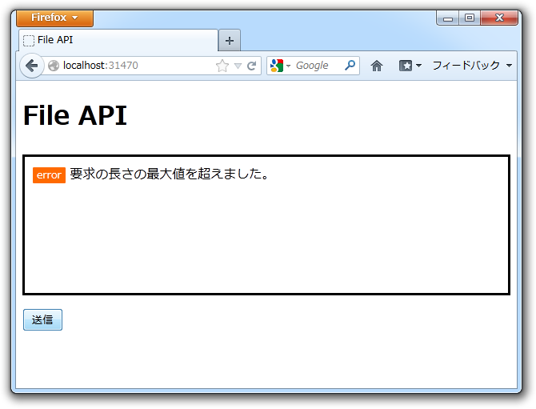

まずはお詫びを。

<blockquote cite="https://blog.daruyanagi.jp/entry/2012/08/19/130606">

あと、最初から複数ファイルのアップデートに対応できるように記述している。

<cite><a href="https://blog.daruyanagi.jp/entry/2012/08/19/130606">WebMatrix &#x3067;&#x30D5;&#x30A1;&#x30A4;&#x30EB;&#x306E;&#x30A2;&#x30C3;&#x30D7;&#x30ED;&#x30FC;&#x30C9; - &#x3060;&#x308B;&#x308D;&#x3050;</a><a href="https://blog.daruyanagi.jp/entry/2012/08/19/130606">WebMatrix &#x3067;&#x30D5;&#x30A1;&#x30A4;&#x30EB;&#x306E;&#x30A2;&#x30C3;&#x30D7;&#x30ED;&#x30FC;&#x30C9; - &#x3060;&#x308B;&#x308D;&#x3050;</a></cite>
</blockquote>

あれはウソだ。

いや、複数ファイルのアップロード自体はできるのだけれど、結果を返す処理が単体ファイルを前提としていたので最後のファイルの結果しか得られない。正しくは、

<pre class="code lang-cs" data-lang="cs" data-unlink>var model = new List&lt;dynamic&gt;();
</pre>
とでもして、複数のファイルの結果を格納できるようにすべきだった。

さてはて。

このように Upload.cshtml はめでたく複数ファイルのアップロードに対応できたし、 Ajax には Json で応答するようにもなった。ならば、ドラッグ＆ドロップで複数ファイルのアップロードもしてみたいよね。というわけでやってみた。

初期状態。

ファイルをドラッグ＆ドロップ。これにはもちろん、 Drag & Drop の API を利用する。

画像のプレビューは HTML5 の File Reader API を利用して実装してある。JavaScript は見よう見まねで書いてみたけれどなかなか難しい……けれど、 cshtml ならば自動補完機能の恩恵をうけることができるのでまだマシ。jQuery だと

<pre class="code" data-lang="" data-unlink>$.event.props.push(&#39;dataTransfer&#39;);</pre>
という呪文を唱えないと動かないのを知らなくて、かなり悩んだ。

Ajax でファイルを Upload.cshtml へ送ると、画面遷移なしで結果が表示される。これには FormData という仕組みを利用した。

まぁ、ここで JavaScript の話をする気はないので本題に入るけど、これ。

デカいファイルをアップロードしようとすると発生するのだけれど、この例外をトラップするのが面倒……。無理やり頑張ってトラップしてみたのだけれど、 try 文がやたらネストするし、 Request に少しでもアクセスしようものなら発生するので IsAjax が取れずに少し困っている<a href="#f-b7512c63" name="fn-b7512c63" title="例外自体は IIS のリクエストのサイズ制限を緩和すれば抑制できるはず">*1</a>。

<pre class="code lang-cs" data-lang="cs" data-unlink># Upload.cs

@using System.IO

@functions
{
private enum Result
{
Success = 0,
Error   = -1,
};

private const string OUTPUT_DIR = &quot;~/Files/&quot;;
private Dictionary&lt;string, string&gt; AllowedFileType = new Dictionary&lt;string, string&gt;();

private void VerifyOutputDir(string path)
{
if (!Directory.Exists(path))
{
throw new DirectoryNotFoundException(
string.Format(&quot;{0} does not exists.&quot;, path)
);
}
}

private void VerifyPostedFile(HttpPostedFileBase file)
{
if (file.ContentLength == 0)
{
throw new ArgumentException(&quot;File is null.&quot;);
}

if (!AllowedFileType.ContainsKey(file.ContentType))
{
throw new ArgumentException(
string.Format(
&quot;{0} is not allowed format&quot;,
file.ContentType
)
);
}
}

private string GetOutputFilename(HttpPostedFileBase file)
{
return string.Format(
&quot;{0:yyyyMMdd-HHmmssfff}.{1}&quot;,
DateTime.Now,
AllowedFileType[file.ContentType].ToLower()
);
}
}

@{
var model = new List&lt;dynamic&gt;();

AllowedFileType.Add(&quot;image/jpeg&quot;, &quot;jpg&quot;);
AllowedFileType.Add(&quot;image/png&quot; , &quot;png&quot;);
AllowedFileType.Add(&quot;image/gif&quot; , &quot;gif&quot;);

var dir = Server.MapPath(OUTPUT_DIR);

try
{
if (IsPost) // &lt;-- ここでもエラーが発生しうるので try…catcgh せざるを得ない
{
foreach (var file in Request.Files.ToEnumerable())
{
try
{
VerifyOutputDir(dir);
VerifyPostedFile(file);

var src = Path.GetFileName(file.FileName);
var dst = GetOutputFilename(file);

file.SaveAs(Path.Combine(dir, dst));

model.Add( new {
Result = Result.Success,
Message = string.Format(&quot;{0} is uploaded as {1}.&quot;, src, dst),
Link = VirtualPathUtility.ToAbsolute(Path.Combine(OUTPUT_DIR, dst)),
});
}
catch (Exception e)
{
model.Add(new
{
Result = Result.Error,
Message = e.Message,
Link = string.Empty,
});
}
}
}
else
{
model.Add (new {
Result = Result.Error,
Message = &quot;You can use only POST method.&quot;,
Link = string.Empty,
});
}

if (IsAjax)
{
Response.ContentType = &quot;application/json&quot;;
Response.Write(Json.Encode(model));
return;
}
}
catch (Exception e)
{
model.Add( new {
Result = Result.Error,
Message = e.Message,
Link = string.Empty,
});

Response.ContentType = &quot;application/json&quot;;
Response.Write(Json.Encode(model));
return; // &lt;-- IsAjax が使えない（エラーが起こりうる）ので出力先を分岐できない
}
}

&lt;h1&gt;Uploading Result&lt;/h1&gt;

@foreach (var item in model)
{
&lt;h2&gt;@item.Result&lt;/h2&gt;
&lt;p&gt;@item.Message&lt;/p&gt;
if (!string.IsNullOrEmpty(item.Link))
{
&lt;p&gt;&lt;img src=&quot;@item.Link&quot; /&gt;&lt;/p&gt;
}
}

&lt;p&gt;&amp;raquo; Back to &lt;a href=&quot;~/&quot;&gt;home&lt;/a&gt;&lt;/p&gt;
</pre>
とりあえず動くけど、ブラウザーからアクセスした時にリクエストサイズ超過のエラーが出てもそれをユーザーに知らせることができない（Json で返せるのみ）。やっぱりこういうのは Json のみを返す API として作って、ビューは完全に分離したほうがいいなと思った。

<a href="#fn-b7512c63" name="f-b7512c63" class="footnote-number">*1</a>:例外自体は IIS のリクエストのサイズ制限を緩和すれば抑制できるはず

