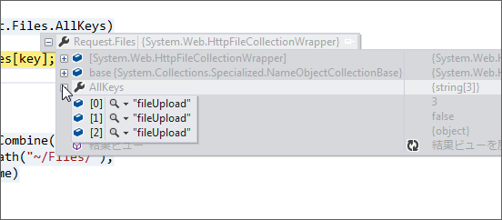
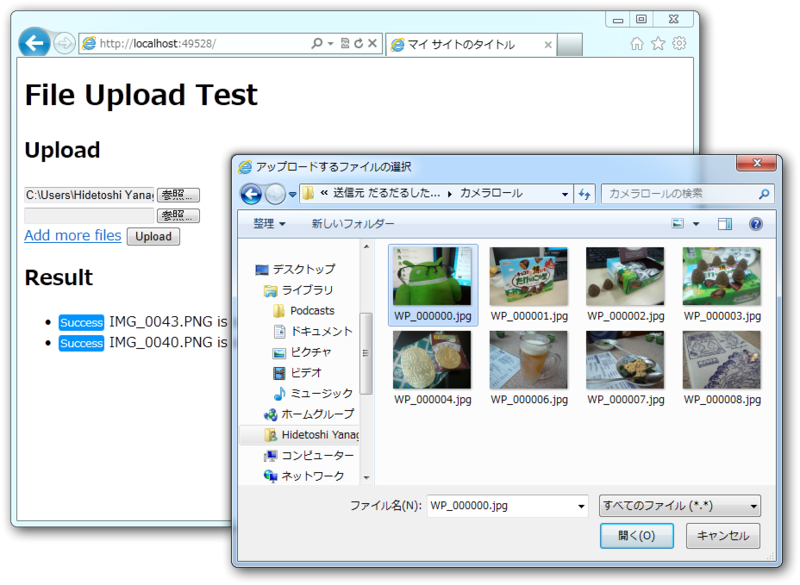

まずはお詫びを。

 

<blockquote cite="https://blog.daruyanagi.jp/entry/2012/08/19/130606">

ASP.NET Web Helpers Library という NuGet をインストールすると、（FileUpload ヘルパーを利用して）複数ファイルのアップロードに対応した Form タグを簡単に生成できる。

でも、個人的にはあんまり好きじゃなかったので今回は使わなかった。なんか動的に生成されるノードの名前がカブってるし、あんまりよくわかんなかった。

<cite><a href="https://blog.daruyanagi.jp/entry/2012/08/19/130606">WebMatrix &#x3067;&#x30D5;&#x30A1;&#x30A4;&#x30EB;&#x306E;&#x30A2;&#x30C3;&#x30D7;&#x30ED;&#x30FC;&#x30C9; - &#x3060;&#x308B;&#x308D;&#x3050;</a></cite>
</blockquote>

そしたらツッコミをもらった。

<blockquote class="twitter-tweet" data-lang="ja">
だるさん、HTML の name 属性の値は重複してもいいんやで
&mdash; しばやん (@shibayan) <a href="https://twitter.com/shibayan/status/237243206683746304?ref_src=twsrc%5Etfw">2012年8月19日</a></blockquote>

最初はなんのことかと思ったけど、 HttpFileCollection は NameObjectCollectionBase を継承している。 NameObjectCollectionBase は重複した複数のキーをもてるので、キーで値を取ろうとすると取りこぼしが発生する、ということみたい。

確かにせやな。 Key はひとつだけど、 Value は複数あるわ。

というわけで、値をすべて取得する拡張メソッド（~/App_Code/HttpFileCollectionBaseExtension.cs）は

<pre class="code lang-cs" data-lang="cs" data-unlink>using System.Collections.Generic;
using System.Web;

public static class HttpFileCollectionBaseExtension
{
public static IEnumerable&lt;HttpPostedFileBase&gt; ToEnumerable(
this HttpFileCollectionBase target)
{
foreach (var key in target.AllKeys) //--&gt; Key で……
{
yield return target[key];
}
}
}
</pre>
ではなくて、

<pre class="code lang-cs" data-lang="cs" data-unlink>using System.Collections.Generic;
using System.Web;

public static class HttpFileCollectionBaseExtension
{
public static IEnumerable&lt;HttpPostedFileBase&gt; ToEnumerable(
this HttpFileCollectionBase target)
{
for (int i = 0; i &lt; target.Count; i++) //--&gt; Index で！
{
yield return target[i];
}
}
}
</pre>
じゃないとダメみたい。 for 文なんて久しぶりに書いたわ……。

んで、 Default.cshtml をこんな感じで書いてみた。

<pre class="code lang-cs" data-lang="cs" data-unlink>&lt;!DOCTYPE html&gt;

@{
IEnumerable&lt;dynamic&gt; model = null;

if (IsPost)
{
model = Request.Files.ToEnumerable()
.Select&lt;HttpPostedFileBase, dynamic&gt;((file) =&gt;
{
try
{
var path = &quot;~/Files/&quot; + file.FileName;
file.SaveAs(Server.MapPath(path));

return new {
Result = &quot;Success&quot;,
Src = VirtualPathUtility.ToAbsolute(path),
Message = string.Format(
&quot;{0} is saved successfully&quot;, file.FileName),
};
}
catch (Exception e)
{
return new {
Result = &quot;Error&quot;,
Message = e.Message,
};
}
});
}
}

&lt;html lang=&quot;ja&quot;&gt;
&lt;head&gt;
&lt;meta charset=&quot;utf-8&quot; /&gt;
&lt;title&gt;マイ サイトのタイトル&lt;/title&gt;

&lt;style&gt;
html { font-family: Meiryo, sans-serif; }
.label { color: #fff; font-size: 0.8em;
border-radius: 2px; padding: 0 5px; }
.success { background-color: #0094ff; }
.error { background-color: #ff6a00; }
&lt;/style&gt;
&lt;/head&gt;
&lt;body&gt;
&lt;h1&gt;File Upload Test&lt;/h1&gt;

&lt;h2&gt;Upload&lt;/h2&gt;
@FileUpload.GetHtml()

&lt;h2&gt;Result&lt;/h2&gt;
@if (model == null)
{
&lt;p&gt;No files are uploaded.&lt;/p&gt;
}
else
{
&lt;ul&gt;
@foreach (var item in model)
{
&lt;li&gt;&lt;span class=&quot;label @item.Result.ToLower()&quot;&gt;
@item.Result&lt;/span&gt; @item.Message&lt;/li&gt;
}
&lt;/ul&gt;
}
&lt;/body&gt;
&lt;/html&gt;
</pre>
結果はこんな感じ。

できた！

<ul>
<li><a href="http://shiba-yan.hatenablog.jp/entry/20110702/1309532938">HTML5 &#x306E; Drag and Drop API &#x3068; File API &#x3092;&#x4F7F;&#x3063;&#x3066;&#x30D5;&#x30A1;&#x30A4;&#x30EB;&#x30A2;&#x30C3;&#x30D7;&#x30ED;&#x30FC;&#x30C9;&#x3092;&#x5B9F;&#x88C5;&#x3059;&#x308B; - &#x3057;&#x3070;&#x3084;&#x3093;&#x96D1;&#x8A18;</a></li>
</ul>