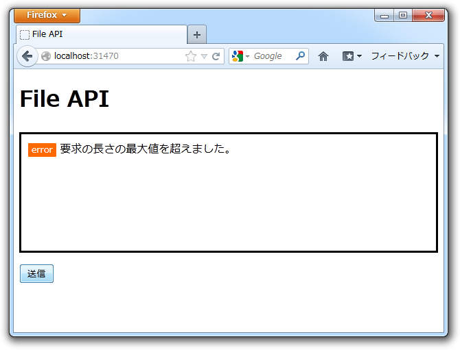
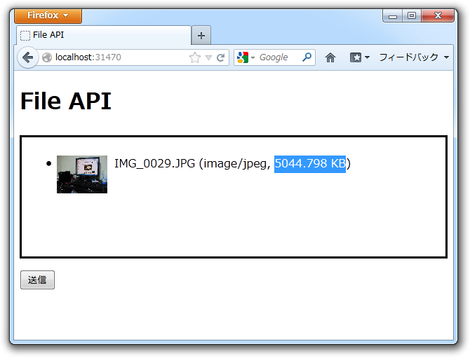
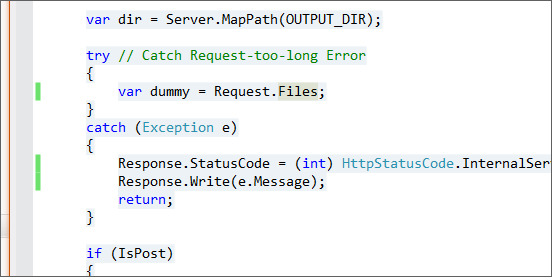
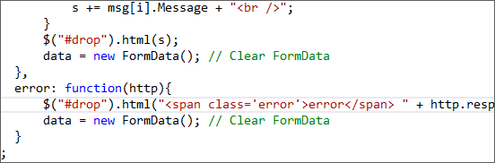

 

<blockquote cite="https://blog.daruyanagi.jp/entry/2012/08/20/020355">

デカいファイルをアップロードしようとすると発生するのだけれど、この例外をトラップするのが面倒……。無理やり頑張ってトラップしてみたのだけれど、 try 文がやたらネストするし、 Request に少しでもアクセスしようものなら発生するので IsAjax が取れずに少し困っている。

<cite><a href="https://blog.daruyanagi.jp/entry/2012/08/20/020355">WebMatrix &#x3067;&#x30D5;&#x30A1;&#x30A4;&#x30EB;&#x306E;&#x30A2;&#x30C3;&#x30D7;&#x30ED;&#x30FC;&#x30C9;&#xFF08;2&#xFF09; - &#x3060;&#x308B;&#x308D;&#x3050;</a></cite>
</blockquote>

思いついたのだけれど、無理してビューまたは Json を返そうとしなくてもステータスコードだけ返せばいいな。最初にわざとエラーを発生させるコードを書いてそこで return してしまえば、 try……catch 文のネストを減らせるし。

<pre class="code lang-cs" data-lang="cs" data-unlink>@{
try // Catch Request-too-long Error
{
var dummy = Request.Files;
}
catch (Exception e)
{
Response.StatusCode =
(int) HttpStatusCode.InternalServerError;
Response.Write(e.Message);
return;
}

if (IsPost)
{
：
：
</pre>
これをするとどうなるのかというと、

まず、デカいファイルを投げる（既定では約4MB以上）。

サーバーでエラーが発生し、ステータスコード（よくわからんけど5**）を返す。

$.ajax() の error プロパティでそれを拾って……

HTML を更新する。ブラウザーからアクセスしたときは、まぁ、なんかエラー画面が表示されるのだろう。とりあえずこれでいいか。

