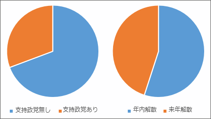

<blockquote cite="http://www.jiji.com/jc/zc?k=201208/2012081600557">

　<a class="keyword" href="http://d.hatena.ne.jp/keyword/%C0%AF%C5%DE%BB%D9%BB%FD%CE%A8">政党支持率</a>は<a class="keyword" href="http://d.hatena.ne.jp/keyword/%CC%B1%BC%E7%C5%DE">民主党</a>６．９％（前月比０．２ポイント増）、自民党１３．３％（同０．８ポイント増）で、ともに微増。今回から調査対象となった<a class="keyword" href="http://d.hatena.ne.jp/keyword/%BE%AE%C2%F4%B0%EC%CF%BA">小沢一郎</a>代表率いる新党「<a class="keyword" href="http://d.hatena.ne.jp/keyword/%B9%F1%CC%B1%A4%CE%C0%B8%B3%E8%A4%AC%C2%E8%B0%EC">国民の生活が第一</a>」は０．９％にとどまった。他は公明党４．３％、<a class="keyword" href="http://d.hatena.ne.jp/keyword/%B6%A6%BB%BA%C5%DE">共産党</a>１．５％、<a class="keyword" href="http://d.hatena.ne.jp/keyword/%A4%DF%A4%F3%A4%CA%A4%CE%C5%DE">みんなの党</a>１．２％、<a class="keyword" href="http://d.hatena.ne.jp/keyword/%B9%F1%CC%B1%BF%B7%C5%DE">国民新党</a>０．２％、<a class="keyword" href="http://d.hatena.ne.jp/keyword/%BC%D2%CC%B1%C5%DE">社民党</a>０．１％で、支持政党なしは６９．３％だった。

　一方、衆院選をいつ実施すべきか尋ねたところ、９月８日までの「今国会中」は１６．５％、「今秋から年末までに」が３８．５％で、年内解散は合わせて５５％。「来年の前半までに」は１４．６％、「来年夏の参院選とのダブル選挙」は１４．７％だった。

<cite><a href="http://www.jiji.com/jc/zc?k=201208/2012081600557">&#x6642;&#x4E8B;&#x30C9;&#x30C3;&#x30C8;&#x30B3;&#x30E0;&#xFF1A;&#x5185;&#x95A3;&#x652F;&#x6301;&#x7D9A;&#x843D;&#x3001;&#xFF11;&#xFF19;&#xFF0E;&#xFF18;&#xFF05;&#xFF1D;&#xFF15;&#x5272;&#x5F37;&#x300C;&#x5E74;&#x5185;&#x89E3;&#x6563;&#x3092;&#x300D;&minus;&#x6642;&#x4E8B;&#x4E16;&#x8AD6;&#x8ABF;&#x67FB;</a></cite>
</blockquote>

支持政党のない人と年内解散を望む人がどれだけ重なっているかはこの記事から読み取れないので、タイトルは煽り。でも、それほど外してはないと思う。

政治家には「信念がない」などと批判しつつ自分は無責任な「無党派」を気取るのが、今の日本国民ということだ。どこの党も支持していないのに、早期解散を願ってどうする？<a href="#f1" name="fn1" title="無所属議員？　それに関する意見はどこかに書いた。端的に言うなら、いるだけ無駄">*1</a>　選挙だってお金がかかるんだよ<a href="#f2" name="fn2" title="40億円ぐらいかな">*2</a>。

「支持する政党がない」というのは言い訳にならない。スジの通った無党派なら自分で立候補すべきだし、それが無理だとしても投票所に行くべきではないし、行ったとしても白票を投ずるべきだ。なぜなら、投票すべき支持政党をもたないのだから。ましてや、解散の時期などいつでもよろしい、予算がかかるのだから任期満了が望ましい、という態度が正しいはず。

なのにフラフラとその場のノリで虎の子の票を<a class="keyword" href="http://d.hatena.ne.jp/keyword/%CC%B1%BC%E7%C5%DE">民主党</a>へ差し上げたのがこのザマだ。<a class="keyword" href="http://d.hatena.ne.jp/keyword/%CC%B1%BC%E7%C5%DE">民主党</a>がただの選挙互助会で、政権をとったら分裂必至で、<a class="keyword" href="http://d.hatena.ne.jp/keyword/%A5%DE%A5%CB%A5%D5%A5%A7%A5%B9%A5%C8">マニフェスト</a>など守りようのないのは明らかなのに<a href="#f3" name="fn3" title="これについてはことあるごとに Twitter などで言ってきた">*3</a>。別に自民党がいいとは言わないが<a href="#f4" name="fn4" title="どちらも支持していない">*4</a>、ああいう党に国民の大多数が投票するなんて見識を疑う。政治家の無節操・不見識なんか笑えないよ。で、お次はといえばとりあえず最近流行りの維新の会にでも投票するのだろう。維新の会には多少シンパシーを感じるけれども、そういった衆愚票で政権をとるのは望まないな。

まぁ、投票は国民の権利なので好きに行使すればいい。ただ、スジの通った政治を望むなら、国民それぞれがスジの通った意見をもつのが先なんじゃないかな<a href="#f5" name="fn5" title="なぜスジの通った政治が望ましいかというと、明確な目的には明確な結果が得られ、ゆえに明確な反省が得られるから。曖昧な・場当たり主義では反省すら得られない">*5</a>。そして、自分の意見が許す範囲でスジの通った意見をする政党を選び、また政党がスジを通した行動をするように監視すべきだ<a href="#f6" name="fn6" title="比例代表で当選しておきながら、まったく理念の異なる党へ任期中に移籍するなぞ許してはならない">*6</a>。

まず、自分の考えを知り、それに近い政党を応援することから始めようよ。

<a href="#fn1" name="f1" class="footnote-number">*1</a>:無所属議員？　それに関する意見はどこかに書いた。端的に言うなら、いるだけ無駄

<a href="#fn2" name="f2" class="footnote-number">*2</a>:40億円ぐらいかな

<a href="#fn3" name="f3" class="footnote-number">*3</a>:これについてはことあるごとに <a class="keyword" href="http://d.hatena.ne.jp/keyword/Twitter">Twitter</a> などで言ってきた

<a href="#fn4" name="f4" class="footnote-number">*4</a>:どちらも支持していない

<a href="#fn5" name="f5" class="footnote-number">*5</a>:なぜスジの通った政治が望ましいかというと、明確な目的には明確な結果が得られ、ゆえに明確な反省が得られるから。曖昧な・場当たり主義では反省すら得られない

<a href="#fn6" name="f6" class="footnote-number">*6</a>:<a class="keyword" href="http://d.hatena.ne.jp/keyword/%C8%E6%CE%E3%C2%E5%C9%BD">比例代表</a>で当選しておきながら、まったく理念の異なる党へ任期中に移籍するなぞ許してはならない

