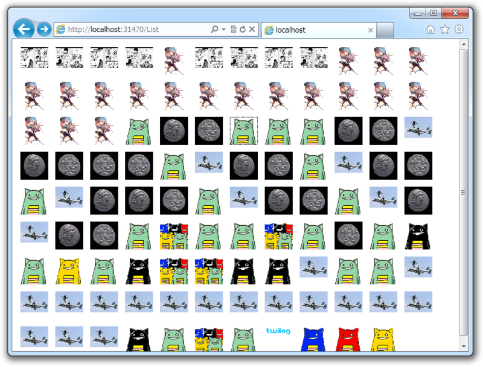

そういえば、アップロードしたファイルの表示をやっていなかった<a href="#f1" name="fn1" title="アップロード「結果」の表示はやっていたけれど">*1</a>。アップロードフォルダには画像ファイルしかないはずなので、今回は img タグで決め打ちしていいかな。

<pre class="code lang-cs" data-lang="cs" data-unlink># List.cshtml

@functions {
private const string OUTPUT_DIR = &quot;~/Files/&quot;;
}

@{
var dir = Server.MapPath(OUTPUT_DIR);
var files = new System.IO.DirectoryInfo(dir)
.EnumerateFiles()
.Select((f) =&gt; VirtualPathUtility
.ToAbsolute(OUTPUT_DIR + f.Name));
}

&lt;!DOCTYPE html&gt;

&lt;html lang=&quot;en&quot;&gt;
&lt;head&gt;
&lt;meta charset=&quot;<a class="keyword" href="http://d.hatena.ne.jp/keyword/utf-8">utf-8</a>&quot; /&gt;
&lt;title&gt;&lt;/title&gt;
&lt;style&gt;
a {
            display: block;
            float: left;
            height: 48px; width: 48px;
            margin: 6px;
text-align: center;
}
a img {
max-height: 48px; max-width: 48px;
            border: none;
}
&lt;/style&gt;
&lt;/head&gt;
&lt;body&gt;
@foreach (var file in files)
{
&lt;a href=&quot;@file&quot;&gt;&lt;img src=&quot;@file&quot; /&gt;&lt;/a&gt;
}
&lt;/body&gt;
&lt;/html&gt;
</pre>
結果はこんな感じ。

びっくりするほど難しくなかった。

OUTPUT_DIR はアップロード処理と共通なので、どこかにまとめておいたほうがいいな。むしろ、 OUTPUT_DIR フォルダーの内容を管理するクラスを作って、それを経由してファイルの保存・一覧をするようにするのが望ましいと思った。

<a href="#fn1" name="f1" class="footnote-number">*1</a>:アップロード「結果」の表示はやっていたけれど

