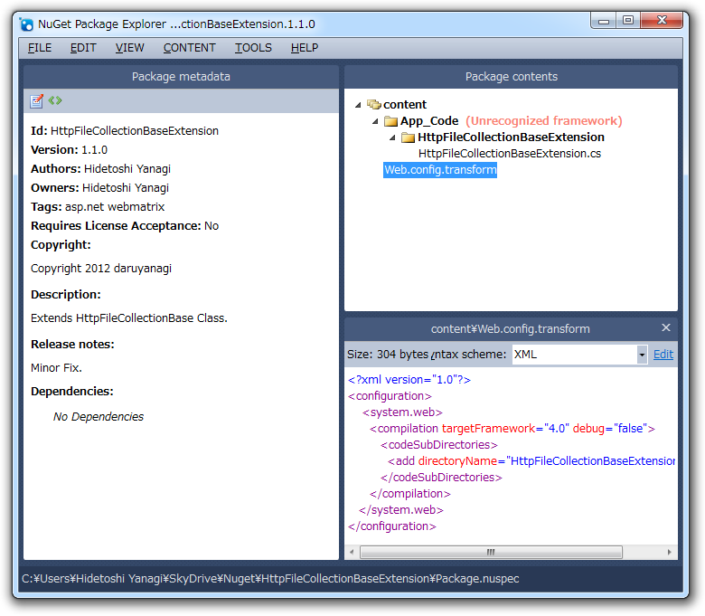

<b>NuGet Package Explorer</b>（<a href="http://npe.codeplex.com/">http://npe.codeplex.com/</a>）を使ってみたかったので、 <a href="https://blog.daruyanagi.jp/entry/2012/08/20/202253">WebMatrix &#x3067;&#x30D5;&#x30A1;&#x30A4;&#x30EB;&#x306E;&#x30A2;&#x30C3;&#x30D7;&#x30ED;&#x30FC;&#x30C9;&#xFF08;3&#xFF09; - FileUpload &#x30D8;&#x30EB;&#x30D1;&#x30FC;&#x3092;&#x4F7F;&#x3046; - &#x3060;&#x308B;&#x308D;&#x3050;</a> で利用した HttpFileCollectionBase の拡張メソッドを NuGet パッケージにしてみた。 ClickOnce 形式のインストーラーになっていて、セットアップは簡単。やっぱ GUI で編集できるのはいいな。

<pre class="code" data-lang="" data-unlink>/
HttpFileCollectionBaseExtension.nuspec

content/
web.config.transform
App_Code/
HttpFileCollectionBaseExtension.cs
ReadMe.txt</pre>
というフォルダー階層にして .nuspec を開いたら、 &lt;Files&gt; を書いてなくてちゃんと Contentが読み込まれた。なるほど。

別に使い方は難しくないけれど、いくつか躓いたところもある。

まず、メタデータ（.nuspec）を保存するのを忘れやすい。［Save］メニューは .nupack を保存するコマンドなので、 .nuspec を保存するには［Save metadata］メニューを利用する。

あと、公開（push）の終了がわかりづらい。まぁ、重複して公開するとエラーになる（実害はない）のでわかるのだけれど。

<ul>
<li><a href="https://nuget.org/packages/HttpFileCollectionBaseExtension">NuGet Gallery | HttpFileCollectionBaseExtension 1.1.0</a></li>
<li><a href="https://blog.daruyanagi.jp/entry/2012/08/17/034631">Highlight.js &#x3092; NuGet &#x30D1;&#x30C3;&#x30B1;&#x30FC;&#x30B8;&#x306B;&#x3057;&#x3066;&#x307F;&#x307E;&#x3057;&#x305F; - &#x3060;&#x308B;&#x308D;&#x3050;</a></li>
</ul>