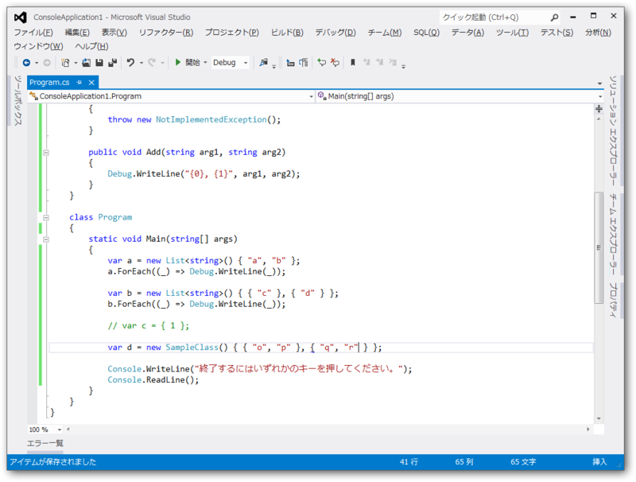
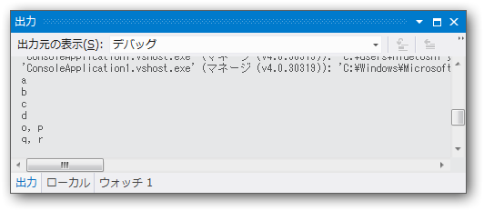
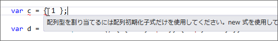
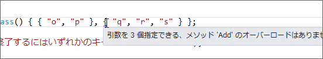

<blockquote cite="https://blog.daruyanagi.jp/entry/2012/08/22/073342">

Dictionary ってその場で初期化できるんだね。

<pre class="code lang-cs" data-lang="cs" data-unlink>private Dictionary&lt;string, string&gt; AllowedFileType =
new Dictionary&lt;string, string&gt;()
{
{ &quot;image/jpeg&quot;, &quot;jpg&quot; },
{ &quot;image/png&quot; , &quot;png&quot; },
{ &quot;image/gif&quot; , &quot;gif&quot; },
};
</pre>
こっちのほうがいいや。

<cite><a href="https://blog.daruyanagi.jp/entry/2012/08/22/073342">&#x3053;&#x308C;&#x307E;&#x3067;&#x306E;&#x30B5;&#x30F3;&#x30D7;&#x30EB;&#x3092; NuGet &#x30D1;&#x30C3;&#x30B1;&#x30FC;&#x30B8;&#x306B;&#x3057;&#x3066;&#x307F;&#x307E;&#x3057;&#x305F; - &#x3060;&#x308B;&#x308D;&#x3050;</a></cite>
</blockquote>

簡単に書けるのはとっても素晴らしいのだけれど、イマイチこうやって書ける理由がわからなかったので調べてみました。

<h3>C# 3.0 のコレクション初期化子<a href="#f-a4390923" name="fn-a4390923" title=".NET Framework 3.5">*1</a></h3>

とりあえず、基本となるコレクション初期化子（配列初期化子）の復習から。

<blockquote cite="http://msdn.microsoft.com/ja-jp/library/bb308966.aspx#topic14">

List<Contact> は、次のように作成して初期化することができます。

<pre class="code lang-cs" data-lang="cs" data-unlink>var contacts = new List&lt;Contact&gt; {
new Contact {
Name = &quot;Chris Smith&quot;,
PhoneNumbers = { &quot;206-555-0101&quot;, &quot;425-882-8080&quot; }
},
new Contact {
Name = &quot;Bob Harris&quot;,
PhoneNumbers = { &quot;650-555-0199&quot; }
}
};
</pre>
これは、以下と同じ効果を持ちます。

<pre class="code lang-cs" data-lang="cs" data-unlink>var contacts = new List&lt;Contact&gt;();
var __c1 = new Contact();
__c1.Name = &quot;Chris Smith&quot;;
__c1.PhoneNumbers.Add(&quot;206-555-0101&quot;);
__c1.PhoneNumbers.Add(&quot;425-882-8080&quot;);
contacts.Add(__c1);
var __c2 = new Contact();
__c2.Name = &quot;Bob Harris&quot;;
__c2.PhoneNumbers.Add(&quot;650-555-0199&quot;);
contacts.Add(__c2);
</pre>
__c1 と __c2 は、このような方法を使用しなければ隠蔽されアクセスできないテンポラリ変数です。

<cite><a href="http://msdn.microsoft.com/ja-jp/library/bb308966.aspx#topic14">Overview of C# 3.0 | Microsoft Docs</a></cite>
</blockquote>

つまり、

<pre class="code lang-cs" data-lang="cs" data-unlink>var x = List&lt;string&gt;() { &quot;a&quot;, &quot;b&quot; };
</pre>
は、

<pre class="code lang-cs" data-lang="cs" data-unlink>var x = List&lt;string&gt;();
x.Add(&quot;a&quot;);
x.Add(&quot;b&quot;);
</pre>
とほぼ同じ。ただし、配列初期化子を利用して初期化できるクラスは、 <b>IEnumerable が実装されている</b>こと、メンバーとして <b>Add() が実装されていること</b>の二つが条件となります。逆に言えば、それさえ満たしていれば内容は問われません（後述）。

<h3>足りない条件</h3>

さて、 List の場合はだいたいわかりました。けれど、 Dictionary の場合はそれではまだ説明が足りないと思います。

<blockquote class="twitter-tweet" data-lang="ja">
<a href="https://twitter.com/aetos382?ref_src=twsrc%5Etfw">@aetos382</a> <a href="https://twitter.com/Grabacr07?ref_src=twsrc%5Etfw">@Grabacr07</a> そうなんですよね。たとえば IEnumerable 実装してて、Add(arg1, arg2) ってシグネチャがあってればOK  とか、そういうルールあるのかなって
&mdash; だるやなぎ に天使が舞い降りた！ (@daruyanagi) <a href="https://twitter.com/daruyanagi/status/238089590404153344?ref_src=twsrc%5Etfw">2012年8月22日</a></blockquote>

以下のコードで言えば、なぜ { "a", "b" } なんて書けるのか、ちょっとわかりません。

<pre class="code lang-cs" data-lang="cs" data-unlink>var d = new Dictionary&lt;string, string&gt;
{
{ &quot;a&quot;, &quot;b&quot; }, // &lt;-- この {} って何さ！
{ &quot;c&quot;, &quot;d&quot; }
}
</pre>
すると、こんな助言をいただくなど。

<blockquote class="twitter-tweet" data-lang="ja">
<a href="https://twitter.com/okazuki?ref_src=twsrc%5Etfw">@okazuki</a> なるほどー パラメーターはいくつでもいいのか
&mdash; だるやなぎ に天使が舞い降りた！ (@daruyanagi) <a href="https://twitter.com/daruyanagi/status/238098962467393536?ref_src=twsrc%5Etfw">2012年8月22日</a></blockquote>

そういうわけで少し試してみました。

 

<pre class="code lang-cs" data-lang="cs" data-unlink>using System;
using System.Collections.Generic;
using System.Linq;
using System.Text;
using System.Threading.Tasks;

namespace ConsoleApplication1
{
using System.Collections;
using System.Diagnostics;

class SampleClass : IEnumerable&lt;string&gt;
{
public IEnumerator&lt;string&gt; GetEnumerator()
{ throw new NotImplementedException(); }

IEnumerator GetEnumerator()
{ throw new NotImplementedException(); }

public void Add(string arg1, string arg2)
{ Debug.WriteLine(&quot;{0}, {1}&quot;, arg1, arg2); }
}

class Program
{
static void Main(string[] args)
{
var a = new List&lt;string&gt;() { &quot;a&quot;, &quot;b&quot; };
a.ForEach((_) =&gt; Debug.WriteLine(_));

var b = new List&lt;string&gt;() { { &quot;c&quot; }, { &quot;d&quot; } };
b.ForEach((_) =&gt; Debug.WriteLine(_));

// var c = { 1 };

var d = new SampleClass() {
{ &quot;o&quot;, &quot;p&quot; }, { &quot;q&quot;, &quot;r&quot; }
};

Console.WriteLine(&quot;何かキーを押してください。&quot;);
Console.ReadLine();
}
}
}
</pre>

少しずつカラクリが見えてきました。

<h4>{ x } で Add(x) が呼ばれる</h4>
<pre class="code lang-cs" data-lang="cs" data-unlink>var b = new List&lt;string&gt;() { { &quot;c&quot; }, { &quot;d&quot; } };
</pre>
全然知らなかったのだけれど、こんな書き方もいけるのですね。つまり、

<pre class="code lang-cs" data-lang="cs" data-unlink>var a = new List&lt;string&gt;() { &quot;a&quot;, &quot;b&quot; };
</pre>
において、 "a" は { "a" } の省略記法と見なせそう。

<pre class="code lang-cs" data-lang="cs" data-unlink>var c = { 1 };
</pre>
さすがにこれはダメですね。 { } ではなく ( ) ならばそのままコンパイルできるのですが。

ゴメンナサイ。

<h4>中身はどうでもいい。とりあえず IEnumerable を実装して Add() 書いとけ</h4>

SampleClass は IEnumerable<string> の出来損ないです。しかも、要素に一つの値しか取れないくせに Add() の引数は二つもある！

<pre class="code lang-cs" data-lang="cs" data-unlink>class SampleClass : IEnumerable&lt;string&gt;
{
public IEnumerator&lt;string&gt; GetEnumerator()
{ throw new NotImplementedException(); }

IEnumerator GetEnumerator()
{ throw new NotImplementedException(); }

public void Add(string arg1, string arg2)
{ Debug.WriteLine(&quot;{0}, {1}&quot;, arg1, arg2); }
}
</pre>
それでも、これが動くんですね。

<pre class="code lang-cs" data-lang="cs" data-unlink>var d = new SampleClass() {
{ &quot;o&quot;, &quot;p&quot; }, { &quot;q&quot;, &quot;r&quot; }
};
</pre>
ただ単に Add() してるのを簡易記法で隠蔽しているだけだとわかれば、何も難しくありません。

<pre class="code lang-cs" data-lang="cs" data-unlink>var d = new SampleClass();
d.Add(&quot;o&quot;, &quot;p&quot;); // &lt;-- 実際にはコレクションに値を追加していない！
d.Add(&quot;q&quot;, &quot;r&quot;);
</pre>
こういうのを糖衣構文（シンタックスシュガー）というのですね。ちなみに、引数の数を間違えると静的にチェックされ、さすがにコンパイルエラーになります。

 

<pre class="code lang-cs" data-lang="cs" data-unlink>var d = new SampleClass() {
{ &quot;o&quot;, &quot;p&quot; }, { &quot;q&quot;, &quot;r&quot;, &quot;s&quot; } // &lt;-- アウチ！
};
</pre>
ちょっと興味深かったのでまとめてみました。

<a href="#fn-a4390923" name="f-a4390923" class="footnote-number">*1</a>:.NET Framework 3.5

