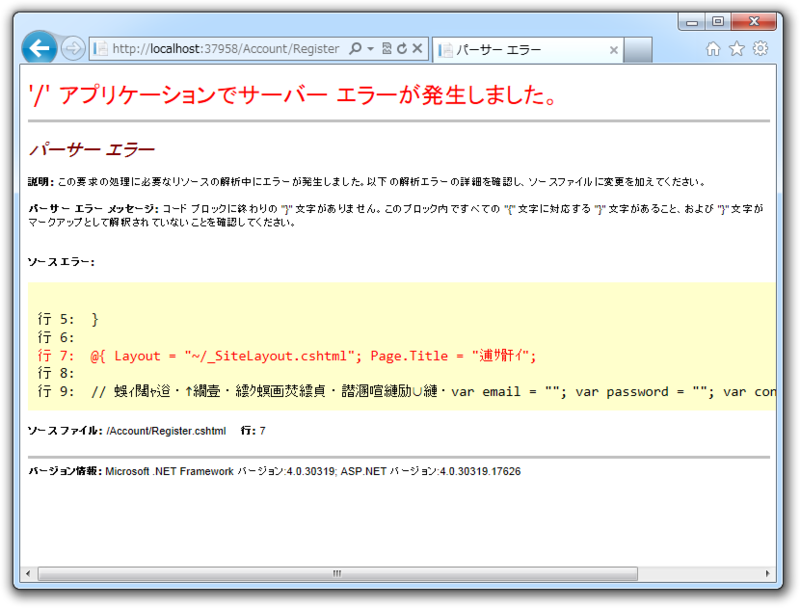
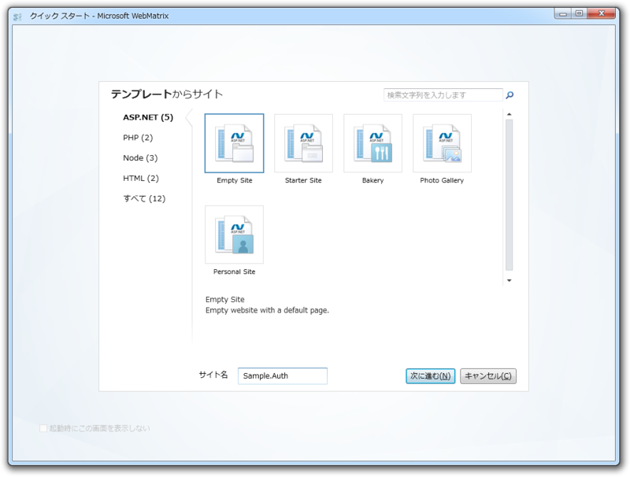
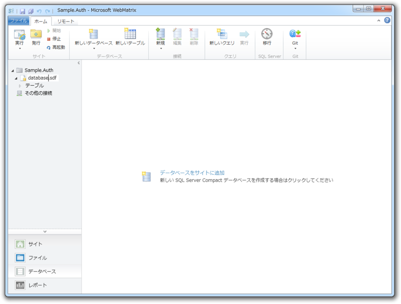
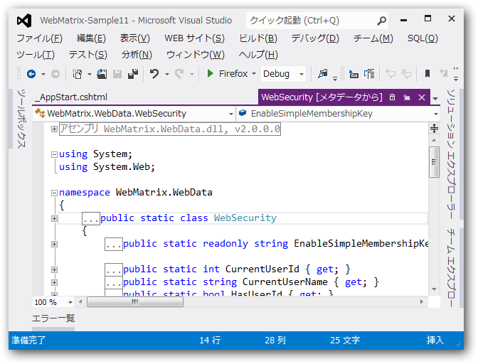
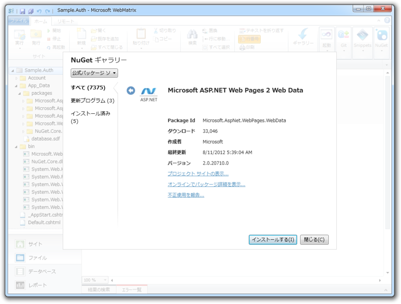
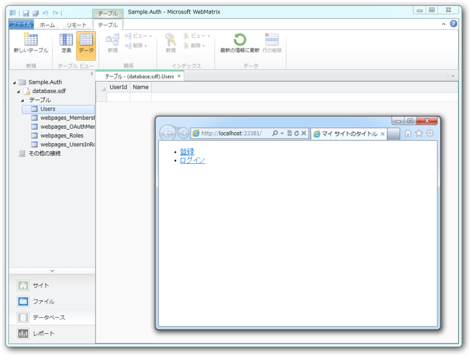

お次はユーザー認証機能に挑戦しますかね？　Webサイトでデータを扱うとき、ユーザー認証機能がなかったらだいぶ困る。

というわけで、“Startar Site”テンプレートをみながら勉強しようかなぁ、と思ったのだけど……

ナンテコッタイ／(^o^)＼　ソースを見てみたら文字化けしてたり改行が吹っ飛んでたりで、一部<a class="keyword" href="http://d.hatena.ne.jp/keyword/%A5%BD%A1%BC%A5%B9%A5%B3%A1%BC%A5%C9">ソースコード</a>がぶっ壊れていた。修正を試みたのだけれど、途中で「いや待て、“Empty Site”から自分で作ったほうが勉強になるかもしれない」と思い直し、まっさらなWebサイトを作ってユーザー認証機能を追加してみることにした。

<h3>データベースを作成</h3>

まずはユーザー情報を格納するデータベースを作成。名前は……思いつかなかったから“database.sdf”でいいや。

リネームした時のことを考えて、データベース名は App に格納しておくことにした。アプリケーションの起動時に実行される _AppStart.cshtml に記述しておく。

<pre class="code lang-cs" data-lang="cs" data-unlink>#_AppStart.cshtml

@{
App.Database = &quot;database&quot;; // 拡張子は要らないっぽい
}
</pre>

<h3>ユーザー情報テーブルを作成</h3>

次に、認証情報を保存しておくテーブルを作成する。 <a class="keyword" href="http://d.hatena.ne.jp/keyword/WebMatrix">WebMatrix</a> では WebSecurity Helper というお手軽な認証システムがあるらしい。“Startar Site”テンプレートでも利用されていたのでそれを使おう。 WebSecurity.InitializeDatabaseConnection() でユーザー情報を管理するテーブルが初期化されるみたい。

<pre class="code lang-cs" data-lang="cs" data-unlink>#_AppStart.cshtml

@{
App.Database = &quot;database&quot;;

WebSecurity.InitializeDatabaseConnection(
App.Database, // データベース名
&quot;Users&quot;,      // テーブル名
&quot;UserId&quot;,     // ID を格納するカラム
&quot;Name&quot;,       // 一意なユーザー名を格納するカラム
true          // テーブルがなかったら作れ
);
}
</pre>
しかし、「WebSecurity などというクラスは知らない」と怒られてしまう。デフォルトでは入っていないのね……

“Startar Site”テンプレートを「<a class="keyword" href="http://d.hatena.ne.jp/keyword/Visual%20Studio">Visual Studio</a>」でみてみたら、 <a class="keyword" href="http://d.hatena.ne.jp/keyword/WebMatrix">WebMatrix</a>.WebData.dll というアセンブリが必要であるらしい。これもどうせ NuGet で取得できるんでしょ？ わかってる、わかってる！

<h3>Microsoft <a class="keyword" href="http://d.hatena.ne.jp/keyword/ASP.NET">ASP.NET</a> Web Page 2 Web Data をインストール</h3>

そこで適当に「WebData」などと検索してみたところ、「Microsoft <a class="keyword" href="http://d.hatena.ne.jp/keyword/ASP.NET">ASP.NET</a> Web Page 2 Web Data」というのがどうもあやしいくさい。さっそくインストールしてみると……ビンゴ！　無事、Web サイトを［実行］できました。テーブルもちゃんと作成されているみたい（まだからっぽだけど！）。

<pre class="code lang-html" data-lang="html" data-unlink>#Default.cshtml

@{

}

&lt;!DOCTYPE html&gt;

&lt;html lang=&quot;ja&quot;&gt;
&lt;head&gt;
        &lt;meta charset=&quot;<a class="keyword" href="http://d.hatena.ne.jp/keyword/utf-8">utf-8</a>&quot; /&gt;
        &lt;title&gt;マイ サイトのタイトル&lt;/title&gt;
    &lt;/head&gt;
&lt;body&gt;
&lt;!-- Starter Site テンプレートからパクって<a class="keyword" href="http://d.hatena.ne.jp/keyword/%CB%E2%B2%FE%C2%A4">魔改造</a>してみた！ --&gt;
&lt;section id=&quot;login&quot;&gt;
@if (WebSecurity.IsAuthenticated) {
&lt;ul&gt;
&lt;li&gt;&lt;a href=&quot;~/Users/@WebSecurity.CurrentUserName&quot;&gt;
                @WebSecurity.CurrentUserName&lt;/a&gt;&lt;/li&gt;
&lt;li&gt;&lt;a href=&quot;~/Account/Logout&quot;&gt;ログアウト&lt;/a&gt;&lt;/li&gt;
&lt;/ul&gt;
} else {
&lt;ul&gt;
&lt;li&gt;&lt;a href=&quot;~/Account/Register&quot;&gt;登録&lt;/a&gt;&lt;/li&gt;
&lt;li&gt;&lt;a href=&quot;~/Account/Login&quot;&gt;ログイン&lt;/a&gt;&lt;/li&gt;
&lt;/ul&gt;
}
&lt;/section&gt;
&lt;/body&gt;
&lt;/html&gt;
</pre>
コレで準備は完了といったところかな。とりあえず、 Register / Login / Logout を作って、ユーザーページも表示できるようにしたいな。

