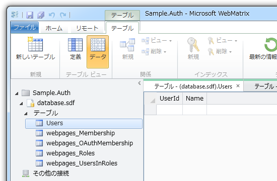
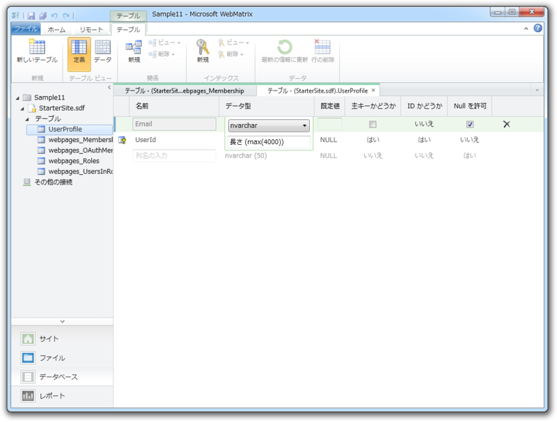

さて、前回（<a href="https://blog.daruyanagi.jp/entry/2012/08/24/095023">WebMatrix &#x3067;&#x30E6;&#x30FC;&#x30B6;&#x30FC;&#x8A8D;&#x8A3C;&#x6A5F;&#x80FD; &#x2015;&#x2015; &#x6E96;&#x5099;&#x7DE8; - &#x3060;&#x308B;&#x308D;&#x3050;</a>）準備した WebSecurity Helper ですけど、これってどうやって使うんでしょうね。ちょっとメタデータからプロパティやメソッドを引っ張ってみました。名前と引数をみるだけで使い方がだいたい分かる感じ。

<pre class="code lang-cs" data-lang="cs" data-unlink>using System;
using System.Web;

namespace WebMatrix.WebData
{
public static class WebSecurity
{
public static readonly string EnableSimpleMembershipKey;
</pre>
WebSecurity は静的クラスです。

“EnableSimpleMembershipKey”はよくわかりませんが、 readonly だしとくにわからなくても問題無さそう。 AppSetting から読み込んだキーを保存しているみたいですけどね。外部に公開してるんだから、どっかの外部クラスが使うんだろうか……。 ASP.NET の認証システムは全然わかってないけれど、おいおい解決していきたいです。

<pre class="code lang-cs" data-lang="cs" data-unlink>        public static int CurrentUserId { get; }
public static string CurrentUserName { get; }
public static bool HasUserId { get; }
public static bool Initialized { get; }
public static bool IsAuthenticated { get; }
</pre>
お次はプロパティ群ですね。 CurrentUser に関するさまざまな情報を取得できます。 Initialized だけは <a href="http://msdn.microsoft.com/en-us/library/webmatrix.webdata.websecurity(v=vs.99).aspx">http://msdn.microsoft.com/en-us/library/webmatrix.webdata.websecurity(v=vs.99).aspx</a> に記述がなくてわからない。たぶん、前回やった初期化が完了しているかどうかを取得できるのだと思う。

<pre class="code lang-cs" data-lang="cs" data-unlink>        public static bool ChangePassword(
string userName, string currentPassword,
string newPassword);
public static bool ConfirmAccount(
string accountConfirmationToken);
public static bool ConfirmAccount(
string userName, string accountConfirmationToken);
public static string CreateAccount(
string userName, string password,
bool requireConfirmationToken = false);
public static string CreateUserAndAccount(
string userName, string password,
object propertyValues = null,
bool requireConfirmationToken = false);
public static string GeneratePasswordResetToken(
string userName,
int tokenExpirationInMinutesFromNow = 1440);
public static DateTime GetCreateDate(string userName);
public static DateTime GetLastPasswordFailureDate(
string userName);
public static DateTime GetPasswordChangedDate(
string userName);
public static int GetPasswordFailuresSinceLastSuccess(
string userName);
public static int GetUserId(string userName);
public static int GetUserIdFromPasswordResetToken(
string token);
public static void InitializeDatabaseConnection(
string connectionStringName, string userTableName,
string userIdColumn, string userNameColumn,
bool autoCreateTables);
public static void InitializeDatabaseConnection(
string connectionString, string providerName,
string userTableName, string userIdColumn,
string userNameColumn, bool autoCreateTables);
public static bool IsAccountLockedOut(
string userName, int allowedPasswordAttempts,
int intervalInSeconds);
public static bool IsAccountLockedOut(
string userName, int allowedPasswordAttempts,
TimeSpan interval);
public static bool IsConfirmed(string userName);
public static bool IsCurrentUser(string userName);
public static bool Login(
string userName, string password,
bool persistCookie = false);
public static void Logout();
public static void RequireAuthenticatedUser();
public static void RequireRoles(params string[] roles);
public static void RequireUser(int userId);
public static void RequireUser(string userName);
public static bool ResetPassword(
string passwordResetToken, string newPassword);
public static bool UserExists(string userName);
}
}
</pre>
WebSecurity クラスのメンバーたち（このうち、InitializeDatabaseConnection() は前回使いました）。

<ul>
<li>メールなどを利用した本人確認</li>
<li>パスワードのリセット（忘れちゃった時のためかな？）</li>
<li>パスワードの入力ミスを複数回繰り返すとアカウントをロック</li>
</ul>
なんてことができるみたい。

気になったのは CreateUserAndAccount() ですかね。 Account （メンバーシップアカウント）と User （ユーザープロファイル、ユーザー情報）って別物なんだ。“Starter Site”テンプレートで使っていたのは CreateAccount() で、ほかにサンプルも見当たらなかったのでよくわかりませんが……。

ちょっと DB のテーブル構成を見てみましょう。なんかいろいろありますけど、メンバーシップアカウントは webpages_Membership 、ユーザープロファイルは Users（初期設定は UserProfile）で管理するというのがなんとなく想像できます。どうやら webpages_ というプレフィックスがついたテーブルはシステム（WebSecurity Helper）が管理するみたい。

実際、webpages_Membership テーブルには認証情報を格納するカラムがたくさん用意されていますが、

UserProfile テーブルのほうはかなりスッキリしていて「好きに使え」と言わんばかり。たとえばユーザーのプロフィール画像なんかの情報はこっちに保存しておいたほうがいいみたいですね。これはおいおい試していきたいと思います。

