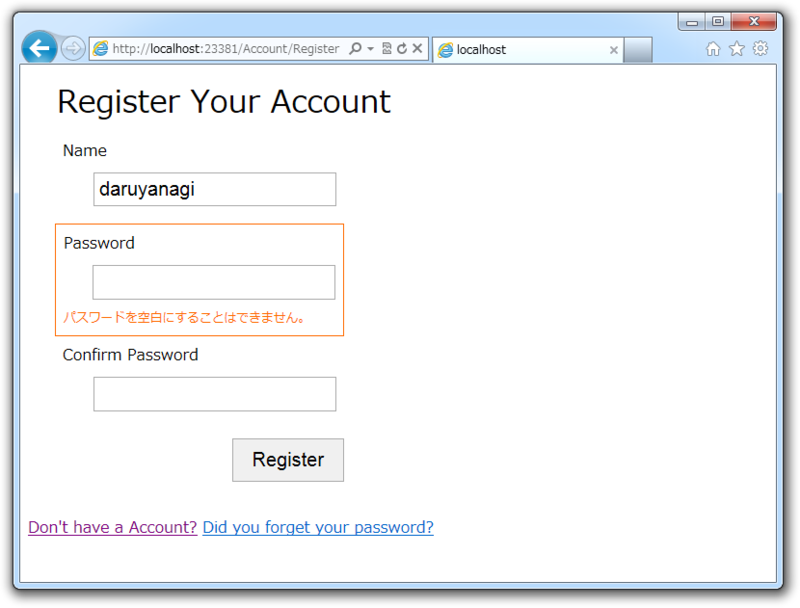
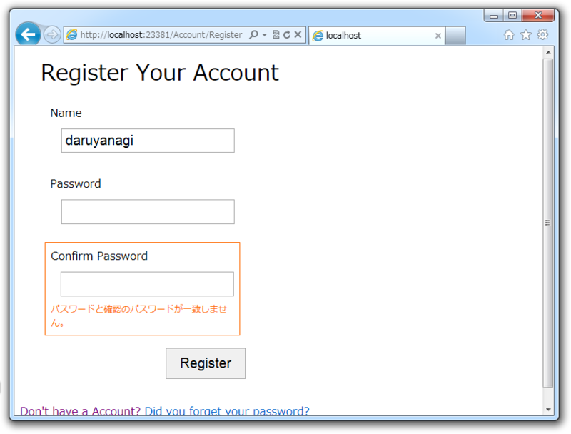

 

<ul>
<li><a href="https://blog.daruyanagi.jp/entry/2012/08/24/095023">WebMatrix &#x3067;&#x30E6;&#x30FC;&#x30B6;&#x30FC;&#x8A8D;&#x8A3C;&#x6A5F;&#x80FD; &#x2015;&#x2015; &#x6E96;&#x5099;&#x7DE8; - &#x3060;&#x308B;&#x308D;&#x3050;</a></li>
<li><a href="https://blog.daruyanagi.jp/entry/2012/08/24/105121">WebMatrix &#x3067;&#x30E6;&#x30FC;&#x30B6;&#x30FC;&#x8A8D;&#x8A3C;&#x6A5F;&#x80FD;&#xFF08;2&#xFF09; &#x2015;&#x2015; WebSecurity&#x3063;&#x3066;&#x3069;&#x3046;&#x3084;&#x3063;&#x3066;&#x4F7F;&#x3046;&#x3093;&#x3060;&#xFF1F; - &#x3060;&#x308B;&#x308D;&#x3050;</a></li>
</ul>
のんびりやっていこう。今回はユーザー登録するで。

<pre class="code lang-cs" data-lang="cs" data-unlink>@{
var name = &quot;&quot;;
var password = &quot;&quot;;
var confirmPassword = &quot;&quot;;

if (IsPost)
{
name = Request.Form[&quot;name&quot;];
password = Request.Form[&quot;password&quot;];
confirmPassword = Request.Form[&quot;confirmPassword&quot;];

// ここでバリデーション（値が妥当なものか検証）する

if (Validation.IsValid())
{
if (WebSecurity.GetUserId(name) &gt; -1)
{
ModelState.AddFormError(&quot;Username alredy exists&quot;);
}
else
{
try
{
WebSecurity.CreateUserAndAccount(
name, password, new { Name = name });
WebSecurity.Login(name, password);
Response.Redirect(&quot;~/&quot;);
}
catch (Exception e)
{
ModelState.AddFormError(e.Message);
}
}
}
}
}
</pre>
まずはバリデーションを関連の記述をとっぱらったサーバー側のコード<a href="#f-8a0f6f9f" name="fn-8a0f6f9f" title="コードビハインドっていうの？　知らんけど">*1</a>。やっていることは簡単で、

<ol>
<li>フォームから値を受け取る</li>
<li>値をバリデーション</li>
<li>ユーザーネームにダブりがないか確認</li>
<li>ユーザープロファイルとメンバーシップアカウントを作成</li>
<li>ログインしてトップページへリダイレクト</li>
<li>エラーが発生したら適宜 ModelState に登録しておく</li>
</ol>
みたいな感じ。

<h3>WebSecurity.CreateUserAndAccount()</h3>

WebSecurity では、ユーザーアカウントをユーザープロファイル（開発者が管理）とメンバーシップアカウント（システムが管理）にわけて管理している（<a href="https://blog.daruyanagi.jp/entry/2012/08/24/105121">WebMatrix &#x3067;&#x30E6;&#x30FC;&#x30B6;&#x30FC;&#x8A8D;&#x8A3C;&#x6A5F;&#x80FD;&#xFF08;2&#xFF09; &#x2015;&#x2015; WebSecurity&#x3063;&#x3066;&#x3069;&#x3046;&#x3084;&#x3063;&#x3066;&#x4F7F;&#x3046;&#x3093;&#x3060;&#xFF1F; - &#x3060;&#x308B;&#x308D;&#x3050;</a>）。両者は同じ UserId で紐付けられる仕組みだ。 

WebSecurity.CreateUserAndAccount() はそのユーザープロファイルとメンバーシップアカウントの作成を同時に行うメソッド。ユーザープロファイルテーブルに挿入するデータは、第三引数で匿名オブジェクトを与えればよい。今回は名前だけを登録しておいた。

ちなみに WebSecurity.Create() だけを使った場合、さきにユーザープロファイルテーブルへ UserId とそのほかのデータを挿入しておかなければならない。“Starter Site”テンプレートではそれを SQL で行なっている。

<pre class="code lang-cs" data-lang="cs" data-unlink>if (Validation.IsValid())
{
var db = Database.Open(App.Database);

var user = db.QuerySingle(
&quot;SELECT Name FROM Users WHERE LOWER(Name) = LOWER(@0)&quot;,
name);

if (user == null)
{
db.Execute(
&quot;INSERT INTO Users (Name) VALUES (@0)&quot;, name);
WebSecurity.CreateAccount(name, password);
</pre>
げろげろうげー。

<pre class="code lang-cs" data-lang="cs" data-unlink>if (Validation.IsValid())
{
if (WebSecurity.GetUserId(name) &gt; -1)
{
ModelState.AddFormError(&quot;Username alredy exists&quot;);
}
else
{
try
{
WebSecurity.CreateUserAndAccount(
name, password, new { Name = name });
</pre>
絶対こっちにするやろ。せっかく WebSecurity Helper を使うんだから、大いに頼ればよろしい。

 

<h3>ModelState</h3>

ModelState は WebPage に属しており、フォームのエラーを管理するものだとでも理解しておく。 ModelState.AddFormError() でフォーム関連のエラーが登録できるんだな。

バリデーション関連のコードはこんな感じ（“Starter Site”からコードをパクってきた）。

<pre class="code lang-cs" data-lang="cs" data-unlink>Validation.RequireField(&quot;name&quot;,
&quot;電子メール アドレスを入力してください。&quot;);
Validation.RequireField(&quot;password&quot;,
&quot;パスワードを空白にすることはできません。&quot;);
Validation.Add(&quot;confirmPassword&quot;,　Validator.EqualsTo(
&quot;password&quot;, &quot;パスワードと確認のパスワードが一致しません。&quot;)
);
Validation.Add(&quot;password&quot;,
Validator.StringLength(
        maxLength: Int32.MaxValue,
        minLength: 6,
        errorMessage: &quot;パスワードは 6 文字以上にする必要があります&quot;
)
);
</pre>
読むだけで何をしているのかわかるのがいい。表示部分はこのようなコードになっていた。

<pre class="code lang-cs" data-lang="cs" data-unlink>&lt;section id=&quot;register&quot;&gt;
&lt;form method=&quot;post&quot;&gt;
@Html.ValidationSummary(&quot;Log in was unsuccessful.&quot; +
&quot;Please correct the errors and try again.&quot;,
            excludeFieldErrors: true, htmlAttributes: null)

&lt;fieldset&gt;
&lt;legend&gt;Register Your Account&lt;/legend&gt;
&lt;ol&gt;
@RenderFormInputWithValidation(this, &quot;name&quot;)
&lt;li class=&quot;name&quot;&gt;
&lt;label for=&quot;name&quot; @if (!ModelState.IsValidField(&quot;name&quot;)) {&lt;text&gt;class=&quot;error-label&quot;&lt;/text&gt;}&gt;Name&lt;/label&gt;
&lt;input type=&quot;text&quot;
id=&quot;name&quot; name=&quot;name&quot; value=&quot;@name&quot;
@Validation.For(&quot;name&quot;) /&gt;
@Html.ValidationMessage(&quot;name&quot;)
&lt;/li&gt;
&lt;li class=&quot;password&quot;&gt;
&lt;label for=&quot;password&quot; @if (!ModelState.IsValidField(&quot;password&quot;)) {&lt;text&gt;class=&quot;error-label&quot;&lt;/text&gt;}&gt;Password&lt;/label&gt;
&lt;input type=&quot;password&quot;
id=&quot;password&quot; name=&quot;password&quot;
@Validation.For(&quot;password&quot;)/&gt;
@Html.ValidationMessage(&quot;password&quot;)
&lt;/li&gt;
&lt;li class=&quot;confirm-password&quot;&gt;
&lt;label for=&quot;confirm-password&quot; @if (!ModelState.IsValidField(&quot;confirmPassword&quot;)) {&lt;text&gt;class=&quot;error-label&quot;&lt;/text&gt;}&gt;confirmPassword&lt;/label&gt;
&lt;input type=&quot;password&quot;
id=&quot;confirmPassword&quot; name=&quot;confirmPassword&quot;
@Validation.For(&quot;confirmPassword&quot;)/&gt;

@Html.ValidationMessage(&quot;confirmPassword&quot;)
&lt;/li&gt;
&lt;/ol&gt;
&lt;input type=&quot;submit&quot; value=&quot;Register&quot; /&gt;
&lt;/fieldset&gt;
&lt;/form&gt;
&lt;/section&gt;
</pre>
ぐちゃぐちゃしてわかりにくいが、

<pre class="code lang-cs" data-lang="cs" data-unlink>@Html.ValidationSummary(&quot;Log in was unsuccessful.&quot; +
&quot;Please correct the errors and try again.&quot;,
    excludeFieldErrors: true, htmlAttributes: null)
</pre>
でページ全体についてのバリデーション結果を表示する。

フォームの各フィールドは、

<pre class="code lang-cs" data-lang="cs" data-unlink>&lt;label for=&quot;name&quot; @if (!ModelState.IsValidField(&quot;name&quot;)) {&lt;text&gt;class=&quot;error-label&quot;&lt;/text&gt;}&gt;Name&lt;/label&gt;
&lt;input type=&quot;text&quot; id=&quot;name&quot; name=&quot;name&quot; value=&quot;@name&quot; @Validation.For(&quot;name&quot;) /&gt;
@Html.ValidationMessage(&quot;name&quot;)
</pre>
このコードでワンセットみたい。 Validation.For() は JavaScript によるバリデーションに必要な data- 属性を出力する（今回は使ってない）。 Html.ValidationMessage() はバリデーションエラーのメッセージがあれば表示する。このメッセージはさっき ModelState に登録したエラーから取得するみたい。

後者のコードは使いまわせそうないわばイディオムなので、ヘルパーか拡張メソッドにしておくとよさそうだ。今回は以下のようにしてみたよ。

<pre class="code lang-cs" data-lang="cs" data-unlink>~/App_Code/WebPageExtension.cs

using System.Linq;
using System.Web;
using System.Web.WebPages;
using System.Web.WebPages.Html;

public static class WebPageExtension
{
private enum InputType
{
Text, Password, Checkbox, Textarea,
}

private static HtmlString RenderInputWithValidation(
this WebPage target, InputType input_type,
string name, string label = &quot;&quot;, object additional = null)
{
const string HTML_TAG = @&quot;
            &lt;div class=&quot;&quot;validation-input {0} {1}&quot;&quot;&gt;
                &lt;label for=&quot;&quot;{0}&quot;&quot;&gt;{2}&lt;/label&gt;
                &lt;input type=&quot;&quot;{3}&quot;&quot; id=&quot;&quot;{0}&quot;&quot; name=&quot;&quot;{0}&quot;&quot; {4} {5} /&gt;
                {6}
            &lt;/div&gt;&quot;;

var attrs = (additional == null)
? string.Empty
: string.Join(&quot; &quot;, additional
.GetType()
.GetProperties()
.Select((p) =&gt; string
.Format(&quot;{0}=\&quot;{1}\&quot;&quot;,
p.Name.ToLower(),
p.GetValue(additional)
)
)
);

return new HtmlString(
string.Format(
HTML_TAG, name,
target.ModelState.IsValidField(name)
? string.Empty
: &quot;validation-failed&quot;,
label.IsEmpty() ? name : label,
input_type.ToString().ToLower(),
attrs,
target.Validation.For(name),
target.Html.ValidationMessage(name)
)
);
}

public static HtmlString RenderTextWithValidation(
this WebPage target, string name,
string label = null, object additional = null)
{
return RenderInputWithValidation(
target, InputType.Text, name, label, additional);
}

public static HtmlString RenderPasswordWithValidation(
this WebPage target, string name,
string label = null, object additional = null)
{
return RenderInputWithValidation(
target, InputType.Password, name, label, additional);
}

public static HtmlString RenderCheckBoxWithValidation(
this WebPage target, string name,
string label = null, object additional = null)
{
return RenderInputWithValidation(
target, InputType.Checkbox, name, label, additional);
}
}
</pre>
ModelState が WebPage に属する関係で、 WebPage クラスの拡張メソッドとして定義してある。ほんとは HTML Helper にして、 @Html.TextWithValidation() などと呼べる方がカッコいいな。今度もう少しこのあたりはブラッシュアップしてみたい。

んで、これを使って書きなおした表示部分はこうなる。

<pre class="code lang-cs" data-lang="cs" data-unlink>&lt;section id=&quot;register&quot;&gt;
&lt;form method=&quot;post&quot;&gt;
@Html.ValidationSummary(
&quot;Log in was unsuccessful.&quot; +
&quot;Please correct the errors and try again.&quot;,
false, null)

&lt;fieldset&gt;
&lt;legend&gt;Register Your Account&lt;/legend&gt;
@this.RenderTextWithValidation(
&quot;name&quot;, &quot;Name&quot;, new { Value = name} )
@this.RenderPasswordWithValidation(
&quot;password&quot;, &quot;Password&quot;)
@this.RenderPasswordWithValidation(
&quot;confirmPassword&quot;, &quot;Confirm Password&quot;)
&lt;input type=&quot;submit&quot; value=&quot;Register&quot; /&gt;
&lt;/fieldset&gt;
&lt;/form&gt;
&lt;/section&gt;
</pre>
だいぶシンプルになって予はだいぶ満足したぞよ。ほかのヘルパーの真似して new { Value = name} で追加の属性を追加できるようにしてみたのがちょっとだけ自慢だ。リフレクションはちょっと苦手なので、今日は個人的にその勉強などしてみた。

次回はログインとログアウトだけど、これは一瞬で終わりそう……。

<a href="#fn-8a0f6f9f" name="f-8a0f6f9f" class="footnote-number">*1</a>:コードビハインドっていうの？　知らんけど

