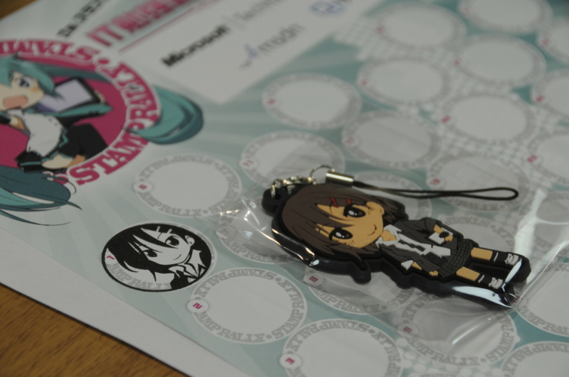
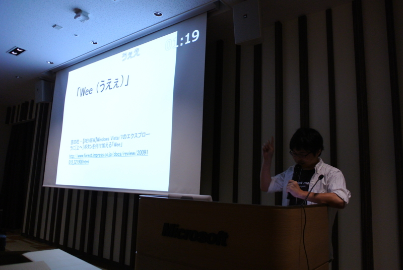

100人以上いたんじゃないかな？　今回も大盛況でした。特製ストラップのおかげかしら。

個人的には、ろす（@lost_and_found）さんの<a class="keyword" href="http://d.hatena.ne.jp/keyword/%C5%C5%BB%D2%BD%F1%C0%D2">電子書籍</a>に関するセッションが勉強になったかな。あのあたりの事情は混沌としているけれど、それが（うまい具合に若干デフォルメされて）図でわかりやすく整理されていたのがよかったです（<del>ぜひスライドも公開してほしいな！</del> もうアップされてた → <a href="http://www.slideshare.net/lost_and_found/epub-3">&#x3044;&#x3044;&#x30D1;&#x30D6;&#x30C3;!! &#x306F;&#x3058;&#x3081;&#x3066;&#x306E;EPUB 3</a>）。デモも面白く、また「今ってここまで進んでいるんだ」というのが実感できましたね。ほかの部署になるけれども、勤め先がお世話になっていたみたいで、存じ上げず失礼いたしますタ。そういえば、 <a href="http://densho.hatenablog.com/">&#x96FB;&#x66F8;&#x3061;&#x3083;&#x3093;&#x306D;&#x308B;</a> の kobo touch のレビューとか拝見してたわ。

あと、面識がなかった <a class="keyword" href="http://d.hatena.ne.jp/keyword/%A6%C5%A6%D0%A6%C9%A6%D2%A6%D3%A6%C7%A6%CC%A6%C7">επιστημη</a> さん<a href="#f1" name="fn1" title="名前だけなら雑誌なんかで10年ぐらい前から知ってたかも……">*1</a>、 @kaorun55 さんに会えたのもよかったです。えぴさんは来週（横浜のわんくま勉強会）でもお話が聞けそう。のいえ先生は引越しと linq.js（<a href="http://linqjs.codeplex.com/">http://linqjs.codeplex.com/</a>） 3.0 のリリースがんばってください（笑

<h3>ライトニングトークデビュー</h3>

ライトニングトーク（LT）もやってきましたよー（内容はお仕事の宣伝）。 LT っていうのは、5分間などと短い時間で区切って小ネタをプレゼンするって感じですかね。一見簡単そうですけれど、やってみるとなかなか自分の思い通りには行きません！

今回は少しトラブって30秒ロスしてしまい、最後まで喋れなかったのが残念だけど、初めてにしては笑いもとれたし頑張ったんじゃないかなーって思っています。また挑戦したいですね。

前日眠れなくて（どうも最近おかしい）ちょっとツラかったけれど、楽しかったです。次回は来週、横浜のわんくま勉強会でお会いしましょう。

<a href="#fn1" name="f1" class="footnote-number">*1</a>:名前だけなら雑誌なんかで10年ぐらい前から知ってたかも……

