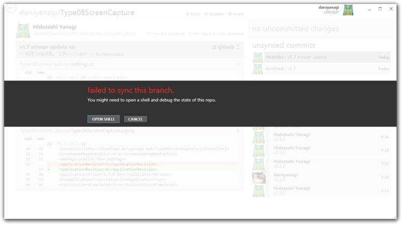

<a href="http://daruyanagi.net/Type08ScreenCapture">http://daruyanagi.net/Type08ScreenCapture</a> 

<h3>1.7.0（12/06/26）</h3>

<ul>
<li>[変更].NET Framework 4.5 ベースになりました（Windows Vista 以前を使っているヒト、さようなら）</li>
<li>[修正] スクリーンショットフォルダの名前を修正</li>
<li>[修正] Windows 8 への対応。［Windows］＋［X］キーで使えるようにしました</li>
</ul>
カーソルを含めたスクリーンショットが可能な点以外、システム標準の機能より勝る点はないです。

<h3>ごめんなさい、Windows 8 のスクリーンショットの保存フォルダは……</h3>

Windows 8 対応の作業をしていたときのこと。あれ、なんで“スクリーンショット”フォルダが2つあるんだろう（＠＠？

実は Windows 8 のスクリーンショットフォルダの名前は“スクリーンショット”ではなく、“Screenshots”でした。見かけは“スクリーンショット”なんだけど、パスは“Screenshots”。やられた……。

まぁ、設定ファイルが優先されると思うので、“スクリーンショット”に保存したいヒトはそのまま。“Screenshots”に変更したいヒトは、“AppData”フォルダにある設定ファイルをサクッと消してから起動すればよいと思います。試してないけれど。

<h3>ソースコードは……</h3>

ぐぬぬ。また今度。

<ul>
<li><a href="https://blog.daruyanagi.jp/entry/2012/06/19/034613">08&#x5F0F;&#x673A;&#x4E0A;&#x64AE;&#x5F71;&#x6A5F; v1.6.0 - &#x3060;&#x308B;&#x308D;&#x3050;</a></li>
</ul>

