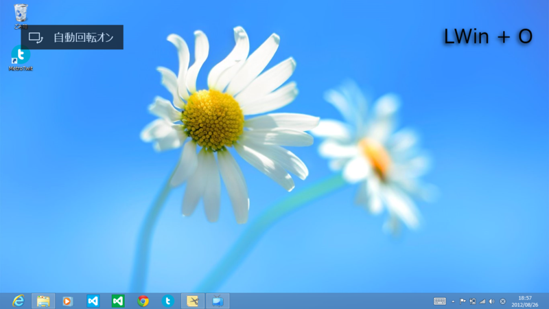

ブログ書いてるあいだに日付が変わりそうだな。

<ul>
<li><a href="http://daruyanagi.net/SoundKeyboard%202012">http://daruyanagi.net/SoundKeyboard%202012</a></li>
</ul>

<h3>2.4.0（12/06/36）</h3>

<ul>
<li>［追加］Windows 8向けにスクリーンショット機能を追加。画面回転のロック（ハードキー、または［Windows］＋［O］）をフック（＆殺）しています</li>
<li>［修正］設定ファイルが不正な場合に起動できなくなる（<a href="https://blog.daruyanagi.jp/entry/2012/08/26/235336">08&#x5F0F;&#x673A;&#x4E0A;&#x64AE;&#x5F71;&#x6A5F; v1.7.0 - &#x3060;&#x308B;&#x308D;&#x3050;</a>）</li>
<li>［変更］ミュート機能のホットキーを［Windows］＋［X］に（「One Note」とキーバインドがカブるため……ペケって覚えてね！</li>
</ul>

自分の場合、画面回転のロックは常に ON 。むしろ、これが OFF になって画面が回転するとウザい。というわけで、このキーを殺してスクリーンショット機能を割り当ててみました。ちなみに、スクリーンショットをとる際に再生されるのは、サウンドパックで［PrintScreen］キー（Snapshot.wav だっけかな）に割り当てられたサウンドです。

時間があるときに、このフック機能も ON/OFF できるようにするつもり。というか、この機能単体でほしい人がいたら作るかもしれない。

<ul>
<li><a href="https://blog.daruyanagi.jp/entry/2012/06/18/201542">SoundKeyboard 2012 v2.3.0 - &#x3060;&#x308B;&#x308D;&#x3050;</a></li>
</ul>

