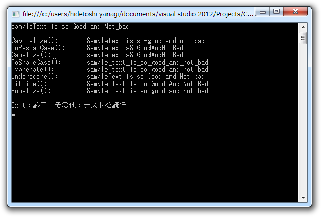

<a href="https://blog.daruyanagi.jp/entry/2012/08/25/003421">WebMatrix &#x3067;&#x30E6;&#x30FC;&#x30B6;&#x30FC;&#x8A8D;&#x8A3C;&#x6A5F;&#x80FD;&#xFF08;3&#xFF09; &#x2015;&#x2015; &#x306A;&#x306B;&#x306F;&#x3068;&#x3082;&#x3042;&#x308C;&#x30E6;&#x30FC;&#x30B6;&#x30FC;&#x767B;&#x9332;&#x3057;&#x306A;&#x3044;&#x3068;&#x59CB;&#x307E;&#x3089;&#x3093; - &#x3060;&#x308B;&#x308D;&#x3050;</a> の脱線。

個人的には

<pre class="code lang-html" data-lang="html" data-unlink>&lt;fieldset&gt;
&lt;legend&gt;Register Your Account&lt;/legend&gt;
@this.RenderTextWithValidation(
&quot;name&quot;, &quot;Name&quot;, new { Value = name} )
@this.RenderPasswordWithValidation(
&quot;password&quot;, &quot;Password&quot;)
@this.RenderPasswordWithValidation(
&quot;confirmPassword&quot;, &quot;Confirm Password&quot;)
&lt;input type=&quot;submit&quot; value=&quot;Register&quot; /&gt;
&lt;/fieldset&gt;
</pre>
って書くのがイケてない。「"password", "Password"」だの、「"confirmPassword", "Confirm Password"」だの、おんなじこと二回も書きたくないじゃん。あと、 HTML 要素の class や id は勝手にハイフン区切りにしてほしい。 Ruby on Rails にはソレ系のユーティリティが用意されているので楽なんだけどな（ActiveSupport）。

まぁ、なければ作れって話だ。

まず、あると便利な拡張メソッドを作っていく。先頭を大文字、後を小文字にする Capitalize() は欲しいよね。

<pre class="code lang-cs" data-lang="cs" data-unlink>public static string Capitalize(this string target)
{
return target.Length &gt; 1
? char.ToUpper(target[0]) +
target.Substring(1, target.Length - 1).ToLower()
: target.ToUpper();
}
</pre>
char.ToUpper() を 'a'.ToUpper() にしたいが今日のところは面倒なので許してやろう。

さぁ、どんどん作っていくよ！　つぎは痴漢系、もとい置換系だな。 C# （.NET Framework）ってちょっと文字列操作系のメソッドが充実してもいいと思う。

<pre class="code lang-cs" data-lang="cs" data-unlink>public static string Gsub(
this string target, Regex r, string replacement)
{
return r.Replace(target, replacement);
}

public static string Gsub(
this string target, Regex r, MatchEvaluator m)
{
return r.Replace(target, m);
}

public static string Gsub(
this string target, string pattern, string replacement)
{
return target.Gsub(new Regex(pattern), replacement);
}

public static string Gsub(
this string target, string pattern, MatchEvaluator m)
{
return target.Gsub(new Regex(pattern), m);
}
</pre>
これの何が便利かというと、

<pre class="code lang-cs" data-lang="cs" data-unlink>public static string Underscore(this string target)
{
// 空白やハイフンをアンダースコアに置き換える
return target.Gsub(@&quot;[ 　-]&quot;, &quot;_&quot;);
}
</pre>
みたいに使える。 string.Replace() みたいに手軽で、それでいて強力！　場合によっては、第一引数に正規表現を渡してもいいし、第二引数で Match を引数にとったラムダを使ってもいい。ホントのことを言えば C# にも正規表現リテラルがあると嬉しいのだけれどね……

<pre class="code lang-cs" data-lang="cs" data-unlink>private static string DivideIntoWords(
this string target, string separator = &quot; &quot;)
{
return target.Gsub(
@&quot;([\w-[A-Z]])([A-Z])&quot;,
string.Format(&quot;$1{0}$2&quot;, separator)
);
}
</pre>
あと、こんなのも作ってみた。これは「HelloWorld」を「Hello World」に分割する。第二引数を渡せば、「Hello_World」や「Hello-World」も作れる。こいつらを使って、 PascalCase （UpperCamelCase）に変換する拡張メソッドを作ってみよう。

<pre class="code lang-cs" data-lang="cs" data-unlink>static readonly char[] SPACE_AND_DELIMITTER = &quot; 　-_&quot;.ToArray();

public static string ToPascalCase(this string target)
{
return target                    // sampleText_is-Cool
.DivideIntoWords()           // sample Text_is-Cool
.Split(SPACE_AND_DELIMITTER) // { sample, Text, is, Cool }
.Select(_ =&gt; _.Capitalize()) // { Sample, Text, Is, Cool }
.Combine();                  // SampleTextIsCool
}

public static string ToUpperCamelCase(this string target)
{
return target.ToPascalCase();
}

private static string Combine(
this IEnumerable&lt;string&gt; target, string separator = &quot;&quot;)
{
return string.Join(separator, target.ToArray());
}
</pre>
Combine() はメソッドチェーンを切らずに string.Join() したいので作った IEnumerable&lt;string&gt; の拡張メソッドで、@xin9le さんが命名してくれた。

同様にして CamelCase（LowerCamelCase）も作れる。

<pre class="code lang-cs" data-lang="cs" data-unlink>public static string Camelize(this string target)
{
return target
.DivideIntoWords()
.Split(SPACE_AND_DELIMITTER_CHARS)
.Select((_, i) =&gt; (i == 0) // &lt;-- カウンターを使う
? _.ToLower()
: _.Capitalize())
.Combine();
}
</pre>
1回目（i == 0）のときだけ ToLower()、あとはさっき作った Capitalize() すればいいね。

今まで知らなかったのだけれど、 Enumerable.Select(Func&lt;TSource, Int32, TResult&gt;) （<a href="http://msdn.microsoft.com/ja-jp/library/bb534869">http://msdn.microsoft.com/ja-jp/library/bb534869</a>）を使うと「今何回目の処理をしているか（インデックス）」が取得できるのね。 Ruby の map {|i| ... } みたいなものかな。

<pre class="code lang-cs" data-lang="cs" data-unlink>public static string Titlize(this string target)
{
return target
.Gsub(@&quot;[_-]&quot;, &quot; &quot;)
.DivideIntoWords()
.Split(SPACE_AND_DELIMITTER)
.Select(_ =&gt; _.Capitalize())
.Combine(&quot; &quot;);
}

public static string Humanize(this string target)
{
return target
.Gsub(@&quot;[_-]&quot;, &quot; &quot;)
.DivideIntoWords()
.Split(SPACE_AND_DELIMITTER)
.Select((_, i) =&gt; (i == 0) ? _.Capitalize() : _.ToLower())
.Combine(&quot; &quot;);
}
</pre>
あとは僕の望みの、Titlize() や Humanize() も作ってみた。メソッド名は ActiveSupport から拝借。

 

<pre class="code" data-lang="" data-unlink>&#34;man from the boondocks&#34;.Titlize()   # =&gt; &#34;Man From The Boondocks&#34;
&#34;man from the boondocks&#34;.Humanize()  # =&gt; &#34;Man from the boondocks&#34;

&#34;x-men: the last stand&#34;.Titlize()    # =&gt; &#34;X Men: The Last Stand&#34;
&#34;x-men: the last stand&#34;.Humanize()   # =&gt; &#34;X men: the last stand&#34;

&#34;TheManWithoutAPast&#34;.Titlize()       # =&gt; &#34;The Man Without A Past&#34;
&#34;TheManWithoutAPast&#34;.Humanize()      # =&gt; &#34;The man without a past&#34;

&#34;raiders_of_the_lost_ark&#34;.Titlize()  # =&gt; &#34;Raiders Of The Lost Ark&#34;
&#34;raiders_of_the_lost_ark&#34;.Humanize() # =&gt; &#34;Raiders of the lost ark&#34;</pre>
CSS text-transform の capitalize に相当する処理が Capitalize() ではなく Titlize() なのが罠といえば罠。

