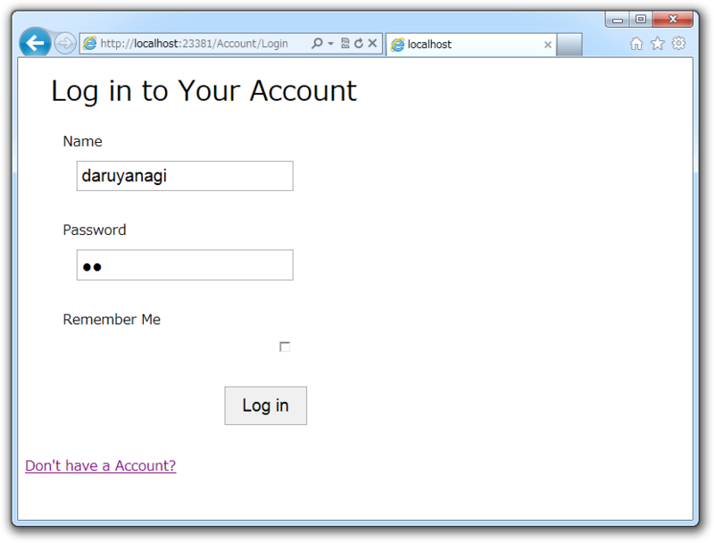

<a href="https://blog.daruyanagi.jp/entry/2012/08/25/003421">WebMatrix &#x3067;&#x30E6;&#x30FC;&#x30B6;&#x30FC;&#x8A8D;&#x8A3C;&#x6A5F;&#x80FD;&#xFF08;3&#xFF09; &#x2015;&#x2015; &#x306A;&#x306B;&#x306F;&#x3068;&#x3082;&#x3042;&#x308C;&#x30E6;&#x30FC;&#x30B6;&#x30FC;&#x767B;&#x9332;&#x3057;&#x306A;&#x3044;&#x3068;&#x59CB;&#x307E;&#x3089;&#x3093; - &#x3060;&#x308B;&#x308D;&#x3050;</a> で無事ユーザー登録ができ、ログインされた。という訳で今回はログアウトを実装しなければならない。

<pre class="code lang-cs" data-lang="cs" data-unlink># Logout.cshtml

@{
WebSecurity.Logout();

var returnUrl = Request.QueryString[&quot;ReturnUrl&quot;];
Response.Redirect(returnUrl.IsEmpty() ? &quot;~/&quot; : returnUrl);
}
</pre>
おわり！　ほんとにこれだけだよ……。一応、 Logout?ReturnUrl=~/Account/Login なんかで ~/Account/Login へリダイレクトされるようにしてみたけど。

ちなみに、ログイン処理は少し長くなった。

<pre class="code lang-cs" data-lang="cs" data-unlink># Login.cshtml

@{
var name = &quot;&quot;;
var password = &quot;&quot;;
var rememberMe = true;

Validation.RequireField(
&quot;name&quot;, &quot;You must specify an name address.&quot;);
Validation.RequireField(
&quot;password&quot;, &quot;You must specify a password.&quot;);

if (IsPost)
{
name = Request.Form[&quot;name&quot;];
password = Request.Form[&quot;password&quot;];
rememberMe = Request.Form[&quot;rememberMe&quot;].AsBool();

if (Validation.IsValid())
{
if (WebSecurity.Login(name, password, rememberMe))
{
var returnUrl = Request.QueryString[&quot;ReturnUrl&quot;];
Response.Redirect(
returnUrl.IsEmpty() ? &quot;~/&quot; : returnUrl);
}
else
{
ModelState.AddFormError(
&quot;The user name or password is incorrect.&quot;);
}
}
}
}

&lt;section id=&quot;login&quot;&gt;
&lt;form method=&quot;post&quot;&gt;
@Html.ValidationSummary(&quot;Log in was unsuccessful.&quot; +
&quot;Please correct the errors and try again.&quot;,
            excludeFieldErrors: true, htmlAttributes: null)

&lt;fieldset&gt;
&lt;legend&gt;Log in to Your Account&lt;/legend&gt;
@this.RenderTextWithValidation(&quot;name&quot;)
@this.RenderPasswordWithValidation(&quot;password&quot;)
@this.RenderCheckBoxWithValidation(&quot;rememberMe&quot;)
&lt;input type=&quot;submit&quot; value=&quot;Log in&quot; /&gt;
&lt;/fieldset&gt;
&lt;/form&gt;
&lt;p&gt;
&lt;a href=&quot;~/Account/Register&quot;&gt;Don't have a Account?&lt;/a&gt;
&lt;/p&gt;
&lt;/section&gt;
</pre>

<a href="https://blog.daruyanagi.jp/entry/2012/08/28/081228">&#x5BC4;&#x308A;&#x9053;: string &#x30AF;&#x30E9;&#x30B9;&#x306E;&#x62E1;&#x5F35; - &#x3060;&#x308B;&#x308D;&#x3050;</a> で作ったコードのお陰で、 RenderTextWithValidation() などがシンプルになっている以外はほとんどユーザー登録の処理と変わらない感じ。

次は OAuth でログインできるようになればいいな。

<h3>ちなみに</h3>

string.AsBool や string.IsEmpty は ASP.NET Web Pages に含まれているのかな？ このあたりの関数については、 <a href="http://msdn.microsoft.com/ja-jp/asp.net/hh180209.aspx">ASP.NET | The ASP.NET Site</a> でコンパクトに纏められているので、一度目を通しておくとわしみたいに車輪の再発明をせずに済むぞ！

