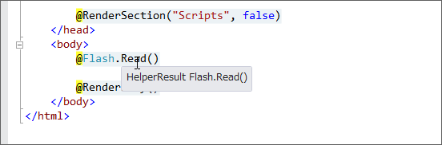
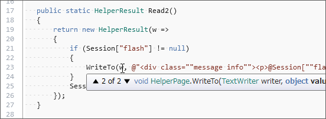

<a href="https://blog.daruyanagi.jp/entry/2012/08/29/201834">&#x5BC4;&#x308A;&#x9053;&#xFF1A; Rails &#x306E; Flash &#x3063;&#x307D;&#x3044;&#x6A5F;&#x80FD;&#x3092; WebMatrix &#x3067;&#x4F7F;&#x3044;&#x305F;&#x3044; - &#x3060;&#x308B;&#x308D;&#x3050;</a> の話は続く。

<pre class="code lang-cs" data-lang="cs" data-unlink># ~/_AppCode/Flash.cshtml

@helper Read()
/* Razor を書く */ {
if (Session[&quot;flash&quot;] == null) { return; }
// Razor では if 文の {} を省略できない。これ、マメな。

&lt;div class=&quot;message info&quot;&gt;&lt;p&gt;@Session[&quot;flash&quot;]&lt;/p&gt;&lt;/div&gt;
Session[&quot;flash&quot;] = null;
}

@functions
/* 通常の C# 構文を書く */ {
public static void Write(string value)
{
Session[&quot;flash&quot;] = value;
}
}
</pre>
この @helper ってなんなんだろうな。便利なのはいいけれど、中身がわからないのは気持ち悪い。まずは Visual Studio のツールチップでのぞいてみた。

とりあえず、 <code>@helper Hoge(args) {……}</code> は <code>public static HelperResult Hoge(args) {……}</code> （引数をとって HelperResult を返す＋なんらかの処理）ということのようだ。実際、 @helper Read() は @functions で表すこともできないことはない。

<pre class="code lang-cs" data-lang="cs" data-unlink>@functions
{
public static HelperResult Read()
{
return new HelperResult(w =&gt;
{
if (Session[&quot;flash&quot;] == null) { return; }

/* &lt;div class=&quot;message info&quot;&gt;&lt;p&gt;
                   @Session[&quot;flash&quot;]
               &lt;/p&gt;&lt;/div&gt; */
WriteLiteralTo(w, &quot;&lt;div class=\&quot;message info\&quot;&gt;&lt;p&gt;&quot;);
WriteTo(w, Session[&quot;flash&quot;]);
WriteLiteralTo(w, &quot;&lt;/p&gt;&lt;/div&gt;&quot;);

Session[&quot;flash&quot;] = null;
});
}
}
</pre>
というわけで書いてみたのがこれ（参考：<a href="http://shiba-yan.hatenablog.jp/entry/20110615/1308070842">Razor Deep Dive (2) - &#x3057;&#x3070;&#x3084;&#x3093;&#x96D1;&#x8A18;</a>）。たぶんきっと内部ではこういうことをしているんだと思う（ラムダの引数 w は TextWriter型）。

HelperPage（<a href="http://msdn.microsoft.com/en-us/library/system.web.webpages.helperpage(v=vs.111).aspx">http://msdn.microsoft.com/en-us/library/system.web.webpages.helperpage(v=vs.111).aspx</a>）っていうのは、WebPage を継承していて「Represents a base class for pages that is used when ASP.NET compiles a .cshtml or .vbhtml file and that exposes page-level and application-level properties and methods.」なんだそうな。

あと、WriteLiteralTo() はエスケープされず、 WriteTo() はエスケープされないようだ。これで、Razor で書いた HTML タグはそのまま、外から与えられた変数（@Session["flash"]）だけ無毒化される。ほへぇ。

<pre class="code lang-cs" data-lang="cs" data-unlink>@functions
{
public static HtmlString Read()
{
if (Session[&quot;flash&quot;] == null) return null;

var result = new HtmlString(
string.Format(
@&quot;&lt;div class=&quot;&quot;message info&quot;&quot;&gt;&lt;p&gt;{0}&lt;/p&gt;&lt;/div&gt;&quot;,
Session[&quot;flash&quot;]
)
);

Session[&quot;flash&quot;] = null;

return result;
}
}
</pre>
今までこんなの書いて「動いたヒャッハー！」とか思ってたけど、ただ HtmlString 型の戻り値を Razor が変数として処理してくれたいたから見かけ上ちゃんと動いていただけなんだな。

ちなみに、~/_AppCode で Hoge.cshtml を書くと、その内容は <code>namespace ASP { public class Hoge: HelperPage }</code> になる。 @functions にはそのクラスの実装になっているみたいだな。で、普通 @... {} 以外の部分はレンダリング（RenderBody()とか）されるときに変数が逐次解釈されながら TextWriter へ書き込まれるんだけど、 _AppCode はレンダリングで呼ばれることがないから書いても無駄。

<pre class="code lang-cs" data-lang="cs" data-unlink># ~/App_Code/Flash.cs

using System.Web;
using System.Web.WebPages;

namespace ASP
{
public class Flash: HelperPage
{
public static void Write(string value)
{
Session[&quot;flash&quot;] = value;
}

public static HelperResult Read()
{
return new HelperResult(w =&gt;
{
if (Session[&quot;flash&quot;] == null) return;

WriteLiteralTo(w, &quot;&lt;div class=\&quot;message info\&quot;&gt;&lt;p&gt;&quot;);
WriteTo(w, Session[&quot;flash&quot;]);
WriteLiteralTo(w, &quot;&lt;/p&gt;&lt;/div&gt;&quot;);

Session[&quot;flash&quot;] = null;
});
}
}
}
</pre>
今回のヘルパーを cshtml ではなく cs で表現してみた。あっているかどうかイマイチ不安だけれども、ちゃんと動いてるみたい。

とりあえず、今のところはそういう理解にしておこう。 

