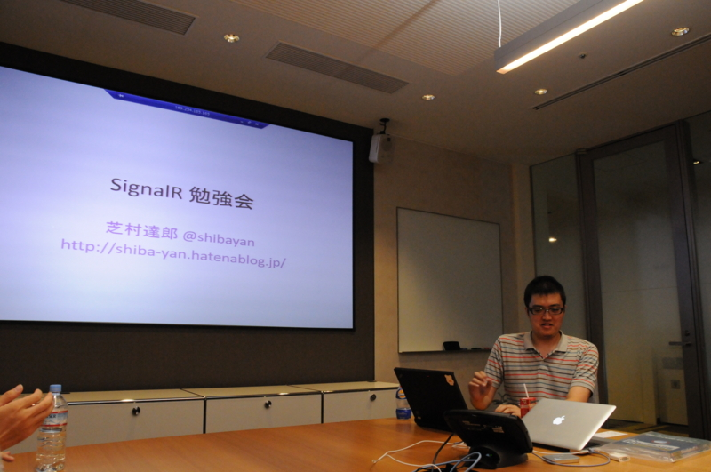
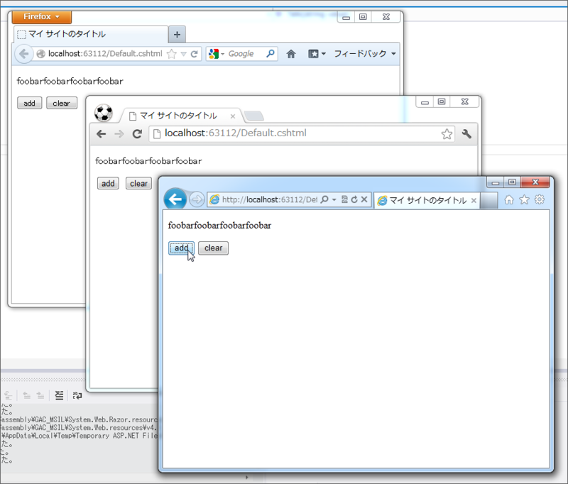

仕事を少し早くあがって、 @shibayan のリサイタルに参加してきました。最近ずっと眠れなくて、仕事中もずっと眠い状態だったけれど、結構面白かったので寝落ちせずにすんだよ（ぉ

<iframe width="480" height="296" src="http://www.ustream.tv/embed/recorded/25059062?wmode=direct" scrolling="no" frameborder="0" style="border: 0px none transparent;">    </iframe> 
 <a href="http://www.ustream.tv/" style="padding: 2px 0px 4px; width: 400px; background: #ffffff; display: block; color: #000000; font-weight: normal; font-size: 10px; text-decoration: underline; text-align: center;" target="_blank">Video streaming by Ustream</a>

興味ある人は USTREAM をご覧あれ。わしもよくわからんけど、とりあえず SignalR （<a href="http://signalr.net/">http://signalr.net/</a>）というのは、

<ul>
<li>ASP.NET テクノロジをベースとした</li>
<li>非同期でリアルタイムな</li>
<li>サーバーとクライアントの双方向通信</li>
</ul>
を実現するライブラリ、ってことでいいのかな。サーバーとクライアントの通信で利用される技術は、 SignalR が勝手にチョイスしてくれるみたい（モダンな環境なら WebSocket を、クラシカルな環境だったらポーリングを、ってな感じ）。詳しくはエロいひと、じゃなくて偉いひとに聞いて欲しい。

ともあれ、忘れないうちにこれを WebMatrix で使ってみる。

<h3>サーバー側のコード</h3>
<pre class="code lang-cs" data-lang="cs" data-unlink># ~/App_Code/SampleHub.cs

using SignalR.Hubs; // &lt;-- NuGet でインストールしる！

[HubName(&quot;sample&quot;)] // &lt;-- あとで createProxy(&quot;sample&quot;) と使う
public class SampleHub : Hub
{
private static string _message = &quot;&quot;;

private string Message
{
get { return _message; }
set
{
_message = value;

// 接続中のクライアントすべてに Echo() 命令を送る
Clients.Echo(_message);

// そのほかにも
// Caller.Echo(); 呼び出したクライアントに命令
// Groups[&quot;Hoge&quot;].Echo(); クライアントグループに命令
// がある
}
}

public void Add(string s)// &lt;-- ちゃんと公開しろよ
{
Message += s;
}

public void Clear()
{
Message = &quot;&quot;;
}
}
</pre>
まずは、 Hub というものを作る。今回は文字列（Message）を足す関数（Add）と、クリアする関数（Clear）を用意した。文字列が更新されるとクライアントにその結果を表示するように命令（Echo）する。これがサーバー側の処理。

<h3>クライアント側のコード</h3>
<pre class="code lang-html" data-lang="html" data-unlink># Default.cshtml

&lt;!DOCTYPE html&gt;

@{

}

&lt;html lang=&quot;ja&quot;&gt;
&lt;head&gt;
        &lt;meta charset=&quot;utf-8&quot; /&gt;
        &lt;title&gt;マイ サイトのタイトル&lt;/title&gt;
        &lt;script type=&quot;text/javascript&quot;
                src=&quot;Scripts/jquery-1.6.4.js&quot;&gt;&lt;/script&gt;
        &lt;script type=&quot;text/javascript&quot;
                src=&quot;Scripts/jquery.signalR-0.5.3.js&quot;&gt;&lt;/script&gt;
        &lt;script&gt;
            // 接続を取得
            var connection = $.hubConnection();

            // sample ハブ（のプロキシ）を取得
            var sample = connection.createProxy(&quot;sample&quot;);

            // 接続開始（忘れたらしばやんみたいにエラー出るで）
            connection.start();

            // sample ハブの Echo() 命令を受け取ったら……
            sample.on(&quot;Echo&quot;, function (value) {
                $(&quot;#value&quot;).html(value);
            });
        &lt;/script&gt;
    &lt;/head&gt;
&lt;body&gt;
&lt;p id=&quot;value&quot;&gt;&lt;/p&gt;
&lt;input type=&quot;button&quot;
               onclick=&quot;sample.invoke('Add', 'foobar');&quot;
               id=&quot;add&quot; name=&quot;add&quot; value=&quot;add&quot; /&gt;
&lt;input type=&quot;button&quot;
               onclick=&quot;sample.invoke('clear');&quot;
               id=&quot;clear&quot; name=&quot;clear&quot; value=&quot;clear&quot; /&gt;
&lt;/body&gt;
&lt;/html&gt;
</pre>
クライアント側の処理は次のような感じ。

［クライアント］ボタンクリックで sample ハブの Add/Clear を呼ぶ 
→ ［サーバー］sample ハブが接続中のクライアントへ Echo() をブロードキャスト 
→ ［すべてのクライアント］#value が更新される

というカラクリ。

<h3>結果</h3>

3つブラウザーを起動し、そのうち1つのブラウザーでボタンを押すと、ほかも全部いっぺんに更新される！　これはちょっと楽しいな。

<ul>
<li><a href="http://shiba-yan.hatenablog.jp/entry/20120823/1345724524">SignalR 0.5.3 &#x3067;&#x5909;&#x308F;&#x3063;&#x305F; JavaScript &#x30AF;&#x30E9;&#x30A4;&#x30A2;&#x30F3;&#x30C8; - &#x3057;&#x3070;&#x3084;&#x3093;&#x96D1;&#x8A18;</a></li>
<li><a href="https://blog.daruyanagi.jp/entry/2012/07/04/081647">SignalR &#x306E;&#x30C7;&#x30E2;&#x304C;&#x3061;&#x3087;&#x3063;&#x3068;&#x304B;&#x3063;&#x3053;&#x3044;&#x3044; - &#x3060;&#x308B;&#x308D;&#x3050;</a></li>
</ul>

