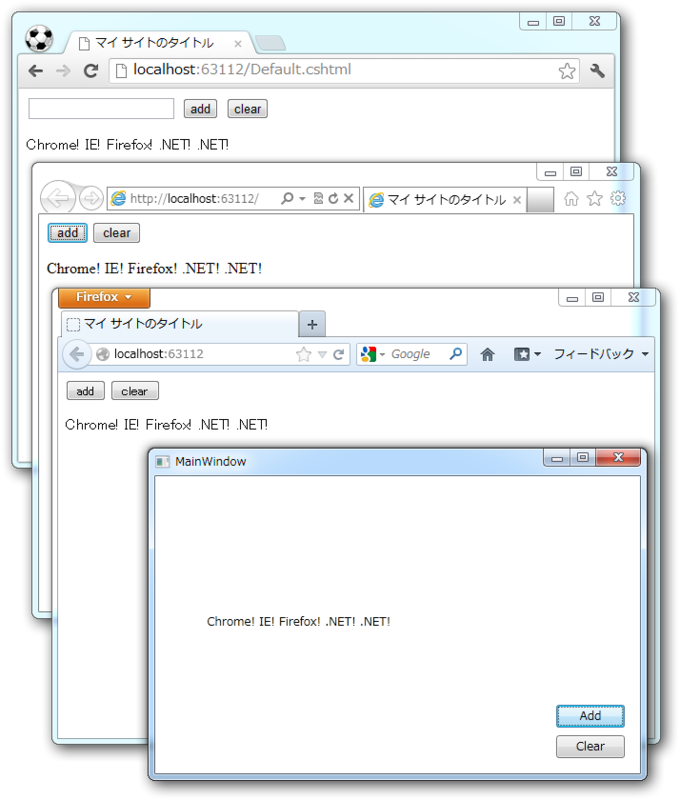

<blockquote cite="http://shiba-yan.hatenablog.jp/entry/20120823/1345724524">

（SignalR 0.5.3 の）JavaScript のクライアントは .NET 向けの各種クライアントとほぼ同じ API となっています。

<cite><a href="http://shiba-yan.hatenablog.jp/entry/20120823/1345724524">SignalR 0.5.3 &#x3067;&#x5909;&#x308F;&#x3063;&#x305F; JavaScript &#x30AF;&#x30E9;&#x30A4;&#x30A2;&#x30F3;&#x30C8; - &#x3057;&#x3070;&#x3084;&#x3093;&#x96D1;&#x8A18;</a></cite>
</blockquote>

そういえば、前回（<a href="https://blog.daruyanagi.jp/entry/2012/08/31/031730">SignalR Deep Dive ! &#x306B;&#x53C2;&#x52A0;&#x3057;&#x3066;&#x304D;&#x305F;&#xFF0B;WebMatrix &#x3067; SignalR &#x52D5;&#x304B;&#x3057;&#x3066;&#x307F;&#x305F; - &#x3060;&#x308B;&#x308D;&#x3050;</a>）.NET から呼んでみるのを忘れてたよ。「ほぼ同じ」らしいのでこっちも試してみよう。

WPF アプリケーションを作って、 NuGet で SignalR.Client をインストール。 Hub （サーバー側）のコードは前回のそのまま。

<pre class="code lang-cs" data-lang="cs" data-unlink>public partial class MainWindow : Window
{
HubConnection connection;
IHubProxy sample;

public MainWindow()
{
InitializeComponent();

// サーバーに接続して sample ハブをげっと
connection = new HubConnection(&quot;http://localhost:63112/&quot;);
sample = connection.CreateProxy(&quot;sample&quot;);
connection.Start(); /* この3つは順番を守ること！ */

// sample ハブで Echo() が呼ばれたら……
sample.On(&quot;Echo&quot;, data =&gt;
// 返り値をもらって UI スレッドで textBox につっこむ
Dispatcher.BeginInvoke(
new Action(() =&gt; { textBox.Text = data; })
)
);
}

private void buttonAdd_Click(object sender, RoutedEventArgs e)
{
// sample Hub の Add() を呼ぶ
sample.Invoke(&quot;Add&quot;, &quot;.NET! &quot;);
}

private void buttonClear_Click(object sender, RoutedEventArgs e)
{
// sample Hub の Clear() を呼ぶ
sample.Invoke(&quot;Clear&quot;);
}
}
</pre>
XAML は省略。ほんまに JavaScript の時と変わらないな。ただ、プロキシの取得と接続のスタートを逆にすると例外が発生する（JavaScript の場合は呼び出し順序はどっちでもいいみたい）。

